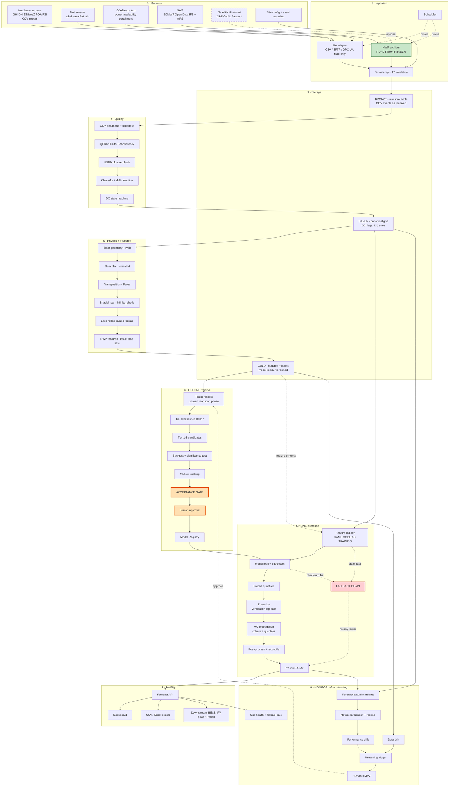
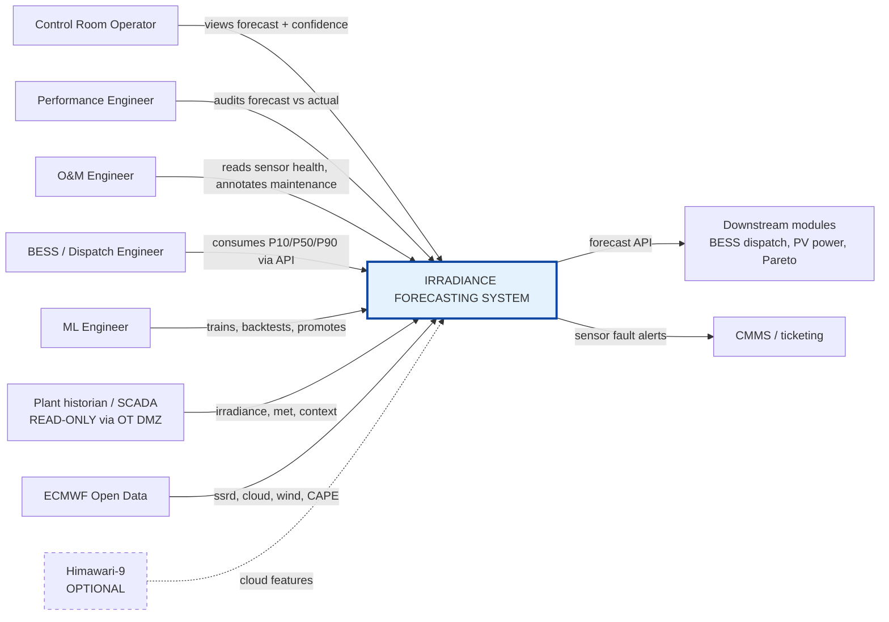
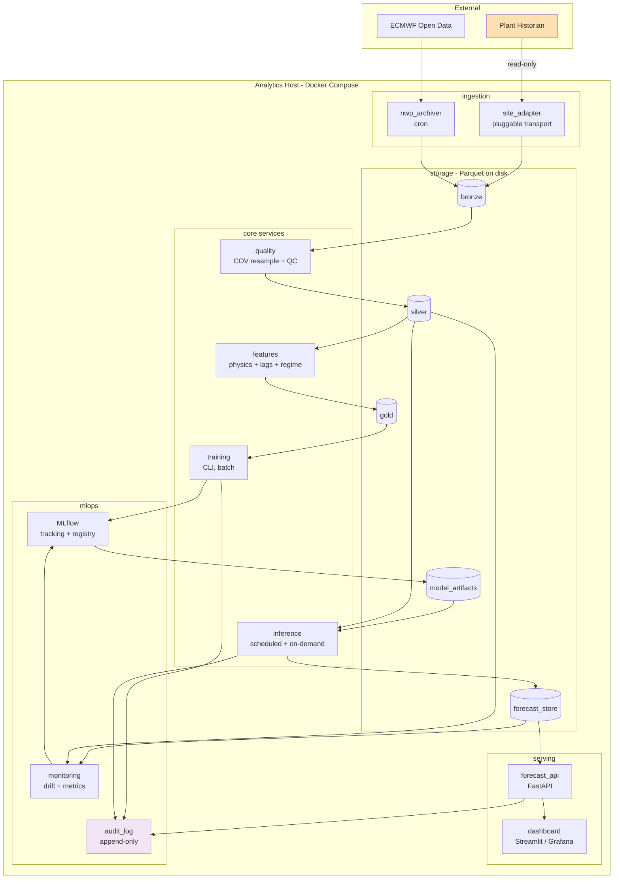
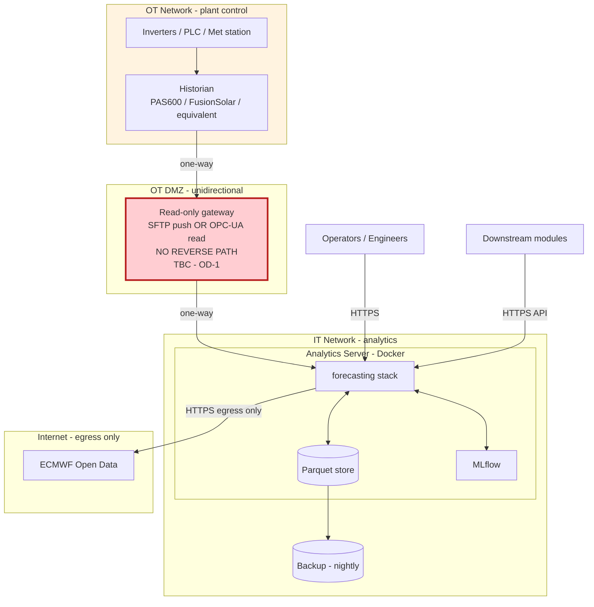
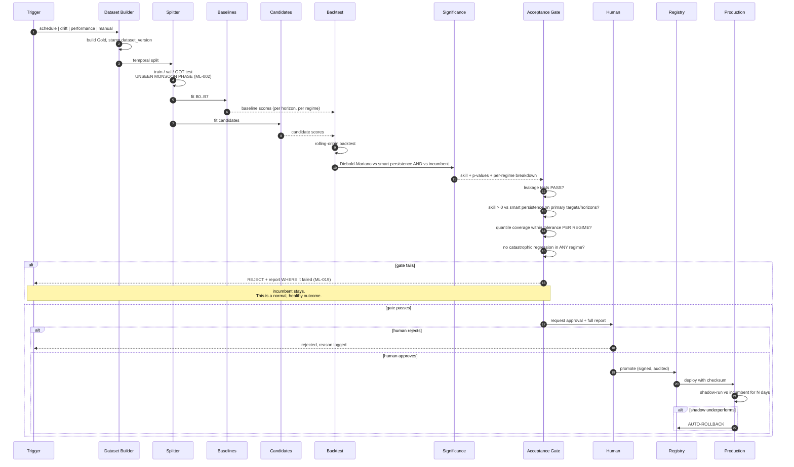

# PRD — Multi-Horizon Probabilistic Irradiance Forecasting System (PLTS)

**File:** `PRD_Forecasting_Irradiance_ML.md`
**Companion:** `MASTER_CONTEXT_Forecasting_Irradiance_ML.md` (normative for engineers and AI coding agents)

> **Assumption labelling used throughout this document**
> `[C]` = **Confirmed** by the product owner.
> `[A]` = **Assumed** by the author; safe to build on, but must be revisited if contradicted.
> `[TBC]` = **To Be Confirmed**; a decision or fact is missing. Code MUST NOT hard-code a value for a `[TBC]` item — it goes in config with a `TODO` and a loud startup warning.

---

## 1. Document Control

| Field | Value |
|---|---|
| Document ID | PRD-IRRAD-FCST-001 |
| Version | 1.1 (Sprint 0 execution status) |
| Status | Draft for stakeholder review |
| Product | Multi-Horizon Probabilistic Irradiance Forecasting System |
| Programme | PLTS Analytics Platform — Module M1 |
| Source material audited | `Forecasting_Irradiance.docx` (see Appendix A) |
| Target readers | PLTS operators, O&M and performance engineers, ML/data engineers, AI coding agents (e.g. Claude Code), OT security, asset management |
| Normative companion | `MASTER_CONTEXT_Forecasting_Irradiance_ML.md` — where the two documents disagree, **Master Context wins** for implementation detail; this PRD wins for scope and priority |
| Review cadence | End of each roadmap phase, or on any change to a `[C]` fact |

### 1.1 Revision History

| Ver | Date | Change |
|---|---|---|
| 1.0 | — | Initial issue. Audit of source document; architecture, requirements, roadmap. |
| 1.1 | 2026-07-17 | Added the evidence-backed Sprint 0 execution ledger. No product requirement or acceptance criterion changed. |

### 1.2 Sign-off Required Before Phase 1

| Role | Reason sign-off is needed |
|---|---|
| Plant Manager / Asset Owner | Scope, horizons, operational use of forecasts |
| OT / Network Security | Data path from SCADA/historian to the analytics host (see §14, §33) |
| Performance Engineering Lead | Target definitions, QC thresholds, evaluation contract |
| IT / Infrastructure | Deployment environment, data residency, egress for NWP |
| ML Lead | Model ladder, acceptance gates |

---

## 2. Executive Summary

This product forecasts **five on-site irradiance channels** — GHI, DHI, DNI·cos(Z), POA (front), and RSI (rear-side) — across **three horizon families**: nowcasting (5–120 min), intra-day (1–6 h), and day-ahead (up to 48 h). Every forecast is issued as a **deterministic P50 plus a P10/P90 interval**, carries **full provenance** (model, version, dataset, data-quality state), and **always has a working fallback**.

Three facts shape the entire design, and they are not negotiable:

1. **The site has no sky camera, no all-sky imager, no drone, and no ground-based cloud image sequence.** `[C]`
   The dominant literature approach to 5–60 min irradiance nowcasting is cloud-motion estimation from images. That door is closed. The system must extract every remaining drop of value from single-point sensors, temporal structure, physics, and (later) NWP and satellite.

2. **The data arrives event-driven ("per value change" / change-of-value), not on a fixed clock.** `[C]`
   This is *not* the same as "high resolution". A COV stream has a deadband, irregular timestamps, and no way to distinguish *"nothing changed"* from *"the link died"*. Everything downstream — resampling, lag features, rolling windows, staleness detection — has to be built for this from day one. Most reference implementations (including the source document) silently assume a fixed 15-minute grid and are therefore wrong here.

3. **RSI = Rear-Side Irradiance.** `[C]`
   This makes the site bifacial `[A]` and makes RSI a fundamentally different modelling problem from the other four: it is ground-reflection-dominated, albedo-dependent, geometry-dependent, and — critically — **a single rear sensor is not representative of array-average rear irradiance**. The product forecasts *the sensor*, and that limitation is stated explicitly rather than papered over.

**The honest headline.** Without cloud imagery, point-forecast skill at 5–30 minutes under convective conditions is *physically capped*. Indonesian convective cells can collapse irradiance by 80–90% in minutes with no observable precursor at a single point. No amount of LightGBM, LSTM, or Transformer will fix that. What this system *can* deliver, and what it is therefore optimised for, is:

- **excellent** clear-sky and overcast-day forecasts across all horizons;
- **honest, well-calibrated uncertainty** — the P10–P90 band widens correctly when the atmosphere is unpredictable, which is precisely when the BESS/dispatch module most needs to know that;
- **meaningful skill over persistence** at 30 min – 48 h, where NWP and diurnal/regime structure carry real information;
- **auditable provenance and graceful degradation**, so operators can trust it.

We deliberately do **not** promise a specific nRMSE number. Any such number invented before the site baseline is computed is fiction (see Appendix A, Finding A-3).

---

## 3. Background

Irradiance is the upstream driver of every downstream analytic in the PLTS platform: PV performance ratio, soiling and shading attribution, module temperature, BESS smoothing strategy, dispatch scheduling, and the Pareto loss waterfall. An error in irradiance propagates into all of them. Forecasting it well is therefore leverage, not a nice-to-have.

The site is instrumented with a full irradiance component set (GHI, DHI, DNI·cosZ) plus a plane-of-array sensor and a rear-side sensor. That component set is unusually complete for a utility-scale plant and unlocks two things most sites cannot do:

- a **three-instrument physical closure check** (`GHI ≈ DHI + DNI·cosZ`) usable as a live sensor-health signal — *provided DNI·cosZ is independently measured and not derived*, which is currently unverified `[TBC]`;
- **direct empirical validation of the transposition model**, because the site measures both the inputs (GHI/DHI/DNI) and the output (POA). Most projects have to assume Perez is right. This one can *test* it.

The counterweight is the absence of any spatial or imaging observation of clouds.

---

## 4. Problem Statement

> Plant operations must make decisions — BESS charge/discharge, ramp-rate smoothing, curtailment response, dispatch bids, maintenance scheduling — whose value depends on knowing what irradiance will do over the next 5 minutes to the next 48 hours. Today those decisions rest on the current reading and human judgement. There is no quantified forecast, no quantified uncertainty, and no record of whether yesterday's expectation was right.

Concretely, the system must close four gaps:

| Gap | Consequence today | What the product must provide |
|---|---|---|
| No forward view | Reactive BESS/dispatch; ramp events absorbed rather than anticipated | Multi-horizon deterministic + probabilistic forecast |
| No uncertainty | A single number is trusted equally on a clear day and during a squall line | Calibrated P10/P90; explicit confidence and regime |
| No verification loop | Nobody can say whether the forecast is any good, or getting worse | Forecast↔actual matching, per-horizon and per-regime error, drift monitoring |
| No degradation contract | A sensor fault or a lost feed silently corrupts downstream analytics | Data-quality state machine, fallback chain, no silent failure |

---

## 5. Product Vision

> **A forecasting service that plant staff trust because it tells them when *not* to trust it.**

The system is a Python service that consumes the site's own sensors first, augments them with external NWP (and, later, satellite) when available, and emits versioned, quality-tagged, probabilistic irradiance forecasts through an API and a dashboard. It degrades gracefully rather than failing, is fully backtestable, and never promotes a model that has not beaten a dumb baseline on out-of-time data.

---

## 6. Goals

| ID | Goal | Measured by |
|---|---|---|
| G-1 | Forecast all five irradiance targets across all configured horizons | AC-002 |
| G-2 | Beat **smart persistence** on the primary targets and horizons | AC-007, ML-013 |
| G-3 | Produce **calibrated** P10/P50/P90 (empirical coverage ≈ nominal, per regime) | AC-008, ML-020 |
| G-4 | Never emit a forecast without provenance and a data-quality state | AC-009, FR-016 |
| G-5 | Never fail silently: always fall back, always flag | AC-010, FR-010 |
| G-6 | Be fully auditable and reproducible: any past forecast can be re-derived | AC-015, NFR-005 |
| G-7 | Run on a single on-premise server for the MVP | NFR-009 |
| G-8 | Give downstream modules (BESS, PV power, Pareto) a stable, documented contract | FR-011, §30 |

---

## 7. Non-Goals

| ID | Non-Goal | Rationale |
|---|---|---|
| NG-1 | Sky-image / all-sky camera nowcasting | Hardware absent `[C]` |
| NG-2 | Drone-based anything | Hardware absent `[C]`; irrelevant to forecasting anyway |
| NG-3 | CNN / optical-flow image pipelines in the MVP | Forbidden by scope `[C]`; also has no input |
| NG-4 | **PV power** forecasting | Downstream module; this product stops at irradiance. It must, however, expose a clean interface for it (FR-011). |
| NG-5 | Grid dispatch optimisation / BESS control logic | Downstream consumer, not this product |
| NG-6 | Writing anything back to SCADA/PLC | Read-only by policy (NFR-017) |
| NG-7 | Multi-site / fleet forecasting in v1 | Single site; keep `site_id` in the schema so it is not a rewrite later |
| NG-8 | Long-range (>48 h) or seasonal forecasting | Different problem, different users |
| NG-9 | Promising a specific accuracy figure before Phase 0 completes | See Appendix A, Finding A-3 |

**Deferred, explicitly not rejected:**
- **Satellite-derived cloud/irradiance features (Himawari-9).** Optional enhancement, Phase 3. This is the single highest-value item on the deferred list — see §23.7. It is *not* an MVP dependency.
- **Inverter-array-as-sensor-network cloud motion.** See §23.8 — a camera-free way to recover some spatial cloud information. Phase 3+, gated on data access.
- **Ambient temperature forecasting.** See Open Decision OD-2.

---

## 8. Stakeholders

| Stakeholder | Interest | Decision rights |
|---|---|---|
| Plant Manager / Asset Owner | Value case, operational adoption | Scope, go/no-go, SLA targets |
| Control Room Operator | Next 0–6 h; ramp warnings; trust | Dashboard UX; alert thresholds |
| O&M Engineer | Sensor health, calibration, maintenance windows | QC thresholds; sensor maintenance annotations |
| Performance Engineer | PR/loss attribution; IEC-consistent definitions | Target and metric definitions |
| BESS / Dispatch Engineer | Probabilistic forecast for scheduling | Downstream API contract |
| ML / Data Engineer | Build and operate | Model selection within the rules in §23 |
| OT / Network Security | Segmentation, data path, no write-back | **Veto** on any real-time data path |
| IT / Infrastructure | Hosting, backup, egress, data residency | Deployment environment |
| Regulator / Offtaker (PLN) `[TBC]` | Any forecast-submission obligation? | May impose horizon/format requirements |

> **OD-9:** Is there a contractual or regulatory obligation to submit a day-ahead generation forecast to the offtaker/grid operator? If yes, its format and gate-closure time become hard requirements and reshape §17. `[TBC]`

---

## 9. User Personas

**P1 — Control Room Operator.** Watches a wall of screens. Needs, at a glance: *is a ramp coming, how confident are we, and is the forecast even trustworthy right now?* Does not care which model won. Will stop using the tool the first time it confidently predicts sun during a downpour without having warned him it was uncertain.

**P2 — Performance Engineer.** Needs the forecast↔actual record to be exact and auditable, needs metrics computed the IEC-consistent way (irradiance-weighted, daylight-filtered), and will personally find any place where a nighttime zero has been used to flatter an RMSE.

**P3 — O&M Engineer.** Cares about the sensors. Uses the irradiance-balance residual and the clear-sky comparison as a *soiling/drift/miscalibration* alarm on the pyranometers themselves. For him the QC pipeline is arguably more valuable than the forecast.

**P4 — BESS / Dispatch Engineer.** Consumes P10/P50/P90 programmatically. Needs the interval to be *honest*: an over-narrow P10–P90 costs money in reserve shortfalls; an over-wide one costs money in unused capacity.

**P5 — "Agent", an AI coding assistant.** Reads `MASTER_CONTEXT_*.md` before writing a line. Must never invent site metadata. Must implement baselines first. Must write the leakage test with the feature.

---

## 10. User Stories

| ID | As a… | I want… | So that… | Priority |
|---|---|---|---|---|
| US-01 | Operator | a 0–2 h GHI/POA forecast with an uncertainty band | I can pre-position the BESS before a ramp | Must |
| US-02 | Operator | a clear visual "forecast confidence: LOW" state | I know when to fall back on my own judgement | Must |
| US-03 | Dispatch engineer | day-ahead P10/P50/P90 at operational resolution via API | I can schedule and bid | Must |
| US-04 | Performance engineer | forecast-vs-actual for any past issuance, with model version | I can audit and report | Must |
| US-05 | Performance engineer | error broken down by horizon **and weather regime** | I know *where* the model is weak, not just that it is | Must |
| US-06 | O&M engineer | an alert when the GHI–DHI–DNI·cosZ balance drifts | I can catch a dirty or drifting pyranometer early | Must |
| US-07 | O&M engineer | to mark a sensor as "under maintenance" | those periods are excluded from training and metrics | Should |
| US-08 | ML engineer | a one-command reproducible backtest | I can compare a candidate model honestly | Must |
| US-09 | ML engineer | the pipeline to refuse to promote a model that loses to smart persistence | we never ship a regression | Must |
| US-10 | Operator | the system to keep producing *something* when a sensor or the internet dies | the screen never goes blank | Must |
| US-11 | Analyst | CSV/Excel export of forecast and actuals | I can do ad-hoc analysis | Should |
| US-12 | Dispatch engineer | a rear-side (RSI) forecast | bifacial gain is in my energy estimate | Should |
| US-13 | Operator | ramp-event probability ("70% chance of a >300 W/m² drop in the next 30 min") | I get a usable warning even when exact timing is unknowable | Should |
| US-14 | Any user | to know which model produced a number and whether it was a fallback | I can calibrate my trust | Must |

---

## 11. Use Cases

**UC-1 — Intra-hour ramp pre-positioning.** Every canonical timestep, the nowcast engine issues 5/10/15/30/60/120-min forecasts for GHI and POA with P10/P90. The BESS module reads P10 to size its headroom. When the predicted P90–P10 spread exceeds a threshold, the dashboard raises a *high-variability* flag. **Explicit limitation:** without imagery the system will frequently signal *"a ramp is likely in this window"* without pinning the minute. That is the honest product, and the UI must present it that way (US-13).

**UC-2 — Day-ahead scheduling.** After the NWP run of record lands, the day-ahead pipeline emits D+1 at operational resolution, bias-corrected against recent site error (MOS). Gate-closure time drives the issuance schedule. `[TBC — see OD-9]`

**UC-3 — Sensor health surveillance.** The QC pipeline continuously computes the irradiance-balance residual, clear-sky comparison, stuck/flatline detection, and cross-sensor consistency. Sustained drift raises a maintenance ticket. This runs whether or not anyone is looking at a forecast.

**UC-4 — Post-event review.** After an unexpected generation shortfall, the performance engineer pulls every forecast issued for that window, with model versions and data-quality flags, and reconstructs what the system knew and when.

**UC-5 — Degraded operation.** The met station link drops. The system detects staleness within the configured threshold, switches to NWP-only (or, if NWP is also stale, to climatology), stamps `fallback_used=true` and `data_quality=DEGRADED|BAD`, keeps serving, and alerts. **It does not serve a stale forecast as if it were fresh.**

---

## 12. Scope

### 12.1 In Scope

- Ingestion of the five irradiance channels + available meteorological channels + SCADA context flags.
- COV→canonical-grid resampling with correct time-weighted reconstruction (§20.2).
- Full QC pipeline and data-quality state machine.
- Physics layer: solar geometry, clear-sky, transposition, bifacial rear-side (pvlib).
- Baseline ladder (Tier 0), tabular ML (Tier 1), sequence (Tier 2), multi-horizon (Tier 3), ensemble (Tier 4).
- Deterministic + probabilistic (P10/P50/P90) multi-horizon forecasting.
- Physical reconciliation and quantile post-processing.
- Backtesting, forecast↔actual matching, metrics by horizon/regime/season.
- Forecast API, dashboard, CSV/Excel export.
- MLOps: experiment tracking, model registry, drift monitoring, human-gated promotion, rollback.
- NWP ingestion **and archiving** (see §12.3 — this starts in Phase 0).

### 12.2 Out of Scope
See §7.

### 12.3 Scope Item That Must Start Immediately

> **NWP archiving is time-critical and must begin in Phase 0, before any modelling.**
>
> ECMWF Open Data keeps only a **rolling archive of the most recent ~12 forecast runs (≈2–3 days)**. You cannot retroactively obtain the NWP forecasts that were issued last month. Training an NWP→site MOS/bias-correction model requires **months of matched (forecast, actual) pairs**. Every week the archiver is not running is a week of training data permanently lost.
>
> Two mitigations, use both:
> 1. **Start a cron job now** that pulls and Parquet-archives the ECMWF Open Data run for the site grid cell, every cycle, from day one — even before anyone has written a model.
> 2. **Backfill** from a third-party archive of *past forecast runs as issued* (not reanalysis) to bootstrap. Verify licence terms for commercial use before relying on it `[TBC]`.
>
> **Do not backfill with ERA5 reanalysis and train a MOS on it.** Reanalysis has assimilated the observations it is being compared to; a MOS fitted on reanalysis→actual will be badly miscalibrated when deployed on forecast→actual. This is a classic and expensive trap. ERA5 is fine for *climatology* and for backfilling non-forecast features; it is not a stand-in for a forecast.

---

## 13. Assumptions

| ID | Assumption | Label | Impact if wrong |
|---|---|---|---|
| A-01 | RSI = rear-side irradiance in W/m² | `[C]` | Total re-scope of §16.5 |
| A-02 | Site has bifacial modules (implied by A-01) | `[A]` | If not bifacial, RSI is measuring something else — re-open A-01 |
| A-03 | Site is in Indonesia; tropical maritime climate; monsoon seasonality; no DST | `[A]` | Clear-sky model choice, seasonal split design, aerosol handling |
| A-04 | All five irradiance sensors are at a single met station | `[A]` | If there are ≥2 spatially separated stations, cross-correlation cloud-advection features become possible — a **significant** upgrade (see §23.8) |
| A-05 | The COV stream has a non-zero deadband | `[A]` | Determines the effective resolution ceiling; **measure it in Phase 0** |
| A-06 | Historical coverage ≥ 12 months | `[TBC]` | <12 months = no unseen-monsoon-season test = no defensible generalisation claim |
| A-07 | The analytics host can reach the internet for NWP | `[TBC]` | If not, day-ahead collapses to climatology + persistence. This is a **major** scope risk. |
| A-08 | Ambient temperature is *out* of the target list for MVP | `[C]` (per §II of the brief) | See OD-2 |
| A-09 | Single site for v1 | `[A]` | Keep `site_id` in every table regardless |
| A-10 | Wind speed/direction available at the met station | `[TBC]` | Wind features are the only advection proxy available without imagery |

---

## 14. Constraints

| ID | Constraint | Type | Consequence |
|---|---|---|---|
| CON-1 | No sky camera / all-sky imager / drone / cloud image sequence | Hardware `[C]` | Caps 5–30 min skill under convective conditions. Non-negotiable physical limit, not an engineering failure. |
| CON-2 | Data arrives as change-of-value, not a fixed clock | Data `[C]` | Requires COV-aware resampling, staleness heartbeat, deadband measurement (§20.2) |
| CON-3 | OT/IT network segmentation; no direct SCADA integration; **no write-back** | Security `[C]` | See CON-4 |
| CON-4 | **The real-time data path is unresolved.** | Blocking `[TBC]` | **This is the single most important open item.** See box below. |
| CON-5 | Python is the implementation language | Technical `[C]` | — |
| CON-6 | MVP must run on a single local server | Infra `[A]` | Rules out heavyweight distributed stacks in Phase 1–2 |
| CON-7 | Data residency may be restricted (national strategic asset) | Legal `[TBC]` | May forbid offshore cloud hosting of raw plant data |
| CON-8 | Free-tier cloud (if used) has no SLA | Infra | Must be disclosed to stakeholders; mandatory backups |

> ### CON-4 — The latency reality check (read this before promising a 5-minute forecast)
>
> A 5-minute-ahead forecast is only *operationally* useful if the whole chain — sensor → historian → ingestion → QC → features → inference → API → downstream action — completes in a small fraction of 5 minutes. Call it a **60-second end-to-end budget** for the 5-min horizon.
>
> If the data path is **manual CSV export**, end-to-end latency is *hours*. In that world a 5-minute forecast is not a product; it is a backtest.
>
> Therefore:
> - The system is **designed and backtested** for all horizons from 5 min upward. `[C — "semuanya"]`
> - The system **operationally serves** a horizon only when its data freshness budget is met. Horizons whose budget cannot be met are marked `served=false` in config and shown as *"backtest only — data path too slow"* on the dashboard rather than quietly served with stale inputs.
> - **Recommendation:** treat **≥15 min** as the operationally-servable set for the MVP, and gate 5/10 min on a sub-minute push path (e.g. an approved read-only SFTP/OPC-UA push from the historian at ≤1-min cadence through the OT DMZ).
>
> This is not a reduction of the requirement. It is a refusal to pretend.

---

## 15. Data Inventory

### 15.1 Full Data Source Table

Latency, sampling and coverage columns marked `[TBC]` must be **measured in Phase 0**, not guessed.

#### A. On-Site Irradiance Sensors

| Source | Owner | Acquisition | Sampling | TZ | Unit | Expected range | Latency | Hist. coverage | DQ risk | Req? | Used for |
|---|---|---|---|---|---|---|---|---|---|---|---|
| GHI | Plant O&M | Historian/SCADA export | COV `[C]` | `[TBC]` | W/m² | −4 … ~1400 (QCRad upper bound is zenith-dependent) | `[TBC]` | `[TBC]` | Soiling, drift, levelling | **Required** | Both |
| DHI | Plant O&M | idem | COV | `[TBC]` | W/m² | −4 … ~700 | `[TBC]` | `[TBC]` | **Shadow-band/ring alignment is a chronic failure mode**; also soiling | **Required** | Both |
| DNI·cosZ | Plant O&M | idem | COV | `[TBC]` | W/m² | 0 … ~1100 | `[TBC]` | `[TBC]` | **Measured or derived? UNKNOWN — see §16.3** | **Required** | Both |
| POA (front) | Plant O&M | idem | COV | `[TBC]` | W/m² | −4 … ~1500 | `[TBC]` | `[TBC]` | Soiling; tilt/azimuth metadata missing | **Required** | Both |
| RSI (rear-side) | Plant O&M | idem | COV | `[TBC]` | W/m² | 0 … ~300 `[A]` | `[TBC]` | `[TBC]` | **Single-point, non-representative of array average**; vegetation/albedo seasonality | **Required** | Both |

#### B. On-Site Meteorological (availability `[TBC]` per channel)

| Source | Unit | Expected range | Why we want it | Req? |
|---|---|---|---|---|
| Ambient temperature | °C | 18 … 40 | Downstream (module temp); weak forecast feature | Optional |
| Module temperature | °C | 15 … 75 | Downstream only | Optional |
| Relative humidity | % | 40 … 100 | Atmospheric transparency; convection proxy | Optional |
| Wind speed | m/s | 0 … 25 | **Only advection proxy available without imagery** | **Strongly wanted** |
| Wind direction | ° (meteorological, FROM) | 0 … 360 | idem — **and see Appendix A, Finding A-2: the source doc's u/v formula is wrong** | **Strongly wanted** |
| Rainfall | mm | ≥0 | Rain-on-dome sensor invalidation; regime label | Optional |
| Atmospheric pressure | hPa | 950 … 1030 | Minor; airmass refinement | Optional |
| **Albedometer** (up+down pyranometer pair) | W/m² | — | **Would materially improve RSI modelling.** If absent, albedo must be inferred (§16.5). | Optional but high value |

#### C. SCADA / Plant Context — *not forecast targets; used as context, QC cross-check, and exclusion flags*

| Source | Use |
|---|---|
| Active power (plant, inverter) | Cross-check irradiance plausibility; downstream; **potential distributed cloud sensor (§23.8)** |
| Inverter availability | Exclusion flag |
| Curtailment / setpoint | Exclusion flag — a curtailed period must not teach the model anything about irradiance→power |
| Plant outage flags | Exclusion flag |
| Sensor alarms | Direct DQ input |
| Communication quality | Staleness / DQ |
| Time-sync status | **Critical.** An unsynchronised clock silently destroys every lag feature. |

#### D. External Weather — *optional for MVP, required for day-ahead value*

| Source | Access | Resolution | Cadence | Key vars | Licence | Notes |
|---|---|---|---|---|---|---|
| **ECMWF Open Data (IFS HRES)** | Free, direct or via AWS/Azure/GCP mirrors; `ecmwf-opendata` client | 0.25° (moving to 0.1°) | 4 runs/day (00/06/12/18Z); **3-hourly steps: 00/12Z to +144 h, 06/18Z to +90 h under IFS Cycle 50r1** | `ssrd`, `ssr`, `tcc`, `2t`, `2d`, `10u`/`10v`, `tp`, `tprate`, `sp`, `tcwv`, **`mucape`** | **CC-BY-4.0, commercial use permitted with attribution** | **Recommended primary NWP.** Note: **`fdir` (direct radiation) is NOT in the free subset** → DNI/DHI must be derived from forecast GHI by a separation model. **Rolling archive only ~12 runs — archive it yourself (§12.3).** |
| **ECMWF AIFS** (same portal) | Free | 0.25° | 4/day, 6-hourly steps | `ssrd`, **`lcc`/`mcc`/`hcc`** (low/mid/high cloud), `cp` (convective precip) | CC-BY-4.0 | Layered cloud cover is *more useful for solar* than IFS's single `tcc`. Worth ingesting alongside IFS. |
| **NCEP GFS** | Free (NOMADS / AWS Open Data) | 0.25° | 4/day | `DSWRF` | Public domain | Redundancy / ensemble diversity |
| Third-party aggregated NWP API | Free tier is typically **non-commercial** | varies | varies | GHI/DNI/DHI, GTI | **Verify commercial licence** `[TBC]` | Convenient; also offers archives of *past runs as issued* (useful for MOS bootstrap, §12.3). Do not build a commercial dependency on a non-commercial free tier. |
| **Himawari-9 (JMA/JAXA)** | Free w/ registration (JAXA P-Tree); also NOAA/AWS Open Data | 0.5–2 km | **Full-disk every 10 min** | AHI bands 1–16 | Free for research; **verify commercial terms** `[TBC]` | Indonesia sits squarely in the disk (satellite at 140.7°E). **The single highest-value optional enhancement — see §23.7.** Deferred to Phase 3. |
| **CAMS / McClear clear-sky** | Free w/ registration | — | — | Clear-sky GHI/DNI/DHI with **near-real-time aerosol** | Verify `[TBC]` | **Strongly recommended** — see §16.6 on the haze problem |

---

## 16. Target Definitions

The five targets are **not** five independent regression problems. Treating them as such (as the source document does) throws away physics and guarantees mutually inconsistent output. The architecture below forecasts a **reduced set of primitives** and *derives* the rest, so consistency is structural rather than patched on afterwards.

### 16.1 The primitive decomposition (core architectural decision — ADR-011)

```
Forecast these primitives                        Derive these
─────────────────────────                        ─────────────
k_c   = GHI / GHI_clearsky      ──┐
                                  ├─►   GHI      = k_c × GHI_clearsky
k_d   = DHI / GHI  (diffuse frac) ┤     DHI      = k_d × GHI
                                  └─►   DNI·cosZ = GHI − DHI          (closure by construction)
                                        DNI      = (GHI − DHI) / cos(θz)   [guard θz→90°]

r_poa = POA_measured / POA_physics ──►  POA      = r_poa × Perez(GHI, DHI, DNI, geometry)

ρ     = RSI / POA_front           ──►   RSI      = ρ × POA
```

Why this is right:

- **`GHI ≈ DHI + DNI·cosZ` holds identically**, so the reconciliation step in §25 becomes a *check*, not a *correction*. No post-hoc fudging.
- Each primitive is **bounded and better-behaved** than the raw channel. `k_c` is ~[0, 1.4], `k_d` is [0, 1], `ρ` is a slowly-varying geometry/albedo ratio. Raw W/m² targets carry a huge deterministic diurnal signal that the model wastes capacity re-learning.
- Errors are **attributable**: a bad POA is either a bad GHI forecast or a bad transposition, and `r_poa` separates them.

Why it is not free — state this honestly:

- Errors **couple**: a `k_c` error propagates to every derived target.
- **Quantiles do not compose.** `P90(GHI) × P90(k_d) ≠ P90(DHI)`. See §24.3 for the ensemble-propagation fix.
- **Mitigation:** always keep an independent **direct-forecast** path per target as a comparator, and let the horizon-specific ensemble (§23.5) decide. If the direct path wins on a target/horizon, use it. Physics earns its place; it is not granted it.

### 16.2 GHI

- **Primary target = `k_c` (clear-sky index), not raw GHI.** Reconstruct as `GHI = k_c × GHI_cs`.
- **`k_c > 1` is physically real** (cloud enhancement / edge-of-cloud effect) and in the tropics can reach ~1.3–1.5 for short periods. **Do not clip it.** Clip only at a configured `k_c_max` (default 1.5) as an *outlier* guard, and log every clip.
- **Beware the twilight singularity.** The source document computes `GHI / clearsky_ghi.clip(lower=1)`. At `GHI_cs = 1 W/m²` this yields a `k_c` of hundreds. **Correct approach:** define `k_c` as `NaN` (not a huge number, not zero) where `GHI_cs < k_c_valid_min` (default 20 W/m², config). Those samples are excluded from `k_c`-space modelling and metrics, and reconstruction falls back to the raw scale.

**Terminology, fixed here once and for all** (the source document reverses these, see Appendix A):

| Name | Symbol used in this project | Definition |
|---|---|---|
| **Clear-sky index** | `k_c` | `GHI / GHI_clearsky` — **this is our modelling target** |
| **Clearness index** | `k_t` | `GHI / GHI_extraterrestrial_horizontal` — a *different* quantity, used only as a secondary feature |

### 16.3 DNI·cosZ — **verify the semantics before writing a single model**

`DNI·cosZ` is the **beam component projected onto the horizontal** (BHI), in W/m². If so, `GHI = DHI + DNI·cosZ` holds directly.

But it might instead be a **derived tag** computed by the SCADA/historian as `GHI − DHI`. If it is:

- the "balance residual" is **identically zero**, provides **zero** QC value, and every claim in §25 about three-instrument closure is void;
- forecasting it as an independent target is **redundant** — it is a linear function of two other targets.

> **The decisive Phase-0 test (cheap, ten minutes of work):**
> Compute `r = GHI − DHI − DNI_cosZ` over the whole history.
> - If `|r|` is **zero to floating-point/rounding precision** → the channel is **derived**. Stop treating it as an instrument. Record this in the data dictionary and drop it as an independent target.
> - If `|r|` has a **realistic distribution** (a few W/m², with structure against zenith angle and against `k_c`) → it is **independently measured**. The closure check is live and valuable, and the three-instrument QC in §25 is on.
>
> Also verify: unit, sign convention, and whether the pyrheliometer (if any) is on a tracker.

Applicable QC (only if independently measured), per the BSRN Global Network recommended QC tests (Long & Dutton):

| Condition | Test |
|---|---|
| `θz < 75°` and `(DNI·cosZ + DHI) > 50 W/m²` | `0.92 ≤ GHI / (DNI·cosZ + DHI) ≤ 1.08` |
| `75° ≤ θz < 93°` and `(DNI·cosZ + DHI) > 50 W/m²` | tolerance widened to ±15% |
| `(DNI·cosZ + DHI) ≤ 50 W/m²` | test **not applicable** |

Plus the QCRad physical-limit tests, available directly in `pvanalytics.quality.irradiance.check_irradiance_limits_qcrad` and `check_irradiance_consistency_qcrad`. **Use the library; do not re-derive the constants by hand.**

### 16.4 POA (front)

Two paths, and the site is unusually lucky: **it can validate the physics path empirically**, because it measures both the inputs and the output.

- **Path A — Physics.** Forecast GHI/DHI/DNI → `pvlib.irradiance.get_total_irradiance(model='perez')` with the array tilt/azimuth. Requires `surface_tilt`, `surface_azimuth` `[TBC]` and, if the array is on **single-axis trackers**, the *time-varying* tilt/azimuth from `pvlib.tracking.singleaxis` (or from the measured tracker angle). **Whether the racking is fixed or tracking is currently unknown and is a blocking metadata gap.** `[TBC — OD-4]`
- **Path B — Direct ML.** Forecast POA directly from POA history + components + geometry + weather, **using Path A's output as a feature**.
- **Chosen design:** forecast the **ratio `r_poa = POA_measured / POA_physics`**. This isolates transposition-model error and sensor-plane mismatch into a slowly-varying, well-conditioned target.
- **Phase 1 deliverable:** a transposition-model bake-off (Perez vs Hay-Davies vs isotropic vs Klucher) *validated against the actual POA sensor* on clear-sky periods. Report the winner and its residual. This is a genuine, publishable-quality site result and it costs one afternoon.
- **Watch out:** is the POA sensor **co-planar with the modules**? If it is on a fixed reference plane while the array tracks, `r_poa` is meaningless. `[TBC]`

### 16.5 RSI (Rear-Side Irradiance) — the hard one, and the one everyone gets wrong

**Confirmed:** RSI = rear-side irradiance `[C]`.

**Physics.** Rear irradiance is dominated by **ground-reflected** radiation, plus a sky-diffuse contribution through the row gaps, minus structural blocking. It therefore depends on:
`albedo`, `ground clearance (height)`, `row pitch` / `GCR`, `module tilt`, `bifaciality`, `mounting-structure shading`, and — heavily — on the **total hemispheric flux**, not just the beam.

**Baseline (Tier 0 for RSI) — a linear physics-informed regression, and it will be surprisingly strong:**

```
RSI ≈ a·GHI + b·DHI + c·POA_front + d
```

with coefficients fitted per month, or as smooth functions of solar geometry. This captures the ground-reflection and sky-diffuse structure almost for free. **Fit it before touching a neural network.**

**Physics baseline (Tier 0.5):** `pvlib.bifacial.infinite_sheds.get_irradiance(...)`

```python
pvlib.bifacial.infinite_sheds.get_irradiance(
    surface_tilt, surface_azimuth, solar_zenith, solar_azimuth,
    gcr, height, pitch, ghi, dhi, dni, albedo,
    model='isotropic', dni_extra=None,
    iam_front=1.0, iam_back=1.0,
    bifaciality=0.8,          # site-specific -> config
    shade_factor=-0.02,       # structural blocking -> FIT THIS, don't accept the default
    transmission_factor=0.0,
)
```

- `shade_factor` is exactly the "structural shading" knob. **Fit it to the site rather than accepting the default.**
- **Dependency note:** if you prefer the full 2-D `pvfactors` model, install it as **`solarfactors`** (`pip install solarfactors`) — the pvlib community's maintained drop-in. The original `pvfactors` package became difficult to install in modern Python environments; pvlib has routed through `solarfactors` since v0.10.1. The import name is still `pvfactors`. **`infinite_sheds` is native to pvlib, faster, and has no extra dependency — start there.**

**Modelling target — forecast the ratio, not the value:**

```
ρ = RSI / POA_front        →  RSI = ρ × POA_forecast
```

`ρ` strips out the fast, cloud-driven variability (which the POA forecast already handles) and leaves a slow signal driven by geometry, season and ground condition.

**Empirical caution, stated up front:** `ρ` is *not* constant. Under cloud, POA_front collapses faster than the ground-reflected component, so `ρ` *rises*. That is fine — it is still far more learnable than raw RSI — but **validate the claim on real data in Phase 1 before committing to it.** If `ρ` turns out to be as noisy as RSI itself, fall back to direct RSI forecasting and say so.

**Albedo — you almost certainly don't have it:**
- If an **albedometer** exists, use it. `[TBC]`
- If not: **invert the physics model against measured RSI on clear-sky periods to fit an effective monthly albedo.** In Indonesia, albedo swings with rainfall (wet vegetation/soil ≈ 0.15–0.20; dry ≈ 0.20–0.25; standing water is near-specular and breaks the isotropic assumption entirely). A single fixed albedo is a modelling error, not a simplification.

> ### The RSI representativeness caveat — put this in the dashboard, not just the docs
>
> Rear-side irradiance across a real bifacial array is **strongly non-uniform**: edge rows see more, centre rows less; module bottoms differ from tops; torque tubes cast structured shadows. A **single rear sensor at one position is not an unbiased estimate of the array-average rear irradiance.**
>
> **This product forecasts the sensor reading.** Using that reading as a proxy for array-average bifacial gain requires a **separate spatial-calibration study** (multi-position rear measurements or a validated 3-D model) that is **out of scope here**. Downstream consumers must be told this in the API response, not discover it later. See FR-020.

### 16.6 Clear-sky model — a decision that silently biases everything

Because `k_c` is the target, **a biased clear-sky model injects a systematic, seasonally-varying bias into every single forecast.** This is the least glamorous and most consequential choice in the system.

| Option | Pros | Cons for this site |
|---|---|---|
| `pvlib` Ineichen–Perez + **Linke turbidity climatology** | Offline, no dependency, default | Linke climatology is **monthly and coarse**. During dry-season **biomass-burning haze** — an annual event in Kalimantan/Sumatra — real AOD spikes far above climatology. The model then **over-predicts clear-sky GHI**, `k_c` reads artificially low, and the model "sees" cloud where there is only smoke. **This is a real, seasonal, systematic failure mode.** |
| `pvlib` Simplified Solis / Bird | Takes AOD and precipitable water as inputs | Needs an AOD source (CAMS, Himawari L3 AOD, AERONET) |
| **CAMS McClear** | Ingests **near-real-time aerosol** — handles haze correctly | Needs internet + registration; adds an external dependency and a fallback path |

**Requirement (ML-004):** pin the clear-sky model in config; **validate it against on-site clear-sky periods** (detect them with `pvlib.clearsky.detect_clearsky`, i.e. Reno–Hansen, then compare measured GHI to modelled `GHI_cs` **on those periods only**); and apply a fitted site-specific clear-sky correction factor if the residual is material.

**Recommendation:** McClear as primary, Ineichen as the offline fallback, and **monitor the divergence between the two as a haze detector.**

---

## 17. Forecast Horizons

All horizons are **configurable**. The table below is the shipped default.

| Family | Horizons (min) | Issuance cadence | Dominant information source | Realistic expectation without imagery |
|---|---|---|---|---|
| **A — Nowcast** | 5, 10, 15, 30, 60, 120 | Every canonical timestep | Sensor lags, `k_c` dynamics, ramp features, wind | 5–15 min: persistence is *very* hard to beat. 30–120 min: real ML gains available. **Under convective conditions, timing is not recoverable from a point sensor — sell the uncertainty band, not the point.** |
| **B — Intra-day** | 60, 120, 180, 360 | Hourly (and on each new NWP run) | NWP + `k_c` climatology + regime | Where NWP-MOS starts paying. Satellite would help most here (Phase 3). |
| **C — Day-ahead** | D+1 at operational resolution; up to 48 h | On the NWP run of record (see OD-9) | **NWP is everything.** | Without NWP, day-ahead ≈ diurnal climatology. **This is why A-07 (internet access) is a scope risk, not a detail.** |

**Canonical timestep.** Because the source is COV, there is no native timestep. The system **defines** one:

- **Primary canonical grid: 1 minute** (config: `canonical_freq`), with 5-min and 15-min derived by aggregation.
- The 1-min grid is only *honest* if the COV inter-arrival statistics support it. **Phase 0 must measure this** (§20.2). If the median COV inter-arrival is, say, 4 minutes, then a 1-min grid is mostly interpolation and the 5-min grid is the real one. **Let the data decide, then pin it in config.**

**Servability.** Each horizon carries a `served: true|false` flag driven by the data-freshness budget (CON-4). Backtest covers all horizons regardless.

---

## 18. Functional Requirements

Priority: **M**ust / **S**hould / **C**ould.

| ID | Requirement | Pri | Acceptance criteria | Depends on | Failure behaviour |
|---|---|---|---|---|---|
| **FR-001** | Ingest all five irradiance channels + available met + SCADA context from the site source | M | All configured tags land in Bronze with original timestamps, values and source metadata; no silent drops; ingestion count reconciles with source | CON-4 | Alert `INGEST_FAILED`; last-good data retained; DQ→`MISSING` after `stale_threshold` |
| **FR-002** | **COV-aware resampling** to the canonical grid with time-weighted reconstruction, plus per-interval `n_samples` and `max_gap_s` | M | Unit test: a synthetic COV series with known true mean reconstructs to within tolerance; a naive `.mean()` of raw COV samples demonstrably does not (§20.2) | FR-001 | Interval flagged `IMPUTED` or `MISSING` |
| **FR-003** | Full QC pipeline (§20) producing per-timestep, per-channel quality flags | M | Every one of the 20 checks in §20.1 implemented and unit-tested; flags persisted | FR-002 | QC failure ⇒ `BAD`; never silently pass |
| **FR-004** | Physics layer: solar position, clear-sky, transposition, bifacial rear-side (pvlib) | M | Solar position matches a reference SPA implementation to <0.01°; clear-sky validated against detected on-site clear periods | Site metadata `[TBC]` | **Refuse to start** if `latitude`/`longitude`/`altitude`/`timezone` are unset — **do not default to 0,0** |
| **FR-005** | Feature engineering per §21, **all windows time-based, none count-based** | M | Leakage harness (§34.2) passes on every feature | FR-002, FR-004 | Fail the pipeline; do not train |
| **FR-006** | Tier-0 baselines: persistence, smart persistence, **optimal/damped persistence**, diurnal climatology, clear-sky, **two-state regime model**, NWP-raw, **CH-PeEn** | M | All implemented, backtested, and reported alongside every ML result | FR-005 | Persistence is the terminal fallback and must never itself fail |
| **FR-007** | Tabular ML (LightGBM primary; XGBoost + HistGradientBoosting as comparators), per-horizon, quantile-capable | M | Backtest report per target × horizon × regime vs all baselines | FR-006 | Fall back down the chain (§23.6) |
| **FR-008** | Sequence models (LSTM/GRU/TCN) — **evaluated, adopted only if they earn it** | S | Must beat Tier 1 on out-of-time test **with statistical significance** (Diebold–Mariano, AC-020) | FR-007 | Not promoted; documented as "evaluated, rejected" — that is a *valid* outcome |
| **FR-009** | Multi-horizon model (TFT / NHITS) for intra-day + day-ahead with known-future covariates | S | Same gate as FR-008 | **NWP ingestion (FR-013)** — a TFT without future covariates is a very expensive climatology | Not promoted |
| **FR-010** | **Fallback chain** — always produce a forecast, always label it | M | Chaos test (§34.5) kills each dependency in turn; a labelled forecast still emerges every time | FR-006 | *This IS the failure behaviour.* No silent failure permitted (NFR-018) |
| **FR-011** | Forecast API (§30) | M | OpenAPI schema published; contract tests green | FR-007 | `503` with a machine-readable reason; **never a stale 200** |
| **FR-012** | Dashboard (§31) | M | All 21 panels present | FR-011 | Degraded banner |
| **FR-013** | **NWP ingestion AND archiving** | M *(archiving)* / S *(modelling)* | Archiver runs from Phase 0; Parquet store grows daily; issue-time and valid-time recorded separately | A-07 internet access | Day-ahead degrades to climatology; alert `NWP_STALE` |
| **FR-014** | Ensemble / hybrid combination, horizon- and regime-specific weights | S | Weights respect **verification lag** (§23.5) — a weight update at time *T* may only use forecasts issued at or before *T − h* | FR-007 | Single best model |
| **FR-015** | Probabilistic output P10/P50/P90 with **enforced ordering** | M | `P10 ≤ P50 ≤ P90` on 100% of rows; coverage reported per regime | FR-007 | Post-processing repair (§24.4), flagged |
| **FR-016** | **Provenance on every forecast row** | M | `model_name`, `model_version`, `dataset_version`, `issuance_time`, `valid_time`, `inference_time`, `fallback_used`, `data_quality`, `confidence`, `source_data_freshness` all non-null | — | Reject the write. A forecast without provenance is not a forecast. |
| **FR-017** | Backtesting + forecast↔actual matching | M | Any historical issuance can be replayed and reproduced bit-for-bit | FR-005 | — |
| **FR-018** | Physical reconciliation + QC on **output** (§25) | M | Closure holds by construction (§16.1); violations logged as *code* bugs | FR-004 | Log + flag |
| **FR-019** | Retraining: scheduled, drift-triggered, performance-triggered, manual | S | All four paths implemented; **none auto-promotes** | FR-017 | Keep incumbent |
| **FR-020** | **Model rollback**, and **explicit RSI representativeness warning in the API payload** | M | Rollback to any registered version in <5 min; RSI responses carry `rsi_single_point_sensor_not_array_representative` | FR-016 | — |
| **FR-021** | Audit trail: every promotion, rollback, config change, manual override | M | Append-only, immutable, who/what/when/why | — | — |
| **FR-022** | **Human-gated model promotion** | M | No path from training to production without a recorded human approval | FR-019 | Blocked |
| **FR-023** | Configuration management: **zero hard-coded site values** | M | Grep for magic numbers in `src/` returns nothing; startup validates config against a schema | — | Refuse to start |
| **FR-024** | Alerting: sensor stale, sensor fault, NWP stale, fallback active, drift, forecast miss | M | Each alert has an owner and a runbook | FR-003 | — |
| **FR-025** | Data export CSV/Excel | S | Forecast, actuals, metrics, DQ | FR-011 | — |
| **FR-026** | Weather regime classification (rule-based in MVP) | M | Every timestep labelled; used in evaluation and ensembling | FR-005 | `UNKNOWN` regime |
| **FR-027** | **Ramp-event probability output** | S | For each horizon, `P(|Δk_c| > threshold)`; precision/recall/F1 reported | FR-015 | Omit field |
| **FR-028** | Maintenance/outage annotation feeding exclusion flags | S | Annotated periods excluded from training and metrics; the exclusion is itself logged | FR-003 | — |

---

## 19. Non-Functional Requirements

**No SLA is invented here.** Each row gives an MVP target, a production *candidate*, and flags what needs stakeholder sign-off.

| ID | Category | MVP target | Production candidate | Needs approval? |
|---|---|---|---|---|
| NFR-001 | **Reliability** | Nowcast pipeline completes ≥95% of scheduled runs | ≥99.5% | Yes |
| NFR-002 | **Availability (API)** | Best-effort, single node | 99.5% (excl. planned maintenance) | Yes |
| NFR-003 | **Latency — inference** | P95 < 2 s per issuance (all targets, all horizons) | P95 < 1 s | No |
| NFR-004 | **Latency — end-to-end** | See CON-4. **Budget must be set per horizon and enforced.** Proposed: 5-min horizon ⇒ ≤60 s; 15-min ⇒ ≤3 min; ≥1 h ⇒ ≤10 min | idem | **Yes — this determines which horizons ship** |
| NFR-005 | **Reproducibility** | Any historical forecast re-derivable from (code SHA + model version + dataset version + config hash) | idem | No |
| NFR-006 | **Observability** | Structured logs + Prometheus metrics on ingestion, QC, inference, fallback, drift | + tracing | No |
| NFR-007 | **Scalability** | 1 site, ~1 year of 1-min data (~525k rows/channel/yr) — trivially fits on one box | N sites, horizontal | No |
| NFR-008 | **Maintainability** | Type hints, docstrings, ≥80% coverage on `physics/`, `features/`, `quality/` | ≥85% overall | No |
| NFR-009 | **Portability** | Docker; runs on a single on-prem server; **no cloud dependency for the MVP core path** | K8s optional | No |
| NFR-010 | **Data integrity** | Bronze is **immutable and append-only**; every derived layer is regenerable from Bronze | idem | No |
| NFR-011 | **Auditability** | Append-only audit log; forecasts never mutated after issuance (corrections are new rows) | idem | No |
| NFR-012 | **Disaster recovery** | Nightly Parquet backup; documented restore; **RPO/RTO to be set by stakeholders** | RPO 24 h / RTO 4 h `[TBC]` | **Yes** |
| NFR-013 | **Time synchronisation** | **All storage in UTC.** NTP required on every source clock. Skew > `max_clock_skew` (default 5 s) raises `TIME_SYNC_FAULT`. | idem | No |
| NFR-014 | **Unit consistency** | Units in every column name (`ghi_wm2`); a unit-conversion test suite; **a unit change is a schema migration** | idem | No |
| NFR-015 | **Security — transport** | TLS on the API; no plaintext credentials; secrets from env/vault | + mTLS | Yes |
| NFR-016 | **Security — authz** | RBAC; `POST /retrain` and promotion require an elevated role | + SSO | Yes |
| NFR-017 | **Security — OT** | **Read-only. No write path to SCADA/PLC. Ever.** Enforced by architecture: the site adapter has no write method. | idem | **Yes — OT veto** |
| NFR-018 | **No silent failure** | Every failure produces a log line, a metric, an alert, and a degraded-but-labelled output | idem | No |
| NFR-019 | **Model artifact integrity** | SHA-256 checksum verified at load; mismatch ⇒ refuse to load ⇒ fall back | + signing | No |
| NFR-020 | **Data residency** | **`[TBC — CON-7]`** Raw plant data location may be legally constrained. Resolve before choosing hosting. | idem | **Yes — legal** |
| NFR-021 | **Free-tier disclosure** | If free-tier infra is used, its **no-SLA status must be disclosed in writing** to stakeholders, and backups are mandatory | Paid tier | **Yes** |

---

## 20. Data Quality Requirements

### 20.1 QC Pipeline (all mandatory)

| ID | Check | Implementation note |
|---|---|---|
| DQ-01 | Timestamp normalisation | Parse to tz-aware UTC. **Reject naive timestamps** rather than assuming. |
| DQ-02 | Timezone normalisation | Site TZ from config `[TBC]`. Indonesia has **no DST** — one less trap, but SCADA clocks still drift. |
| DQ-03 | Duplicate detection | Exact and near-duplicate timestamps; keep-last with a logged decision |
| DQ-04 | Missing-interval detection | Against the **canonical grid**, not the COV stream |
| DQ-05 | **Sensor gap / staleness** | **COV-specific heartbeat.** See §20.2 — "no new value" ≠ "sensor healthy". |
| DQ-06 | Range check | QCRad physical limits — `pvanalytics.quality.irradiance.check_irradiance_limits_qcrad` |
| DQ-07 | Nighttime check | `GHI_cs < night_threshold` ⇒ expect ~0; a non-trivial nighttime reading is an **offset/thermal-offset fault**, not data |
| DQ-08 | Physically impossible values | Negative beyond the −4 W/m² instrument-offset allowance; above extraterrestrial |
| DQ-09 | Stuck sensor | Value identical for > `stuck_window`. **On a COV stream this is genuinely ambiguous** — see §20.2(c) |
| DQ-10 | Flatline | Zero variance during daylight with non-zero clear-sky |
| DQ-11 | Spike | Rate-of-change beyond a physically plausible bound — **but calibrate the bound against real convective ramps, not a textbook.** Set it too tight and you will delete exactly the events you are trying to forecast. |
| DQ-12 | Rate-of-change | idem, as a soft flag |
| DQ-13 | Cross-sensor consistency | `pvanalytics.quality.irradiance.check_irradiance_consistency_qcrad` |
| DQ-14 | **GHI–DHI–DNI·cosZ balance** | BSRN closure (§16.3). **Conditional on the derived/measured test.** |
| DQ-15 | POA plausibility | POA vs physics-derived POA within tolerance |
| DQ-16 | RSI plausibility | RSI vs `infinite_sheds` rear estimate within tolerance; `ρ` within a plausible band |
| DQ-17 | Clear-sky comparison | `k_c` in `[0, k_c_max]`; and the **haze detector** (§16.6) |
| DQ-18 | Sensor drift | Rolling median of `k_c` on **detected clear-sky periods only** — a slow downward trend is soiling or drift. This is arguably the highest-ROI check in the whole system. |
| DQ-19 | Calibration status | From `sensor_metadata`; **an expired calibration downgrades DQ to `DEGRADED`, it does not stop the pipeline** |
| DQ-20 | Maintenance / outage annotation | Human-entered; excludes periods from training and metrics |

### 20.2 COV Handling — the part everyone gets wrong

> Change-of-value data is **not** a time series. It is an event log that *describes* a time series. Treating it as the former is the single most likely source of silent, systematic error in this project.

#### (a) Measure the deadband. Phase 0, day one.

Take the distribution of `|Δvalue|` between consecutive COV records per tag. A COV stream with a deadband `D` shows a **floor** at `D` — no reported change is ever smaller than it. Recover `D` empirically. Then:

- **The reconstruction error is bounded by ~`D` regardless of how clever your resampling is.** If `D` is 15 W/m², a 1-minute canonical grid is a comfortable fiction.
- Also measure the **inter-arrival distribution**. The median inter-arrival sets the honest canonical frequency.
- **Deliverable:** `docs/phase0_cov_characterisation.md` with, per tag: deadband, inter-arrival percentiles (p50/p90/p99), max observed gap, and a recommended `canonical_freq`.

#### (b) Resample correctly.

Given COV samples `(t_i, x_i)` and a canonical interval `[T0, T1)`:

```
Zero-order hold (step) — the COV-semantically-correct reconstruction:

    x̄ = (1 / (T1 − T0)) · Σ_i  x_i · (t_{i+1} − t_i)

    where the value at T0 is the last sample at or before T0,
    and t_{i+1} is clipped to T1 for the final segment.

Trapezoidal — the smoother estimator, better if the underlying signal is smooth:

    x̄ = (1 / (T1 − T0)) · Σ_i  ((x_i + x_{i+1}) / 2) · (t_{i+1} − t_i)
```

**Why NOT `df.resample('1min').mean()` on the raw COV records:** COV emits samples *preferentially when the signal is changing fast*. A plain mean of the raw samples therefore **over-weights the transitions** and gives a biased interval mean. This is a real, systematic, easy-to-miss bias — and it biases hardest during exactly the ramp events you are trying to forecast.

**Which one?** Check the historian tag attribute. Systems like PI have an explicit `step` flag per tag: if `step=true`, use ZOH; otherwise trapezoid. **Default to ZOH** (it matches COV semantics: *"the value is within ±D of the last report"*), make it configurable per tag, and **validate empirically in Phase 0** against any available high-rate reference.

#### (c) Distinguish "quiet" from "dead".

On a COV stream, silence is ambiguous. Resolve it with:

- a **heartbeat / max-report-time** (most COV configurations have one — find out what it is `[TBC]`);
- a **cross-channel liveness check**: if GHI has reported in the last 60 s but DHI has not reported in 20 minutes while `GHI_cs > 200 W/m²`, DHI is **dead**, not quiet. **This is decisive and cheap.**
- `last_valid_observation_age` as an explicit, exported feature and API field.

#### (d) Sanity check against IEC 61724-1.

The standard expects irradiance to be *sampled* at ≤1 s (Class A) and *recorded* as interval averages (typically 1 min). Deadband-based COV storage is **not strictly conformant**. Whether that matters depends on the deadband and on what the data is used for. **Flag it to the performance engineer** — if this same data also feeds IEC-compliant PR reporting elsewhere in the platform, the conformance gap is worth knowing about. `[TBC]`

### 20.3 Gap Handling

| Gap length | Action |
|---|---|
| ≤ `gap_interp_limit` (default 2 canonical steps) | Interpolate **for feature continuity only**; mark `IMPUTED` |
| > limit | `MISSING`. **Never interpolate.** |
| Any gap | **Never create a label from imputed data.** A target value must be real or absent. |
| At inference | **Never use future data to impute.** Backward-fill only. The offline and online imputation code must be *literally the same function*. |

### 20.4 Data-Quality State Machine

| State | Meaning | Effect |
|---|---|---|
| `GOOD` | All checks pass | Full confidence |
| `DEGRADED` | Non-critical failure (e.g. one auxiliary channel down, calibration expired) | Forecast served; `confidence` reduced; band widened |
| `BAD` | Critical failure (primary sensor implausible / QC hard-fail) | Fall back; `confidence` LOW |
| `MISSING` | No data | Fall back |
| `IMPUTED` | Small gap filled | Served; flagged; **excluded from metric denominators** |

---

## 21. Feature Catalogue & ML Requirements

### 21.1 Feature Catalogue

**A. Solar geometry (pvlib).** Solar zenith, apparent zenith, elevation, azimuth (as `sin`/`cos` — see note), extraterrestrial irradiance, airmass, clear-sky GHI/DNI/DHI.

> **Tropical note.** Near the equator the sun passes close to the zenith twice a year. As `θz → 0`, **solar azimuth becomes ill-conditioned and swings rapidly**. Use `sin(azimuth)` / `cos(azimuth)`, never raw degrees, and do not build features that differentiate azimuth.

**B. Normalised irradiance.** `k_c` (clear-sky index — the primary target), `k_t` (clearness index — secondary feature), diffuse fraction `k_d = DHI/GHI`, beam fraction, POA clear-sky ratio, rear ratio `ρ = RSI/POA`.

**C. Temporal lags.** Configurable, **expressed in minutes** and converted to steps from `canonical_freq`: 1, 2, 3, 5 steps; 15, 30, 60, 120 min; same-time-previous-day.

**D. Rolling statistics.** **Time-based windows only** (`rolling('30min')`): mean, median, std, min, max, quantiles, coefficient of variation, ramp magnitude, ramp direction, ramp persistence. Windows: 5, 15, 30, 60 min (config).

**E. Time features.** Cyclical: `hour_sin/cos`, `doy_sin/cos`, `month_sin/cos`, and **sunrise/sunset-relative time**.

> **Tropical note.** Near the equator, day *length* barely varies. `doy_sin/cos` therefore encodes **monsoon phase**, not daylength. That is still valuable — arguably more so — but understand what the feature is actually doing.

**F. Wind features (if available).**

```python
# CORRECT — meteorological convention.
# wind_dir_deg = direction the wind blows FROM, clockwise from true north.
u = -wind_speed * np.sin(np.deg2rad(wind_dir_deg))   # eastward component
v = -wind_speed * np.cos(np.deg2rad(wind_dir_deg))   # northward component

# Reference case for the unit test (§34.1):
#   10 m/s wind FROM due north (wd = 0°)  ->  u = 0, v = -10
#   10 m/s wind FROM due east  (wd = 90°) ->  u = -10, v = 0
```

> **The source document has this formula wrong in both the axis convention and the sign.** See Appendix A, Finding A-2. A unit test against the reference case above is **mandatory**.

Plus: `wind_speed`, `sin/cos(wind_dir)`, wind lags, and `wind × irradiance-ramp` interaction terms.

**G. NWP features.** Forecast lead time, model run/issue time, `ssrd`, cloud cover (total and — from AIFS — low/mid/high), `2t`, `2d`, wind, precipitation, `mucape`, NWP clear-sky bias, and **NWP−sensor residual history** (the MOS core).
> **Leakage guard:** only NWP runs with `issue_time + measured_dissemination_latency ≤ issuance_time` may be used. **Latency is measured from the `retrieved_at_utc` column, not assumed.**

**H. Data-quality features.** Missing flag, imputed flag, sensor alarm, **irradiance-balance residual**, sensor-availability count, data freshness, `last_valid_observation_age`, `n_cov_samples`, `max_gap_s`.

### 21.2 Weather Regime Classification (FR-026)

Rule-based for MVP (an ML classifier only if it demonstrably adds value):

| Regime | Rule sketch (thresholds in config) |
|---|---|
| `CLEAR` | `k_c > 0.9` and rolling `std(k_c)` low |
| `MOSTLY_CLEAR` | `k_c > 0.75`, low variability |
| `PARTLY_CLOUDY` | Mid `k_c`, **high** rolling variability |
| `OVERCAST` | `k_c < 0.4`, **low** variability, high diffuse fraction |
| `HIGHLY_VARIABLE` | High ramp frequency, high `std(k_c)` — **the regime that matters and the one that is hardest** |
| `RAIN_DEGRADED` | Rain flag active (sensor dome wetting invalidates readings) |
| `UNKNOWN` | Insufficient data |

### 21.3 ML Requirements

| ID | Requirement |
|---|---|
| **ML-001** | **Temporal splits only.** Chronological holdout + rolling-origin + walk-forward. A random split is a **build-breaking** offence (§34.2). |
| **ML-002** | **The test set must include an unseen *monsoon phase*, not merely unseen months.** Near the equator, day length barely changes; what changes is the **wet/dry season cloud regime**. "Train Jan–Sep, test Oct–Dec" may be a *seasonal* test or may be nothing at all, depending on the monsoon calendar. Design the split against the **actual regime distribution**, not the Gregorian one. |
| **ML-003** | Targets are the primitives of §16.1, not the raw channels. |
| **ML-004** | Clear-sky model pinned in config; validated on detected clear-sky periods; site correction factor fitted if needed (§16.6). |
| **ML-005** | Scalers/encoders fit on **training data only**. Enforced by test. |
| **ML-006** | All rolling/lag features are **time-based** (`rolling('60min')`), never count-based (`rolling(4)`). The source document's `rolling(4)` hard-codes a 15-min grid and is wrong here (Appendix A, Finding A-6). |
| **ML-007** | **NWP issue-time discipline.** For a forecast issued at `T`, only NWP runs with `issue_time + observed_dissemination_latency ≤ T` may be used. Latency is **measured**, not assumed. Enforced by test (§34.2). |
| **ML-008** | Target shift verified by test: `y[t+h]` really is `h` canonical steps ahead. |
| **ML-009** | Evaluation is **daylight-filtered** by default (`solar_elevation > elev_threshold` **or** `GHI_cs > cs_threshold`, config). All-hours metrics reported **separately** and never as the headline. |
| **ML-010** | **MAPE is forbidden** on irradiance. No denominator guard makes it meaningful near sunrise. |
| **ML-011** | **The `nRMSE` denominator is pinned in config and stated in every report.** Default: mean of **daylight-filtered actuals** over the evaluation period. Changing the denominator silently changes the number by a factor of 2–3. |
| **ML-012** | R² is a **secondary** metric. It is not a headline. |
| **ML-013** | **Every model reports skill score against *both* naive persistence *and* smart persistence.** The headline is against **smart persistence** — naive persistence is a straw man at irradiance timescales. |
| **ML-014** | **Probabilistic baselines are mandatory too.** Report pinball/CRPS skill against a **climatology-persistence ensemble (CH-PeEn, B7)** and against climatology quantiles. A P10/P90 band that cannot beat climatology is worthless. |
| **ML-015** | **Compute more quantiles internally** (e.g. 9 deciles) even though only P10/P50/P90 are exposed. It costs almost nothing and it makes a real CRPS — rather than a 3-point approximation — available. |
| **ML-016** | Model selection requires a **significance test**, not a decimal place. Use Diebold–Mariano (or a block-bootstrap CI on the skill difference). "0.3% better RMSE" on one test period is noise. |
| **ML-017** | **Simplicity wins ties.** If two models are statistically indistinguishable, ship the simpler one. |
| **ML-018** | Never promote on training or validation performance. Out-of-time test only, and only once per candidate. |
| **ML-019** | **Report where the model loses** to the baseline (which horizon, which regime). A model that wins on average and loses catastrophically on convective days is a liability, not a win. |
| **ML-020** | Quantile calibration reported as **conditional coverage per regime**, not just marginal coverage. Marginal coverage can look perfect while the intervals are far too narrow on cloudy days and far too wide on clear ones — the two errors cancel into a lie. |
| **ML-021** | Deterministic seeds; artifacts reproducible where practical. |
| **ML-022** | No production logic in notebooks. |

---

## 22. Baseline Strategy (Tier 0)

**Baselines are not a formality. They are the product's floor and its fallback, and at 5–15 minutes they may well be the winner.**

| ID | Baseline | Definition | Notes |
|---|---|---|---|
| B0 | **Naive persistence** | `ŷ(t+h) = y(t)` | Trivially strong at short `h`. **The correct short-horizon baseline** — *not* the 24-h-lag version the source document uses (Appendix A, Finding A-5). |
| B1 | **Smart persistence** | `k̂_c(t+h) = k_c(t)`; `ŷ = k̂_c · GHI_cs(t+h)` | **The default benchmark for irradiance.** Removes the deterministic solar cycle. |
| B2 | **Optimal / damped persistence** | `k̂_c(t+h) = α(h)·k_c(t) + (1−α(h))·k̄_c`, with `α(h)` fitted on train, per horizon and optionally per regime | **Add this. It is nearly free and it is the baseline most ML papers quietly fail to beat.** As `h` grows, `α→0` and it degrades gracefully into climatology — exactly the right behaviour. |
| B3 | **Diurnal climatology** | Mean `k_c` by (month × solar-elevation bin) | Long-horizon floor; **always available** (needs nothing but a clock) |
| B4 | **Clear-sky** | `k_c ≡ 1` | Sanity reference |
| B5 | **NWP raw** | Interpolated `ssrd`, no correction | Phase 2 |
| B6 | **Two-state regime model** | Clear-sky model × a binary "sun visible / obscured" state, with the atmospheric parameter updated in real time from recent observations | **Lifted out of the source document's literature review and promoted to an implemented baseline.** It is a *physics-informed, camera-free, adaptive* method that fits this site's constraints exactly. It was cited but never built. Build it. |
| **B7** | **CH-PeEn (probabilistic)** | Empirical quantiles of the historical `k_c` distribution, conditioned on lead time | **The probabilistic baseline.** Without it, "our P10/P90 are calibrated" is an unfalsifiable claim. |

---

## 23. Model Strategy

### 23.1 Tier 1 — Tabular ML (the MVP)

- **LightGBM** primary (native quantile objective, fast, interpretable, trivial to deploy). **XGBoost** and **HistGradientBoosting** as comparators.
- **Direct strategy:** one model per `(primitive_target, horizon, quantile)`.
- **Model count.** 4 primitives × 12 horizons × 3 quantiles = 144 models. That sounds alarming; it is not. Each trains in seconds-to-minutes on ~1 year of 1-min data, they parallelise perfectly, and each is independently debuggable and independently fallback-able. **Compare with the alternative:** one giant model whose failure mode is "everything is wrong at once".
- Features: §21.1.

### 23.2 Tier 2 — Sequence models

LSTM / GRU / TCN. **Gate:** must beat Tier 1 out-of-time with statistical significance (ML-016).

**Sceptical prior, and it is well-founded.** The `pytorch-forecasting` documentation states it plainly: *if you have only one or very few time series, they need to be very long for a deep-learning approach to work well.* This is **one site**, with possibly **~1 year** of history `[TBC — A-06]`. That is precisely the regime where gradient boosting usually wins.

**Evaluate honestly, and be prepared for "rejected" to be the correct answer — and to say so out loud.**

### 23.3 Tier 3 — Multi-horizon

- **TFT** (`pytorch-forecasting`, now maintained under the `sktime` organisation — **pin the version**, its dependency surface moves) or **NHITS** (`neuralforecast`), which is far cheaper and should be tried **first**.
- **Hard dependency:** a multi-horizon model earns its keep through **known-future covariates**. Without NWP, the only known futures are solar geometry and the calendar — and a TFT that knows only the time of day is an extremely expensive climatology. **Do not build Tier 3 before FR-013.**
- **Two red flags in the source document's TFT config — do not repeat them** (Appendix A, Findings A-7, A-8):
  - `static_reals=["lat", "lon", "altitude", "tilt", "azimuth"]` on a **single site** is a constant vector carrying **zero** information — it consumes parameters and teaches nothing.
  - `target_normalizer=None` justified by *"Kt is already [0,1]"* **directly contradicts the same document's own correct point** that `k_c > 1` is valid.

### 23.4 Tier 4 — Hybrid

| Approach | Use for |
|---|---|
| NWP + MOS / bias correction | Intra-day, day-ahead |
| Physics baseline + **residual ML** | POA (residual on transposition), RSI (residual on `infinite_sheds`) |
| Horizon-specific weighted ensemble | Everything |
| Regime-aware weighting | Everything — weights differ enormously between `CLEAR` and `HIGHLY_VARIABLE` |

### 23.5 Ensembling — done correctly

Two rules the source document violates:

**(1) The weights must actually be the fitted model.**

The source's `AdaptiveEnsemble` fits `Ridge(positive=True)` — which fits an **intercept** by default — then discards the intercept, clips `coef_`, and renormalises to sum 1. The object that predicts is therefore **not** the object that was fitted (Appendix A, Finding A-4).

If you want a simplex-constrained blend, *solve for one*:

```
minimise  ‖ X·w − y ‖²     subject to   w ≥ 0,   Σ w = 1
```

(`scipy.optimize.nnls` on the simplex, or `cvxpy`.)

**Or — recommended for the MVP — skip the fit entirely and use inverse-error weights** from rolling validation. No intercept, no leakage surface, no bug, and it is competitive with fitted stacking on this kind of problem.

**(2) Respect the verification lag.**

For horizon `h`, the actual for a forecast issued at `T` is only known at `T + h`. A weight update at time `T` may therefore only use forecasts issued **at or before `T − h`**. The source's *"refit weekly on the last 7 days"* silently violates this for day-ahead. **Encode the lag in the weight-update job and unit-test it.**

### 23.6 The Fallback Chain (FR-010) — normative

```
1. Ensemble                        [all members healthy]
2. Best single ML model for this (target, horizon)
3. NWP-MOS                         [if NWP fresh]
4. Two-state model (B6)            [if sensors fresh]
5. Optimal/damped persistence (B2) [if last valid obs within max_persist_age]
6. Smart persistence (B1)
7. Diurnal climatology (B3)        [ALWAYS AVAILABLE — needs nothing but a clock]
```

Every step down sets `fallback_used=true`, records `fallback_reason`, lowers `confidence`, and **widens the P10–P90 band to the empirically-measured error distribution of *that fallback*** — not of the model it replaced. Reporting the model's uncertainty while serving the fallback's forecast is lying about uncertainty.

### 23.7 Optional enhancement — satellite (Phase 3; highest value on the deferred list)

Indonesia sits under **Himawari-9** (geostationary at 140.7°E), which delivers a **full-disk scan every 10 minutes** at 0.5–2 km resolution. Free access via JAXA P-Tree (registration required) and via NOAA/AWS Open Data mirrors, with a full-disk archive back to 2015 for Himawari-8/9.

This is the **only realistic path to recovering the 15–120 minute skill that the missing sky camera costs us.** Two levels:

- **Level 1 (moderate effort):** satellite-derived GHI as a *current-state* feature (a Heliosat-type retrieval, or a third-party API). **Caveat:** aggregated APIs typically return **1-hourly** satellite radiation — **far too coarse for nowcasting**. Native 10-minute processing is required for real value.
- **Level 2 (substantial effort):** cloud-motion advection from consecutive AHI frames → a genuine satellite nowcast at 15–120 min.

**Level 2 uses optical flow on images.** That is *explicitly excluded from the MVP* `[C]` — and correctly so. It is listed here as a **Phase 3, separately-scoped, separately-justified project with its own business case**, not as a smuggled-in dependency. Flagged as **OD-6**.

### 23.8 Optional enhancement — the array *is* a sensor network (Phase 3+)

A large PLTS has hundreds of inverters and thousands of strings spread over a square kilometre. **DC power at spatially separated inverters is a coarse, distributed irradiance field.** Cross-correlating inverter DC power time series with known inverter coordinates yields **cloud motion vectors** — the very thing the missing sky camera was supposed to provide — **with no camera and no satellite.**

This idea is **entirely absent from the source document**, and it is the most interesting camera-free option available.

Preconditions, all `[TBC]`:

- inverter **geographic coordinates** (available from the layout drawing);
- inverter DC power at a **sub-minute cadence** (COV may actually *help* here — a fast-changing inverter reports often);
- clean **curtailment/clipping exclusion** — a clipped inverter is blind to irradiance, and this is the main pitfall;
- a data path (CON-4).

**Flagged as OD-7.** Genuinely promising, genuinely non-trivial. Do not put it in the MVP; do not let it be forgotten either.

---

## 24. Probabilistic Forecasting

### 24.1 Method

| Approach | Where |
|---|---|
| LightGBM quantile objective (`objective='quantile', alpha=q`) | Tier 1 — MVP |
| TFT `QuantileLoss` | Tier 3 |
| **Conformal prediction** on top of a point model | **Recommended addition.** Distribution-free coverage guarantees, cheap, works with any base model. Use **Mondrian / regime-conditional** conformal so the intervals are conditioned on regime (ML-020). |
| Ensemble spread | Tier 4 |

### 24.2 Evaluation

Pinball loss at each quantile; **CRPS** (real, computed from the internal decile set — ML-015); coverage (**marginal *and* per-regime**); interval sharpness; reliability / PIT diagram; quantile-crossing rate. **All reported against the CH-PeEn baseline (B7).**

### 24.3 Coherent quantiles across derived targets — the subtle one

`P90(GHI) × P90(k_d) ≠ P90(DHI)`. **Quantiles do not survive the reconstruction in §16.1.**

**Solution — Monte-Carlo propagation:**

1. Model the **joint** predictive distribution of the primitives (`k_c`, `k_d`, `r_poa`, `ρ`). In practice: sample from the fitted marginals with an empirical residual copula — or, simpler and very effective, **resample historical joint residual vectors** (a block bootstrap preserves the cross-target dependence for free).
2. Push each sample through the **deterministic** reconstruction of §16.1.
3. Take **empirical quantiles of the reconstructed samples.**

This gives P10/P50/P90 for all five targets that are **individually calibrated *and* mutually physically consistent**. Fitting each target's quantiles independently gives you neither.

### 24.4 Post-processing

`P10 ≤ P50 ≤ P90` enforced by isotonic regression / sorting. **Every repair is logged and counted** — a rising crossing rate is a model-health signal, not a cosmetic problem to be silently sorted away.

---

## 25. Physical Reconciliation

| Relation | Status under §16.1 | Action |
|---|---|---|
| `GHI = DHI + DNI·cosZ` | **Holds by construction** | Assert it in a test; any violation is a **code bug**, log it as such |
| `POA` vs transposition of the forecast components | Holds via `r_poa` | Monitor `r_poa` drift — a trend means the sensor plane or the array has changed |
| `RSI` vs `infinite_sheds` rear | Holds via `ρ` | Monitor `ρ` drift — a trend means albedo / vegetation / soiling has changed. **This is a useful O&M signal in its own right.** |
| Non-negativity | Post-processing | Clip at 0, log |
| Nighttime | Post-processing | Force 0 where `GHI_cs < night_threshold` |
| Upper bound | Post-processing | Cap at the QCRad extreme limit, log |
| `k_c` upper bound | Post-processing | Cap at `k_c_max` (default **1.5**), log. **Do NOT cap at 1.0.** |

**On the input side**, where the closure is a *check* rather than an identity: **do not force it.** GHI, DHI and DNI·cosZ come from different instruments with different response times, different calibration uncertainties, and possibly different COV deadbands. A residual of a few W/m² is physics, not error.

Use a tolerance derived from the **stated instrument uncertainties**, per the BSRN bands in §16.3 — not a number someone liked the look of.

---

## 26. Workflow Stack

### 26.1 MVP Stack (single server, Docker)

| Layer | Choice | Why |
|---|---|---|
| Language | Python 3.11+ | `[C]` |
| Dataframes | **pandas** (polars optional, and only for the COV resampler if profiling actually demands it) | ~0.5M rows/channel/year is small. Do not reach for polars on principle. |
| Numerics | NumPy, SciPy | — |
| **Solar physics** | **pvlib** (≥0.11) | Solar position, clear-sky, transposition, `bifacial.infinite_sheds` |
| **PV data quality** | **pvanalytics** | QCRad, clear-sky detection, gaps, stuck values — **do not reimplement these** |
| Classical ML | scikit-learn | Baselines, calibration, conformal |
| GBM | **LightGBM** (primary), XGBoost (comparator) | Quantile objective built in |
| Storage | **Parquet + PyArrow**, Hive-partitioned on disk | No database needed at MVP scale. Bronze/Silver/Gold as directories. |
| Experiments | **MLflow** (local file backend) | Tracking + model registry |
| Serving | **FastAPI + Pydantic v2** | The schema *is* the contract |
| Dashboard | **Streamlit** (MVP) → **Grafana** (production) | Streamlit ships in days; Grafana is what ops actually wants long-term |
| Config | **Pydantic Settings + YAML** | Typed, validated, fails loudly |
| Container | Docker + docker-compose | — |
| Test | pytest, pytest-cov, **hypothesis** (property tests for the COV resampler) | — |
| Lint/format | Ruff | — |
| Types | mypy (`strict` on `physics/`, `features/`, `quality/`) | Those three modules are where a silent unit error is most expensive |
| NWP | `ecmwf-opendata`, `cfgrib` / `xarray` | — |
| Scheduling | **cron / APScheduler** for MVP | Airflow is overkill for six jobs |

### 26.2 Production Stack — and when each piece is actually justified

| Component | Add it **when** | Do **not** add it because |
|---|---|---|
| TimescaleDB / InfluxDB | Dashboard queries over Parquet become the bottleneck, or a second consumer needs SQL | "Time-series data needs a time-series database." At ~0.5M rows/year, it does not. |
| Prefect / Airflow | You have >10 interdependent jobs with real backfill and retry semantics | It is on the CV of everyone in the room |
| Redis | The inference latency budget (NFR-004) is **actually being missed** on feature reads | It appears in every architecture diagram on the internet |
| Kubernetes | Multi-site, multi-tenant, or genuine HA requirements exist | Docker Compose is "not production-grade" (it is, for one node) |
| Great Expectations | The QC suite outgrows pytest and non-engineers need to author checks | It sounds more rigorous than a test file |
| DVC | Datasets exceed what git-lfs + Parquet content hashes handle comfortably | Versioning is a good idea — it is — but a `dataset_version` column plus content hashes already achieves it |
| Prometheus + Grafana | Phase 4 — i.e. as soon as anyone depends on this operationally | — |
| CI/CD (GitHub Actions or equivalent) | **Phase 1. Immediately.** | — (this one is never premature) |

> **The rule:** every production component must be justified by a **specific, observed** MVP limitation, named in the ADR that introduces it. Not by popularity.

---

## 27. Data Flow



**Three things to notice in that diagram:**

- `I2` (the NWP archiver) is highlighted because it must start **before** any modelling (§12.3). Nothing consumes it in Phase 0 — and it must run anyway.
- `N7` (fallback) is reachable from **every** online node, not just the end of the chain.
- `T6` / `T7` (acceptance gate + human approval) sit between the registry and production. **There is no other path.**

---

## 28. System Architecture

### 28.1 Six Layers

| Layer | Contents |
|---|---|
| **1 — Data Sources** | Irradiance/met sensors, SCADA, NWP, optional satellite, site config + asset metadata |
| **2 — Ingestion** | Site adapter (pluggable: CSV / SFTP / OPC-UA-read-only), NWP archiver, timestamp + TZ validation, scheduler |
| **3 — Storage** | **Bronze** (raw COV, immutable, Parquet, partitioned `source/year/month/day`, retention **indefinite**) → **Silver** (canonical grid + QC flags, partitioned by date, retention indefinite) → **Gold** (features + labels, `dataset_version`-stamped; retention: keep every version referenced by a registered model) |
| **4 — ML Core** | Baselines, tabular, sequence, multi-horizon, ensemble, quantile calibration, MC propagation, physical reconciliation |
| **5 — MLOps** | MLflow tracking + registry, dataset versioning, CI/CD, drift monitors, retraining, rollback, audit log |
| **6 — Serving & Decision Support** | FastAPI, dashboard, alerting, export, downstream interface, human approval |

### 28.2 Context Diagram (C4 L1)



> **Note the arrows into `SCADA`: there are none.** Read-only is architectural, not a policy note (NFR-017).

### 28.3 Container / Component Diagram (C4 L2)



### 28.4 Deployment Diagram



> The red box is the **blocking unknown (CON-4 / OD-1)**. Everything about which horizons are operationally servable depends on what goes in it.

### 28.5 Sequence — Real-Time Inference

```mermaid
sequenceDiagram
    autonumber
    participant SCH as Scheduler
    participant ADP as Site Adapter
    participant QC as QC + Resampler
    participant FE as Feature Builder
    participant REG as Model Registry
    participant ENS as Ensemble
    participant PP as Post-process
    participant FB as Fallback
    participant ST as Forecast Store
    participant API as API

    SCH->>ADP: trigger (every canonical step)
    ADP->>ADP: pull COV events since last watermark
    ADP-->>QC: raw events

    QC->>QC: resample to canonical grid (ZOH / trapezoid)
    QC->>QC: staleness + heartbeat + cross-channel liveness
    alt data stale beyond threshold
        QC-->>FB: DQ = BAD / MISSING
        FB->>FB: descend fallback chain (23.6)
        FB-->>ST: forecast + fallback_used=true + widened band
        Note over FB,ST: NEVER a silent stale 200
    else data fresh
        QC->>QC: QCRad + BSRN closure + clear-sky
        QC-->>FE: silver + DQ flags
        FE->>FE: solar geometry, k_c, lags, rolling, ramps, regime
        FE->>FE: NWP features where issue_time <= T - measured_latency
        FE-->>REG: feature vector
        REG->>REG: load model + VERIFY SHA-256
        alt checksum mismatch
            REG-->>FB: artifact corrupt
        else ok
            REG-->>ENS: per-model quantile predictions
            ENS->>ENS: regime + horizon weights (verification-lag safe)
            ENS->>PP: primitive quantiles
            PP->>PP: MC propagation -> coherent quantiles (24.3)
            PP->>PP: reconstruct GHI / DHI / DNIcosZ / POA / RSI
            PP->>PP: enforce P10<=P50<=P90; nighttime; non-negativity
            PP-->>ST: forecast + FULL PROVENANCE
        end
    end
    ST-->>API: available
    API-->>API: attach data_quality, confidence, freshness,<br/>served flag, and RSI representativeness caveat
```

### 28.6 Sequence — Model Retraining



> **There is no arrow from `GATE` directly to `PROD`.** Automatic promotion does not exist in this system (FR-022).

---

## 29. Data Model

All tables carry `site_id`. All timestamps are **UTC, tz-aware**. All physical columns carry their unit in the name.

### 29.1 `sensor_observation` (Bronze)

| Column | Type | Unit | Note |
|---|---|---|---|
| `site_id` | str | — | PK part |
| `tag_id` | str | — | PK part; the source tag name, **verbatim** |
| `event_time_utc` | timestamptz | — | **PK part; the COV event time as reported** |
| `value` | float64 | per tag | Raw, unconverted |
| `source_quality` | str | — | The source's own quality code, if any |
| `ingestion_time_utc` | timestamptz | — | When *we* saw it |
| `source_file` | str | — | Lineage |

- **PK:** (`site_id`, `tag_id`, `event_time_utc`) · **Partition:** `source/year/month/day` · **Retention:** indefinite (Bronze is the system of record) · **Immutable.**

### 29.2 `irradiance_canonical` (Silver)

| Column | Type | Unit |
|---|---|---|
| `site_id`, `timestamp_utc` | str, timestamptz | PK |
| `ghi_wm2`, `dhi_wm2`, `dni_cosz_wm2`, `poa_wm2`, `rsi_wm2` | float64 | W/m² |
| `temp_amb_c`, `temp_mod_c` | float64 | °C |
| `rh_pct` | float64 | % |
| `wind_speed_ms` | float64 | m/s |
| `wind_dir_deg` | float64 | ° meteorological (**FROM**) |
| `rain_mm`, `pressure_hpa` | float64 | mm, hPa |
| `qflag_<channel>` | str | GOOD / DEGRADED / BAD / MISSING / IMPUTED |
| `n_cov_samples_<channel>` | int | COV records in this interval |
| `max_gap_s_<channel>` | float64 | s — **the COV honesty metric** |
| `last_valid_age_s_<channel>` | float64 | s |
| `resample_method` | str | `zoh` / `trapezoid` |

- **PK:** (`site_id`, `timestamp_utc`) · **Partition:** `year/month` · **Retention:** indefinite

### 29.3 `weather_forecast_raw`

| Column | Type | Note |
|---|---|---|
| `site_id`, `nwp_source`, `issue_time_utc`, `valid_time_utc` | — | **PK. `issue_time` and `valid_time` are separate columns and this is not negotiable — collapsing them is how leakage happens.** |
| `lead_time_min` | int | derived, indexed |
| `ssrd_wm2`, `tcc_frac`, `lcc_frac`, `mcc_frac`, `hcc_frac` | float64 | Note: ECMWF `ssrd` arrives **accumulated, in J/m²** — convert to a mean flux over the step and **record the conversion** |
| `t2m_c`, `d2m_c`, `u10_ms`, `v10_ms`, `tp_mm`, `mucape_jkg` | float64 | |
| `retrieved_at_utc` | timestamptz | **Used to measure the real dissemination latency (ML-007)** |

- **Partition:** `nwp_source/issue_date` · **Retention:** indefinite (**irreplaceable** — see §12.3)

### 29.4 `irradiance_feature` (Gold)

`site_id`, `timestamp_utc`, `dataset_version`, `feature_set_version`, all feature columns, all label columns (`y_<primitive>_h<H>`), `is_daylight`, `weather_regime`, `dq_state`.

- **Partition:** `dataset_version/year/month` · **Retention:** any version referenced by a registered model.

### 29.5 `forecast_run`

`run_id` (PK), `site_id`, `issuance_time_utc`, `inference_time_utc`, `model_name`, `model_version`, `dataset_version`, `code_sha`, `config_hash`, `ensemble_weights_json`, `fallback_used`, `fallback_reason`, `data_quality`, `source_data_freshness_s`, `duration_ms`.

### 29.6 `forecast_value`

`run_id` (FK), `site_id`, `target`, `valid_time_utc`, `horizon_minutes`, `p10`, `p50`, `p90`, `deterministic`, `confidence`, `regime_at_issuance`, `ramp_probability`, `served`.

- **PK:** (`run_id`, `target`, `horizon_minutes`) · **Partition:** `issuance_date` · **Immutable after write** (NFR-011). Corrections are *new rows*, never updates.

### 29.7 `actual_forecast_pair`

Materialised join of `forecast_value` to `irradiance_canonical` at `valid_time`. Carries `actual_value`, `actual_qflag`, `error`, `abs_error`, `is_daylight`, `weather_regime_actual`.

> **Only rows with `actual_qflag == GOOD` count toward headline metrics.** `IMPUTED` and `DEGRADED` actuals are retained but **excluded from denominators**, and the exclusion count is reported. Scoring a forecast against an imputed actual measures the imputer, not the forecast.

### 29.8 `model_metric`

`model_version`, `dataset_version`, `test_period_start` / `test_period_end`, `target`, `horizon_minutes`, `weather_regime`, `daylight_filter`, `metric_name`, `metric_value`, `baseline_name`, `baseline_value`, `skill_score`, `p_value`, `n_samples`, `n_excluded`, `nrmse_denominator`.

### 29.9 `model_registry_metadata`

`model_version` (PK), `model_name`, `tier`, `artifact_uri`, `artifact_sha256`, `feature_schema_json`, `target_schema_json`, `training_period_start` / `_end`, `dataset_version`, `hyperparams_json`, `status` (`staging` | `production` | `archived` | `rejected`), `promoted_by`, `promoted_at`, `approval_ticket`.

### 29.10 `data_quality_event`

`event_id`, `site_id`, `channel`, `event_type`, `severity`, `start_time_utc`, `end_time_utc`, `detected_at_utc`, `details_json`, `acknowledged_by`, `cmms_ticket`.

### 29.11 `retraining_run`

`retrain_id`, `trigger_type` (`scheduled` | `drift` | `performance` | `manual`), `trigger_details_json`, `started_at`, `completed_at`, `candidate_versions`, `gate_result`, `gate_failure_reason`, `approved_by`, `outcome`.

### 29.12 `site_configuration`

`site_id` (PK), `name`, `latitude_deg`, `longitude_deg`, `altitude_m`, `timezone`, `racking_type` (`fixed` | `single_axis`), `surface_tilt_deg`, `surface_azimuth_deg`, `gcr`, `row_pitch_m`, `module_height_m`, `bifaciality_factor`, `albedo_default`, `canonical_freq`, `horizons_min`, `daylight_elev_threshold_deg`, `clearsky_model`, `nrmse_denominator`, `valid_from`, `valid_to`.

> **This is a slowly-changing dimension.** If the array is re-tilted or a sensor is moved, that is a **new row with a new `valid_from`**, not an `UPDATE`. Historical forecasts must remain reproducible against the geometry that existed *when they were issued*.

### 29.13 `sensor_metadata`

`site_id`, `tag_id`, `canonical_name`, `instrument_type`, `manufacturer`, `model`, `iso9060_class`, `serial`, **`cov_deadband`** (measured — §20.2), **`cov_max_report_time_s`**, `mounting_position`, `mounting_tilt_deg`, `mounting_azimuth_deg`, `height_agl_m`, `calibration_date`, `calibration_due`, `calibration_factor`, **`is_derived_tag`** (boolean — this column is what resolves §16.3), `derivation_formula`, `valid_from`, `valid_to`.

---

## 30. API Contract

### 30.1 Endpoints

| Method | Path | Auth | Purpose |
|---|---|---|---|
| POST | `/forecast` | read | On-demand forecast |
| GET | `/forecast/latest` | read | Most recent issuance |
| GET | `/forecast/history` | read | By issuance / valid window |
| GET | `/metrics` | read | Error metrics, filterable |
| GET | `/health` | none | Liveness + readiness |
| GET | `/model-info` | read | Active models + versions |
| POST | `/retrain` | **admin** | Trigger retraining (**never auto-promotes**) |
| GET | `/data-quality` | read | Current + historical DQ |

### 30.2 Pydantic Models

```python
from datetime import datetime
from enum import Enum
from typing import Literal

from pydantic import BaseModel, Field, model_validator


class Target(str, Enum):
    GHI = "ghi"
    DHI = "dhi"
    DNI_COSZ = "dni_cosz"
    POA = "poa"
    RSI = "rsi"


class DataQuality(str, Enum):
    GOOD = "GOOD"
    DEGRADED = "DEGRADED"
    BAD = "BAD"
    MISSING = "MISSING"
    IMPUTED = "IMPUTED"


class WeatherRegime(str, Enum):
    CLEAR = "CLEAR"
    MOSTLY_CLEAR = "MOSTLY_CLEAR"
    PARTLY_CLOUDY = "PARTLY_CLOUDY"
    OVERCAST = "OVERCAST"
    HIGHLY_VARIABLE = "HIGHLY_VARIABLE"
    RAIN_DEGRADED = "RAIN_DEGRADED"
    UNKNOWN = "UNKNOWN"


class ForecastRequest(BaseModel):
    site_id: str
    issuance_time: datetime | None = Field(
        None,
        description=(
            "UTC. None = now. A PAST value replays that issuance using ONLY "
            "the data that was available at that time (FR-017)."
        ),
    )
    targets: list[Target]
    horizons_minutes: list[int]
    quantiles: list[float] = [0.10, 0.50, 0.90]

    @model_validator(mode="after")
    def _check(self):
        if any(h <= 0 for h in self.horizons_minutes):
            raise ValueError("horizons must be positive")
        if any(not 0.0 < q < 1.0 for q in self.quantiles):
            raise ValueError("quantiles must lie strictly in (0, 1)")
        return self


class ForecastPoint(BaseModel):
    site_id: str
    target: Target
    issuance_time: datetime          # UTC
    valid_time: datetime             # UTC
    horizon_minutes: int

    p10: float | None
    p50: float | None
    p90: float | None
    deterministic_forecast: float | None
    unit: Literal["W/m2"] = "W/m2"

    # --- provenance: EVERY field below is MANDATORY (FR-016) ---
    model_name: str
    model_version: str
    dataset_version: str
    fallback_used: bool
    fallback_reason: str | None
    data_quality: DataQuality
    confidence: Literal["HIGH", "MEDIUM", "LOW"]
    source_data_freshness_seconds: float
    weather_regime_at_issuance: WeatherRegime
    ramp_probability: float | None = None

    # --- honesty fields ---
    served: bool = Field(
        True,
        description=(
            "False when this horizon is BACKTEST-ONLY because the data-path "
            "latency budget is not met (CON-4)."
        ),
    )
    caveats: list[str] = Field(
        default_factory=list,
        description=(
            "Machine-readable caveats. An RSI forecast ALWAYS carries "
            "'rsi_single_point_sensor_not_array_representative' (FR-020)."
        ),
    )

    @model_validator(mode="after")
    def _quantiles_ordered(self):
        q = [self.p10, self.p50, self.p90]
        if all(v is not None for v in q) and not (q[0] <= q[1] <= q[2]):
            raise ValueError("quantile ordering violated: require P10 <= P50 <= P90")
        return self


class ForecastResponse(BaseModel):
    run_id: str
    generated_at: datetime
    forecasts: list[ForecastPoint]
    warnings: list[str] = []
```

### 30.3 Error Semantics

| Situation | Response | **Never** |
|---|---|---|
| Model unavailable, fallback succeeded | `200` + `fallback_used=true` + `confidence` lowered + widened band | pretend it was the model |
| All models **and** all fallbacks failed | `503` + machine-readable reason | a stale `200` |
| Data stale beyond threshold | `200` + `data_quality=BAD` + widened band | a `200` implying freshness |
| Horizon not served (CON-4) | `200` + `served=false` | silently serve a nowcast built on stale inputs |
| Bad request | `422` (Pydantic) | — |

---

## 31. Dashboard

| # | Panel | Note |
|---|---|---|
| 1 | Actual vs P50 | — |
| 2 | P10–P90 band | **The band, not the line, is the product** |
| 3 | Forecast per target | Target selector |
| 4 | Forecast per horizon | Horizon selector |
| 5 | Forecast issuance selector | Replay any past issuance |
| 6 | Error metrics | MAE / RMSE / MBE / nMAE / nRMSE — **denominator stated on the panel** (ML-011) |
| 7 | **Skill vs persistence AND vs smart persistence** | Smart persistence is the headline |
| 8 | Weather regime | Timeline strip |
| 9 | Data-quality status | Per channel |
| 10 | Sensor freshness | `last_valid_age_s` per channel |
| 11 | Model version | Currently serving |
| 12 | **Fallback status** | **Prominent, not buried** |
| 13 | Daily error heatmap | day × hour |
| 14 | Horizon error curve | error vs lead time, **by regime** |
| 15 | **Calibration plot / PIT histogram** | Per regime |
| 16 | Ramp-event view | Predicted probability vs observed |
| 17 | GHI–DHI–DNI·cosZ balance residual | **The sensor-health panel** |
| 18 | POA physics-derived vs actual | And `r_poa` drift |
| 19 | RSI forecast vs actual | **With a persistent, visible representativeness caveat** (FR-020) |
| 20 | CSV / Excel download | — |
| **21** | **COV health** | Inter-arrival p50/p90/p99, deadband, max gap. *Added — you cannot operate a COV system blind to this.* |

---

## 32. MLOps

**Data drift.** Feature distributions (PSI / KS), sensor range shift, missing-rate shift, NWP bias shift, **regime-distribution shift**.

> A wet-season model scored in the dry season will drift **by construction**. The monitor must distinguish *expected seasonal* drift from *anomalous* drift, or it will cry wolf every six months and be switched off — which is the worst possible outcome. Baseline the drift metric against the same calendar window in the previous year, not against the training mean.

**Performance drift.** MAE, RMSE, nRMSE, MBE, skill score, quantile coverage — **all sliced by horizon and regime**. An aggregate metric hides exactly the failure you care about.

**Operational health.** Inference latency, ingestion failures, stale data, missing forecast runs, **fallback activation rate** (the single best canary in the system), API health, model-load failures.

**Retraining triggers.** Scheduled | drift | performance | manual. **All four converge on the same acceptance gate. None auto-promotes** (FR-022).

**Shadow deployment.** A newly promoted model runs alongside the incumbent for N days (config, default 14) before taking over. Auto-rollback if it underperforms.

---

## 33. Security

| Area | Requirement |
|---|---|
| **OT boundary** | **Read-only. No write path to SCADA/PLC exists in the codebase.** Enforced by architecture — the site adapter has **no write method** — not by policy alone. |
| Network | Analytics host on the IT network. Ingress from OT via an approved unidirectional path only (OD-1). Egress to the internet restricted to the NWP endpoints. |
| Transport | TLS everywhere. |
| AuthN / AuthZ | RBAC. `POST /retrain`, model promotion, and config changes require an elevated role. |
| Secrets | Env / vault. **Never in git.** CI secret-scanning enabled. |
| Artifact integrity | SHA-256 verified at load; mismatch ⇒ refuse ⇒ fall back (NFR-019). |
| Audit | Append-only. Every promotion, rollback, config change and manual override: who, what, when, why. |
| **Data residency** | `[TBC — NFR-020]`. A PLTS that is a national strategic asset may be subject to residency rules. **Resolve this before choosing a host.** Do not put raw plant data in an offshore free-tier cloud and discover the problem at audit. |
| Third-party data licences | ECMWF Open Data is **CC-BY-4.0** (commercial use permitted, attribution required). **Every other source — including "free" aggregator APIs and satellite archives — must have its commercial-use terms verified before production.** `[TBC]` |
| Dependencies | Pinned; SBOM; automated vulnerability scanning. |

---

## 34. Test Strategy

### 34.1 Unit Tests

Solar position (vs a reference SPA implementation, <0.01°); clear-sky (vs pvlib reference); **`k_c` at the twilight singularity** (must be `NaN`, not `1e6` — Appendix A, Finding A-7); lag features; **time-based rolling** (must be **invariant to a change in `canonical_freq`** — the count-based version is not, and that is the test that catches it); target shift; quantile ordering; physical reconciliation; unit conversion (**including ECMWF `ssrd` J/m² → W/m²**); **wind u/v conversion against the meteorological reference case** (§21.1.F, and Appendix A, Finding A-2).

### 34.2 Data & Leakage Tests — the non-negotiable ones

```python
def test_no_future_leakage(feature_fn, df, cutoff):
    """
    Feed the feature builder a dataframe in which EVERYTHING after `cutoff`
    is NaN. Every feature value at or before `cutoff` must be identical to
    the value produced from the full dataframe.

    If any feature changes, it is reading the future. Fail the build.

    This single test catches: centred rolling windows, bfill/interpolate
    across the boundary, scalers fit on the full series, and target-derived
    features. It is the cheapest high-value test in the entire repository.
    """
    full = feature_fn(df)

    truncated = df.copy()
    truncated.loc[truncated.index > cutoff, :] = np.nan
    partial = feature_fn(truncated)

    pd.testing.assert_frame_equal(
        full.loc[full.index <= cutoff],
        partial.loc[partial.index <= cutoff],
        check_exact=False,
        rtol=1e-9,
    )
```

Also mandatory:

- duplicate timestamps;
- missing intervals;
- **naive (tz-unaware) timestamps must raise, not be silently assumed** to be site-local;
- unit sanity;
- **NWP issue-time leakage:** `assert (nwp.issue_time + measured_latency <= issuance_time).all()`;
- stale data;
- **a static guard against random splits ever entering the codebase** — e.g. assert that no `KFold` / `train_test_split` import appears in `src/`, and that the splitter in use is one of the approved temporal splitters.

**COV property tests (hypothesis).** Generate a random continuous signal; emit COV samples from it with a known deadband; reconstruct. Then assert **both** of:

1. the reconstructed interval mean is within `~deadband` of the true interval mean; **and**
2. a naive `.mean()` of the raw COV samples is **demonstrably worse**.

If assertion (2) fails, the resampler is not doing what §20.2 claims it does — and the whole COV story is decoration.

### 34.3 Model Tests

Baseline comparison (**every model, every time**); deterministic reproducibility (same seed + same data ⇒ same artifact hash); backtest integrity; serialisation round-trip; **fallback behaviour under every failure mode**.

### 34.4 Integration Tests

Sensor ingestion → API, end to end. NWP ingestion. Storage read/write. Dashboard query. Retraining pipeline. Rollback.

### 34.5 Operational Acceptance Tests (chaos)

Kill each of these and assert that a **labelled** forecast still emerges:

- total data outage;
- NWP outage;
- one sensor fails;
- multiple sensors fail;
- **a sensor goes silent but does not error** — the COV ambiguity (§20.2c). **This is the nastiest case, and the one a normal test suite misses entirely.**
- delayed SCADA;
- model server restart mid-inference;
- corrupt model artifact;
- injected clock skew;
- **duplicate COV events replayed** (idempotency).

---

## 35. Acceptance Criteria

| ID | Criterion |
|---|---|
| AC-001 | System ingests every available irradiance channel |
| AC-002 | Forecasts produced for every configured horizon (backtest) and every **servable** horizon (operational) |
| AC-003 | Persistence, smart persistence **and optimal/damped persistence** implemented and always available |
| AC-004 | Every candidate evaluated on an **out-of-time** test set |
| AC-005 | **No random split exists anywhere in the codebase** (enforced by test) |
| AC-006 | Daylight-filtered metrics are the default; all-hours reported separately |
| AC-007 | Skill score vs baselines reported per target × horizon × regime |
| AC-008 | `P10 ≤ P50 ≤ P90` on 100% of rows |
| AC-009 | Every forecast carries complete provenance |
| AC-010 | Fallback chain verified by the chaos suite |
| AC-011 | Stale / missing sensors detected — **including the COV silent-death case** |
| AC-012 | Leakage test suite present and green |
| AC-013 | Unit tests for solar geometry and feature generation present and green |
| AC-014 | GHI / DHI / DNI·cosZ reconciliation implemented **and its applicability determined** (§16.3) |
| AC-015 | Forecast↔actual matching auditable; any past issuance reproducible |
| AC-016 | `/health` implemented |
| AC-017 | Rollback demonstrated in <5 min |
| AC-018 | Dashboard shows data quality **and** fallback status |
| AC-019 | **Zero dependency on drone or sky camera** — verified by a dependency audit |
| AC-020 | **No promotion without passing the gate AND a recorded human approval** |
| **AC-021** | **The Phase-0 COV characterisation report exists**, and `canonical_freq` is *justified by measured inter-arrival statistics* rather than chosen |
| **AC-022** | **The `is_derived_tag` question for `dni_cosz` is answered** and recorded in `sensor_metadata` |
| **AC-023** | **The RSI representativeness caveat appears in the API payload and on the dashboard** |
| **AC-024** | **The NWP archiver has been running since Phase 0**, with a monotonically growing archive |

### 35.1 The Model-Quality Gate

**Mandatory:** a positive skill score vs **smart persistence** (B1) on the primary target/horizon set, **with statistical significance** (ML-016).

**Deliberately absent: a target nRMSE number.**

> The final improvement target must be set **after** the site baseline is computed. Any absolute nRMSE figure written before Phase 1 completes is fabricated. The source document contains exactly such figures ("nRMSE 11.43% → 8–9% with LSTM"); Appendix A, Finding A-3 explains why they must be ignored.

**Mandatory reporting of failure:** the gate report must name **every** (horizon, regime) cell in which the candidate **loses** to the baseline. A model that wins on average and loses on convective days is not a win; it is a hazard, and the operator needs to know it (ML-019).

---

## 36. Risk Register

Probability / Impact: **L** / **M** / **H**.

| ID | Risk | P | I | Mitigation | Detection | Owner | Residual |
|---|---|---|---|---|---|---|---|
| R-01 | Sensor clock skew / desync | M | **H** | NTP mandatory; skew check; reject naive timestamps | `TIME_SYNC_FAULT`; balance residual degrades | O&M | L |
| R-02 | Sensor drift / soiling | **H** | M | Clear-sky `k_c` trend monitor (DQ-18); calibration schedule | Drift alarm | O&M | L |
| R-03 | Calibration uncertainty | M | M | `sensor_metadata`; uncertainty-based closure tolerance | Calibration-due alert | O&M | M |
| R-04 | Missing data | **H** | M | Gap policy; fallback; DQ states | DQ monitor | Data Eng | L |
| R-05 | NWP latency | M | M | **Measure** the real latency; issue-time discipline; stale alert | `NWP_STALE` | Data Eng | L |
| R-06 | **NWP issue-time leakage** | M | **H** | Separate `issue_time` / `valid_time` columns; automated leakage test | Test suite | ML | L |
| R-07 | **Insufficient historical coverage** | **H** | **H** | **Phase-0 audit.** <12 months ⇒ no monsoon generalisation claim. Say so; do not model around it. | Phase 0 | ML | **M** |
| R-08 | **Convective events under-represented** | **H** | **H** | Regime-stratified reporting; sample weighting; **sell calibrated uncertainty rather than point accuracy** | Per-regime metrics | ML | **M — irreducible without imagery** |
| R-09 | Overfitting | M | M | Temporal CV; significance test; simplicity-wins rule | Train/OOT gap | ML | L |
| R-10 | Performance degradation in production | M | M | Drift monitors; shadow deploy; auto-rollback | Perf monitor | ML | L |
| R-11 | ~~Incorrect RSI definition~~ | **Closed** | — | **RSI = rear-side irradiance `[C]`** | — | — | — |
| R-12 | **`dni_cosz` is a derived tag, not an instrument** | **M** | **H** | The residual test in §16.3, in Phase 0 | Phase 0 | Perf Eng | L once tested |
| R-13 | **POA / array orientation metadata missing; fixed vs tracker unknown** | **H** | **H** | Phase-0 metadata audit; **the code refuses to start without it** | Startup validation | Perf Eng | L once obtained |
| R-14 | **No image-based cloud-motion data** | **Certain** | **H** | Accept it. Optimise uncertainty calibration and 30 min–48 h skill. Satellite (§23.7) and array-as-sensor (§23.8) are the only recovery paths. | — | Product | **H — structural** |
| R-15 | Weather-regime imbalance | **H** | M | Stratified evaluation; regime-aware ensembling | Regime-distribution monitor | ML | M |
| R-16 | Nighttime metric inflation | M | **H** | The daylight filter is the **default**, not an option (ML-009) | Metric review | ML | L |
| R-17 | Quantile miscalibration | M | **H** | Conformal calibration; **per-regime** coverage; PIT | Calibration monitor | ML | M |
| R-18 | Infrastructure failure | M | M | Backups; documented restore; **free-tier no-SLA disclosed in writing** | Health checks | IT | M |
| R-19 | **Downstream misuse** — RSI read as an array average; P50 treated as a guarantee | **H** | **H** | **Caveats in the API payload** (FR-020); documented contract; downstream onboarding gate (Phase 5) | Consumer review | Product | M |
| R-20 | Lack of human oversight | M | **H** | Human-gated promotion (FR-022); audit trail | Audit review | ML Lead | L |
| **R-21** | **COV deadband too coarse for the claimed resolution** | **M** | **H** | **Measure it in Phase 0** (§20.2). If the deadband is large, **say so and coarsen `canonical_freq`** rather than pretending. | Phase 0 | Data Eng | L once measured |
| **R-22** | **Real-time data path not approved (CON-4)** | **H** | **H** | Escalate to OT security **now**. Design a transport-agnostic adapter so the rest of the build is not blocked. | — | OT / Product | **H until resolved** |
| **R-23** | **NWP archive not started ⇒ months of MOS training data lost forever** | **M** | **H** | **Start the archiver in Phase 0** (§12.3). Cheap insurance against an irreversible loss. | Archive-size monitor | Data Eng | L if actioned |
| **R-24** | **Dry-season biomass-burning haze breaks the clear-sky model** | **M** | **M** | McClear / CAMS with real-time aerosol; Ineichen-vs-McClear divergence as a haze detector (§16.6) | Clear-sky validation monitor | ML | M |
| **R-25** | **Third-party data licence unsuitable for commercial use** | **M** | **M** | Prefer ECMWF Open Data (CC-BY-4.0, commercial OK). Verify **every** other source before production. | Licence review | Legal / IT | L |

---

## 37. Roadmap

> **Effort estimates are `[A]` and rest on this stated assumption:** 1 FTE senior ML engineer + 0.5 FTE data engineer, working with data that is **already accessible**. They **exclude** procurement, OT security approval, and stakeholder decision lead times — which, in practice, are usually the long pole. Calendar duration is **not** estimated, because it is dominated by those excluded items.

### Phase 0 — Discovery & Data Audit

**Do not skip this. Every downstream number is only as good as this phase.**

| Field | Content |
|---|---|
| **Scope** | Sensor metadata & data dictionary · unit validation · **COV deadband + inter-arrival characterisation** · historical coverage audit · **the `dni_cosz` derived-vs-measured test** · POA orientation & racking type · RSI mounting geometry · albedo source · NWP feasibility & **measurement of the real dissemination latency** · **start the NWP archiver** · data-path options with OT |
| **Deliverables** | `docs/phase0_data_audit.md` · `docs/phase0_cov_characterisation.md` · populated `site_configuration` + `sensor_metadata` · **a running NWP archiver** · a data-backed decision on `canonical_freq` |
| **Prerequisites** | Access to raw data, layout drawings, instrument datasheets |
| **Exit criteria** | Every `[TBC]` in §13/§14 is either **resolved** or has a **named owner and a date**. `canonical_freq` justified by data. Archiver running. |
| **Complexity** | **S** (~1–2 engineer-weeks) |
| **Risks addressed** | R-07, R-12, R-13, R-21, R-22, R-23 |
| **Roles** | Data Eng, Perf Eng, O&M, OT Security |

### Phase 1 — Baseline MVP

| Field | Content |
|---|---|
| **Scope** | COV resampler · full QC pipeline · physics layer (solar geometry, **validated** clear-sky, transposition bake-off *against the measured POA sensor*, `infinite_sheds` rear baseline) · feature builder + leakage harness · **all Tier-0 baselines B0–B7** · LightGBM Tier 1 (quantile) · rolling-origin backtest · Streamlit dashboard · CI |
| **Deliverables** | Working forecast for all targets/horizons, backtested · **the first honest site baseline table** · transposition-model report · RSI linear-baseline report |
| **Prerequisites** | Phase 0 exit |
| **Exit criteria** | AC-001…AC-014, AC-021, AC-022 · **a published, site-specific baseline table that every future claim is measured against** |
| **Complexity** | **L** (~6–10 engineer-weeks) |
| **Risks addressed** | R-08, R-16 |
| **Roles** | ML Eng, Data Eng, Perf Eng |

### Phase 2 — Hybrid Forecast (NWP)

| Field | Content |
|---|---|
| **Scope** | ECMWF ingestion + MOS / bias correction · separation model for DNI/DHI from the forecast GHI (no `fdir` in the free tier) · **temporal downscaling of 3-hourly `ssrd` via clear-sky-index interpolation** · residual ML on the physics baseline · MC-propagated coherent P10/P50/P90 · conformal calibration |
| **Deliverables** | Day-ahead + intra-day with real skill; calibrated intervals |
| **Prerequisites** | Phase 1 · **≥3 months of archived NWP** (hence the Phase-0 archiver) · A-07 internet access |
| **Exit criteria** | AC-008, AC-024 · positive skill vs climatology on day-ahead · coverage within tolerance **per regime** |
| **Complexity** | **M** (~4–6 engineer-weeks) |
| **Risks addressed** | R-05, R-06, R-17, R-23, R-24 |
| **Roles** | ML Eng, Data Eng |

> **A warning on the downscaling step.** ECMWF open-data `ssrd` arrives at **3-hourly** steps. **Linearly interpolating irradiance in W/m² across a 3-hour gap is physically wrong** — it flattens the diurnal curve and will visibly ruin the morning and afternoon shape. The correct method is to interpolate the **clear-sky index** (which is smooth and slowly varying) and then multiply by the **high-resolution clear-sky curve** computed on the canonical grid. This is a small piece of code and a large source of error if skipped.

### Phase 3 — Sequence, Multi-Horizon & Optional Enhancements

| Field | Content |
|---|---|
| **Scope** | LSTM / GRU / TCN · NHITS, then TFT · regime-weighted ensemble · **[Optional] Himawari-9 satellite (§23.7)** · **[Optional] array-as-sensor-network cloud motion (§23.8)** |
| **Deliverables** | Either a promoted advanced model, **or a documented, evidence-backed "rejected — did not beat Tier 1"**. **The second outcome is a success,** and must be reported as one. |
| **Prerequisites** | Phase 2 · sufficient history (R-07) |
| **Exit criteria** | Significance-tested comparison vs Tier 1 · business cases written for any optional enhancement |
| **Complexity** | **L** for the core; **XL** for satellite (a project in its own right, with its own specialist) |
| **Risks addressed** | R-09, R-14 |
| **Roles** | ML Eng (+ a remote-sensing specialist **if and only if** satellite is approved) |

### Phase 4 — Production MLOps

**Scope:** FastAPI hardening · MLflow registry · Prometheus/Grafana · drift monitors · retraining · **human-gated promotion** · rollback · shadow deploy · alerting + runbooks.
**Exit criteria:** AC-016…AC-020, AC-023 · **chaos suite green** · runbooks signed off by operations.
**Complexity:** **M** (~4–6 engineer-weeks). **Roles:** ML Eng, DevOps, OT Security.

### Phase 5 — Downstream Integration

**Scope:** BESS / dispatch contract · PV power forecast handoff · operational planning · integration with the performance-analytics modules (M2 / M3 / M8).

**Explicit gate:** downstream consumers must be **onboarded to the caveats** (R-19) *before* they are given an API key. A P50 handed to someone who believes it is a guarantee is worse than no forecast at all.

**Complexity:** **M**. **Roles:** ML Eng, BESS Eng, Product.

---

## 38. Resource and Role Requirements

| Role | Phase | Commitment | Why |
|---|---|---|---|
| ML Engineer (senior) | 0–5 | Full | Core build |
| Data Engineer | 0–4 | ~0.5 | COV pipeline, NWP archiving, storage |
| Performance Engineer (PV) | 0–2, 5 | ~0.25 | **Definitions and QC thresholds. Get these wrong and everything downstream is wrong.** |
| O&M Engineer | 0, 4–5 | Ad hoc | Sensor truth, maintenance annotation |
| OT / Network Security | 0, 4 | Ad hoc | **The data path — and they hold a veto** |
| DevOps | 4 | ~0.25 | Containers, CI/CD, monitoring |
| Product Owner | All | ~0.15 | Open decisions, prioritisation |
| Remote-sensing specialist | 3 (optional) | — | **Only if satellite is approved.** Do not ask an ML engineer to invent a Heliosat retrieval from first principles. |

---

## 39. Open Questions

| ID | Question | Blocking? | Owner | Impact if unresolved |
|---|---|---|---|---|
| **OD-1** | **What is the real-time data path?** Manual CSV, SFTP push, OPC-UA read-only, or something else? What cadence and latency does it *actually* achieve? | **YES — blocks all nowcasting** | OT Security + Data Eng | Determines which horizons ship. See CON-4. |
| **OD-2** | Is **ambient temperature** in scope as a forecast target? The parent module is named "Irradiance **& Ambient Temperature**", but §II of this brief lists only the five irradiance channels. **Recommendation: add it as a `Should`.** It rides the same pipeline at near-zero marginal cost, and the downstream module-temperature / PV-power model needs it. | No | Product | Expensive to retrofit later |
| **OD-3** | Is `dni_cosz` **measured or derived**? (§16.3) | Blocks the QC design | Perf Eng | Determines whether the closure check is real or theatre |
| **OD-4** | **Fixed-tilt or single-axis tracker?** Tilt / azimuth values? Is the POA sensor **co-planar** with the modules? | **YES — blocks the physics layer** | Perf Eng | Transposition and rear-side models cannot be built without it |
| **OD-5** | RSI sensor: exact mounting position, height, row, orientation. Is there an **albedometer**? GCR, row pitch, module height above ground, bifaciality factor? | Blocks RSI physics | Perf Eng | RSI degenerates to a black-box ML model with no physical prior |
| **OD-6** | Approve **Himawari-9 satellite** as a Phase-3 project? (§23.7) | No | Product | The 15–120 min skill gap stays open |
| **OD-7** | Approve investigating **array-as-sensor-network** cloud motion? (§23.8) | No | Product | A genuinely novel camera-free option goes unexplored |
| **OD-8** | **How many months / years of history exist?** Does it span a full **wet and dry** season? | **YES — blocks any generalisation claim** | Data Eng | Without a full annual cycle, "it generalises" is unfalsifiable |
| **OD-9** | Is there a **contractual / regulatory day-ahead forecast submission** obligation (PLN / offtaker)? Gate-closure time? | No, but it reshapes §17 | Asset Owner | The issuance schedule may be built against the wrong deadline |
| **OD-10** | **Data residency** — may plant data leave Indonesia? May it sit in a public cloud at all? | Blocks the hosting decision | Legal / IT | Wrong host = compliance failure discovered at audit |
| **OD-11** | Does the analytics host have **internet egress** for NWP? | **YES — blocks day-ahead** | IT / OT | Day-ahead degrades to climatology; Phase 2 has no content |
| **OD-12** | Are **wind speed and direction** available? At what height? Which direction convention? | No, but degrades nowcasting | O&M | Loses the only advection proxy available |
| **OD-13** | What **COV deadband** and **max-report-time (heartbeat)** are configured on each tag? | Blocks honest resolution claims | Data Eng | It *can* be measured (§20.2) — but asking is faster |

---

## 40. Definition of Done

| Area | Done means |
|---|---|
| **Data ingestion** | Adapter is transport-agnostic · Bronze immutable · **idempotent on replay** · watermarked · integration-tested against real data |
| **QC** | All 20 checks implemented and unit-tested · DQ state machine · COV property tests green · events persisted |
| **Feature** | Deterministic · time-based windows · **leakage harness green** · **identical code path in training and inference (literally the same function — not a reimplementation)** · schema versioned |
| **Baseline** | B0–B7 implemented · backtested · reported alongside **every** ML result · persistence proven unkillable in the chaos suite |
| **Candidate model** | Beats smart persistence with significance · gate passed · **failure cells reported** · human-approved · registered with a checksum |
| **API** | OpenAPI published · contract tests green · every provenance field non-null · caveats present · **error semantics honest — no stale 200s** |
| **Dashboard** | 21 panels · DQ and fallback visible **without clicking** · RSI caveat visible |
| **Deployment** | Docker · config-driven · health endpoint · rollback demonstrated · checksum verified · **no write path to OT exists in the code** |
| **Monitoring** | Drift + performance + ops health · **every alert has an owner and a runbook** |
| **Documentation** | Master Context current · ADRs recorded · every `[TBC]` either resolved or carrying an owner and a date |

---

## 41. Appendices

### Appendix A — Audit of `Forecasting_Irradiance.docx`

The source document is a compilation of prior AI-assistant outputs of markedly uneven quality. Roughly half is sound and directly reusable; the rest ranges from inapplicable to actively wrong. **It was audited, not copied.** Findings below, in descending order of consequence.

---

#### A-1. Structural: the document's core recommendation does not apply to this site. 🔴 **REJECT**

Its most-developed nowcasting content is built on **sky imagers, satellite optical flow, and CNN cloud-feature extraction**. The site has none of these.

The document even concedes the point in passing — *"Data availability: need sky images or high-frequency satellite. Tanpa itu, benefit limited"* — and then proceeds to recommend them anyway, at length, with code.

**Disposition:** all image-based content excluded from the MVP. The one genuinely transferable section is its *"GHI + wind speed + wind direction nowcasting"* chapter, which is the only part written for a site like this one. It is the basis of the wind features in §21.1.F.

---

#### A-2. Bug: the wind u/v conversion formula is wrong. 🔴 **REJECT**

The document gives:

```python
df['u'] = df.ws * np.cos(np.deg2rad(df.wd))   # WRONG
df['v'] = df.ws * np.sin(np.deg2rad(df.wd))   # WRONG
```

Meteorological wind direction is the direction the wind blows **FROM**, measured **clockwise from true north**. The correct conversion to eastward / northward components is:

```python
u = -ws * np.sin(np.deg2rad(wd))   # eastward
v = -ws * np.cos(np.deg2rad(wd))   # northward
```

The document's formula treats `wd` as a *mathematical* angle measured counter-clockwise from east, pointing **toward**. It is wrong in **both the axis convention and the sign** — a 90° rotation *and* a reflection.

Ironically, the same document warns two paragraphs later: *"Wind direction convention: ensure consistent (meteorological vs mathematical)."* **It did not follow its own advice.**

**Consequence if copied:** every wind-advection feature is a rotated, mirrored version of reality. The model will still fit *something* — trees are flexible — but the feature is meaningless, its importance score is a lie, and it will not generalise. This is the most insidious class of bug: it does not crash, it does not look wrong, and it quietly caps your accuracy forever.

**Disposition:** corrected in §21.1.F. **A unit test against a known reference case is mandatory** (§34.1): a 10 m/s wind from due north (`wd = 0°`) must give `u = 0, v = −10`.

---

#### A-3. Fabricated accuracy numbers. 🔴 **REJECT**

The document states:

> *"nRMSE 11.43% → XGBoost ~9–10%, LSTM 8–9%, hybrid CNN+LSTM <8%"*

and

> *"Studi lapangan sering menemukan 10–40% improvement pada RMSE vs baseline PCM."*

These are unsupported, un-sourced, and site-independent. They are also **directly forbidden by the brief's own Output Rules 9 and 10** ("Jangan mengarang hasil akurasi"; "Jangan menjanjikan model tertentu akan mencapai angka RMSE tertentu").

Quoting them to a stakeholder would create an expectation the project cannot honour — and would do so *before anyone has looked at a single row of site data*.

**Disposition:** **all accuracy targets deleted.** The gate (§35.1) is *"positive, statistically significant skill over smart persistence"*, and the absolute numbers are set **after** Phase 1 computes the real site baseline.

---

#### A-4. Bug: the `AdaptiveEnsemble` does not predict what it fitted. 🟠 **FIX**

```python
self.meta_model = Ridge(alpha=1.0, positive=True)   # fit_intercept=True BY DEFAULT
self.meta_model.fit(preds_matrix[-w:], y_true[-w:])
...
weights = self.meta_model.coef_          # <-- the intercept is silently discarded
weights = np.clip(weights, 0, None)      # <-- already >= 0 given positive=True; dead code
weights /= weights.sum()                 # <-- renormalisation CHANGES the prediction
return preds_matrix @ weights
```

Three defects compound:

1. `Ridge` fits an intercept by default; `coef_` excludes it. Dropping it makes the prediction differ from the fitted model by a constant offset.
2. `positive=True` already guarantees `coef_ >= 0`, so the clip is dead code. It just *looks* reassuring.
3. Renormalising to `sum = 1` after fitting an **unconstrained-sum** ridge produces a **different function** from the one that was fitted. The fitted weights were never meant to sum to 1.

**Additionally**, refitting weekly on *"the last 7 days of actuals"* **violates the verification lag** for long horizons: at time `T`, the actuals for day-ahead forecasts issued in the last 24 hours **do not exist yet**.

**Disposition:** §23.5. Either solve the constrained problem properly (`w ≥ 0`, `Σw = 1`, no intercept), or — recommended for the MVP — use inverse-error weights and skip the fit entirely. Encode the verification lag and unit-test it.

---

#### A-5. Bug: the persistence baseline is both wrong for the horizon and leaky. 🟠 **FIX**

```python
y_persist = np.roll(y_true, 24*4)     # "shift 24 hours"
rmse_persist = np.sqrt(np.mean((y_true - y_persist)**2))
skill = 1 - rmse / rmse_persist
```

Two independent problems:

- **`np.roll` wraps.** The last 24 hours of the array are rolled around to the front. Those "persistence forecasts" for the first day are therefore made from data at the *end* of the test period. **That is future data inside the baseline.** It inflates the baseline's error, which inflates the skill score — in the model's favour. A leak in the *baseline* is just as dishonest as a leak in the model, and it is far easier to miss.
- **A 24-hour-lag persistence is the wrong benchmark for a 5-minute forecast.** It is a straw man. At `h = 5 min`, the correct baseline is `ŷ(t+5) = y(t)` — and it is *very* hard to beat. Benchmarking a nowcast against yesterday's value manufactures an impressive-looking skill score out of nothing at all.

**Disposition:** §22. Horizon-appropriate baselines (B0–B7). Use `.shift()`, never `np.roll`. The headline benchmark is **smart persistence (B1)**, and the **damped-persistence baseline (B2)** is added precisely because it is the one that most ML models quietly fail to beat.

---

#### A-6. Bug: count-based rolling windows hard-code a 15-minute grid. 🟠 **FIX**

```python
df['GHI_roll_std_1h'] = df['GHI'].rolling(4).std()   # "4 × 15 mnt"
...
max_encoder_length = 96                              # "24 jam lookback"
```

The site's data is **change-of-value**, with no native fixed timestep. Count-based windows are meaningless on an irregular index, and they will **silently change meaning** the moment `canonical_freq` is retuned — which Phase 0 may well require.

**Disposition:** all windows are **time-based** (`rolling('60min')`), all lags are expressed in **minutes** and converted to steps from config (ML-006). §34.1 contains the test that catches a regression here: *a feature must be invariant to a change in `canonical_freq`.*

---

#### A-7. Bug: `clip(lower=1)` creates a twilight singularity. 🟠 **FIX**

```python
df['clearsky_index'] = df['GHI'] / cs['ghi'].clip(lower=1)  # Kt
```

At sunrise, `GHI_cs` may be 1–5 W/m². Dividing by a clipped floor of `1` produces `k_c` values in the **hundreds** — enormous, meaningless outliers, **twice a day, every day**, that will dominate any scaler and any squared-error loss function.

*(Note also the comment labels the result `Kt` — the **clearness** index. It is not. It is `k_c`, the **clear-sky** index. The document later reverses the two definitions again in its literature summary. §16.2 fixes the terminology once and for all.)*

**Disposition:** §16.2. `k_c := NaN` where `GHI_cs < k_c_valid_min` (default 20 W/m²).

**`NaN` is the honest answer. A large number is a lie, and a zero is a different lie.**

---

#### A-8. Contradiction: `target_normalizer=None` because "Kt is already [0,1]". 🟠 **FIX**

The TFT config asserts that the clear-sky index is bounded in [0, 1] — **directly contradicting the same document's own (correct) point, four pages earlier, that `k_c > 1` is valid under cloud enhancement.** Both cannot be true. The correct one is the second: in the tropics `k_c` routinely exceeds 1.

Two further problems in the same config block:

- `static_reals = ["lat", "lon", "altitude", "tilt", "azimuth"]` on a **single site** is a constant vector. It carries **zero** information, consumes parameters, and teaches the model nothing.
- `group_ids = ["site_id"]` with one site makes the whole grouping machinery vestigial.

**Disposition:** `k_c` is bounded in `[0, k_c_max]` with `k_c_max = 1.5` (config), and the normaliser is chosen on that basis. Static covariates are dropped for a single-site model (§23.3).

---

#### A-9. Bug: the daylight filter is described but never applied. 🟠 **FIX**

`evaluate_forecast()` contains the comment:

```python
# Hanya evaluasi saat siang hari (zenith < 85°)
# ... filter berdasarkan cs_ghi > 10 W/m²
```

…and then computes MAE, RMSE, MBE, nMAE and nRMSE over the **entire array**, nighttime zeros included.

The document's own headline warning — *"jangan evaluasi saat malam hari"*, presented as the first and most important of its "expensive mistakes" — is **violated by its own reference implementation, twenty lines later.**

**Disposition:** the daylight filter is the **default** in this system, not an option (ML-009). All-hours metrics exist, but they are never the headline.

---

#### A-10. Weak: `mean_obs = np.mean(y_true[y_true > 0])` as the nRMSE denominator. 🟡 **TIGHTEN**

Conditioning the denominator on the target makes nRMSE **non-comparable across models and periods**, and drags tiny twilight values into the mean.

**Disposition:** ML-011. The denominator is **pinned in config** (default: the mean of **daylight-filtered** actuals over the evaluation period) and **stated in every report and on every dashboard panel.**

The choice of denominator changes the headline number by a factor of two to three. Leaving it implicit is how two teams end up "disagreeing" about a model that they both measured perfectly correctly.

---

#### A-11. Missing: there is no probabilistic baseline anywhere. 🟡 **ADD**

The document produces P10/P50/P90 — correctly, via pinball loss — but never once asks *"is this interval better than doing nothing clever?"*

Without a probabilistic baseline, **"our quantiles are calibrated" is an unfalsifiable claim.**

**Disposition:** **B7 (CH-PeEn)** and climatology quantiles added as **mandatory** probabilistic baselines (ML-014).

---

#### A-12. Missing: no significance testing. 🟡 **ADD**

Models are compared on a single decimal place of RMSE. On **one site**, with **one test period**, a 0.3% difference is noise.

**Disposition:** ML-016 — Diebold–Mariano (or a block-bootstrap confidence interval on the skill difference) is required before any promotion.

---

#### A-13. Missing: the multi-target physical structure is ignored. 🟢 **IMPROVE**

The document treats GHI, DHI, DNI, POA and RSI as five independent regressions, and mentions "reconciliation" only as an afterthought. This throws away the closure relation and **guarantees mutually inconsistent output** — a forecast in which the components do not add up to the whole.

**Disposition:** §16.1 — **forecast primitives, derive the rest, get consistency by construction.** This is the single largest architectural improvement over the source.

---

#### A-14. Under-used: the Two-State model is the best idea in the document, and it is buried in a literature review. 🟢 **PROMOTE**

The Paulescu & Paulescu (2019) summary describes a **clear-sky model × a binary sunshine state, with atmospheric parameters updated in real time** — a physics-informed, adaptive, **camera-free** method that fits this site's constraints better than anything else in the entire document. The paper's own findings are directly on point: the 2S model is *the most precise at tight tolerances*, and it is *the model that benefits most from finer data resolution*.

It is summarised in detail. **It is never built.**

**Disposition:** promoted to **baseline B6** and implemented in Phase 1.

---

#### A-15. Sound, and adopted as-is. ✅ **KEEP**

Credit where it is due. The following from the source are correct and are carried through into this design:

- **clear-sky-index normalisation as the modelling target** — the single most important modelling idea in the document, and it is right;
- **`k_c > 1` is real** (cloud enhancement) — **do not clip it**;
- no random split for time series;
- no nighttime evaluation *(as stated — see A-9 for the implementation)*;
- convective clouds in Kalimantan cause extreme, under-represented ramps;
- POA requires **transposition** (Perez), not a rescaled GHI;
- **physics baseline + residual ML** as the hybrid pattern;
- start simple, iterate;
- the horizon → method mapping from Kumar et al. (2020) — which, read honestly, is precisely what tells us the 10–60 min band is the one this site cannot serve well;
- the library stack (pvlib, pvanalytics, LightGBM, PyTorch) — with the corrections in §26.

---

#### A-16. On tone, and why it matters. ⚪ **OBSERVATION**

Large portions of the source are written in a *"bestie 💅✨"* register. That is stylistic and has no bearing on the technical audit.

But it is worth noting where the errors cluster. **The technically weakest content — the fabricated accuracy figures (A-3), the wrong wind formula (A-2) — is concentrated in exactly the most confident, most chatty passages.** The sober sections (the clear-sky-index reasoning, the "expensive mistakes" list) are the ones that hold up.

**The confident, fluent passages are the ones to distrust.** That is worth remembering the next time an assistant is asked for a number.

---

### Appendix B — Glossary

See `MASTER_CONTEXT_Forecasting_Irradiance_ML.md` §4 (normative).

### Appendix C — Configuration Schema

See `MASTER_CONTEXT_Forecasting_Irradiance_ML.md` §13 (normative).

### Appendix D — References

| Ref | Source | Used for |
|---|---|---|
| Long, C.N. & Dutton, E.G. — *BSRN Global Network recommended QC tests, V2.0* | BSRN / AWI | §16.3 closure tolerances (±8% for θz < 75° with the component sum > 50 W/m²; ±15% for 75°–93°) |
| Long, C.N. & Shi, Y. — *QCRad* | ARM | §20.1 physical limits (implemented in `pvanalytics`) |
| Reno, M. & Hansen, C. — clear-sky detection | — | `pvlib.clearsky.detect_clearsky`; §16.6 clear-sky validation |
| Perez, R. et al. (1990) — anisotropic transposition | — | §16.4 POA physics path |
| Marion, B. et al. (2017); Mikofski, M. et al. (2019) — bifacial modelling | IEEE PVSC | §16.5, `pvlib.bifacial.infinite_sheds` |
| **Paulescu, M. & Paulescu, E. (2019)** — *Short-Term Forecasting of Solar Irradiance*, Renewable Energy | — | **Baseline B6 (Two-State model)** |
| Kumar, D.S. et al. (2020), IET RPG — *Solar Irradiance Resource and Forecasting: A Comprehensive Review* | — | Horizon → method mapping; the CMV gap this site cannot fill |
| Ghodusinejad et al. (2026), Solar Compass | — | Physics-informed AI direction |
| Diebold, F.X. & Mariano, R.S. (1995) | — | ML-016 significance testing |
| ECMWF Open Data — parameter list, CC-BY-4.0 licence, **rolling ~12-run archive**, `ssrd` present / `fdir` absent | ecmwf.int | §15.D, §12.3 |
| JMA / JAXA Himawari-8/9 — full disk every 10 min, 140.7°E, free via P-Tree and NOAA/AWS Open Data | jma.go.jp; registry.opendata.aws | §23.7 |
| pvlib bifacial docs — `pvfactors` is installed as `solarfactors` since pvlib 0.10.1 | pvlib-python.readthedocs.io | §16.5 dependency note |
| IEC 61724-1 | IEC | Sampling / recording expectations; §20.2(d) |
| IEC TS 60904-1-2 | IEC | Bifacial measurement; §16.5 representativeness |

### Appendix E — Repository Structure

See `MASTER_CONTEXT_Forecasting_Irradiance_ML.md`, Appendix A (normative).

---

## 42. CLOSING SUMMARY

*(Per the brief's Output Rule XXX.22.)*

### 42.1 Critical Open Decisions

| # | Decision | Why it is critical |
|---|---|---|
| 1 | **OD-1 / CON-4 — the real-time data path** | Determines whether nowcasting is a *product* or a *backtest*. Nothing else in the nowcast scope is meaningful until this is answered. **Escalate to OT security today.** |
| 2 | **OD-4 — fixed-tilt vs single-axis tracker; tilt / azimuth; POA sensor co-planarity** | The entire physics layer (transposition, rear-side) is unbuildable without it. |
| 3 | **OD-8 — how much history, and does it span both monsoon seasons?** | Below one full annual cycle, no generalisation claim is defensible, and Tier 2/3 probably should not be attempted at all. |
| 4 | **OD-3 — is `dni_cosz` measured or derived?** | If derived, the three-instrument closure check is theatre and one "target" is redundant. **A ten-minute test answers it.** |
| 5 | **OD-11 — internet egress for NWP** | Without it, day-ahead collapses to climatology and Phase 2 has no content. |
| 6 | **OD-2 — is ambient temperature in scope?** | Cheap to add now; expensive to retrofit. **Recommendation: yes, as a `Should`.** |
| 7 | **OD-10 — data residency** | Choosing a host before answering this is how projects fail audits. |
| 8 | **OD-6 / OD-7 — satellite and array-as-sensor** | The only two paths that recover the skill the missing sky camera costs. Neither is MVP; both deserve a **decision** rather than silent omission. |

### 42.2 Required User Confirmations

1. **Site metadata** (§29.12 / §29.13): coordinates, altitude, timezone, racking type, tilt / azimuth, GCR, row pitch, module height, bifaciality, albedo source, sensor classes, calibration status.
2. **Sensor tag mapping**: which SCADA tags map to which canonical channel — and **which of them are derived rather than measured**.
3. **COV deadband and heartbeat** per tag — or explicit approval to *measure* them from data.
4. **A historical data extract** for Phase 0.
5. **Ambient-temperature scope** (OD-2).
6. **Approval to start the NWP archiver immediately**, before any modelling. This is time-critical, cheap, and irreversible if skipped.
7. **OT security engagement** on the data path.
8. **Acceptance that the 5- and 10-minute horizons may be backtest-only** until a sub-minute data path exists.
9. **Acceptance that no accuracy target will be quoted** until the Phase-1 site baseline exists.

### 42.3 Recommended MVP Boundary

**IN:**

COV-aware ingestion + resampling · full QC + DQ state machine · physics layer (geometry, **validated** clear-sky, transposition, `infinite_sheds` rear) · feature builder + leakage harness · **all Tier-0 baselines (B0–B7)** · **LightGBM Tier 1, quantile** · primitive-decomposition targets with derived reconstruction · rolling-origin backtest with per-horizon and per-regime metrics · fallback chain · FastAPI + Streamlit · MLflow local · Docker · CI · **the NWP archiver (running from day one, even though the NWP *model* itself is Phase 2)**.

**OUT of MVP:**

Sequence models · TFT / NHITS · satellite · array-as-sensor · NWP *modelling* (archiving is in; MOS is Phase 2) · Kubernetes · TimescaleDB · Airflow · Redis · Great Expectations.

**Rationale:** the MVP's job is to produce the **first honest baseline** and a **trustworthy pipeline**. Everything else is an optimisation against a number that does not exist yet.

### 42.4 Recommended First Implementation Sprint

> **Sprint 0 — "Find out what we actually have."**
> Assumes ~2 engineer-weeks. **No modelling — and that is deliberate.**

| # | Task | Deliverable | Why this, first |
|---|---|---|---|
| 1 | **Start the NWP archiver.** A cron job pulling ECMWF Open Data for the site grid cell, every cycle, into Parquet. | A growing archive | **Time-critical.** The rolling archive is only ~2–3 days deep. Every day not archived is training data lost **forever**. Do this **before anything else**, even though nothing consumes it yet. |
| 2 | **COV characterisation.** Per tag: deadband (from the floor of the `\|Δvalue\|` distribution), inter-arrival p50/p90/p99, max gap, heartbeat. | `docs/phase0_cov_characterisation.md` + a **data-backed** `canonical_freq` | Every downstream design decision depends on the **real** resolution, not the claimed one |
| 3 | **The `dni_cosz` test.** Compute `r = GHI − DHI − DNI_cosZ` across all history. Is `\|r\|` ≈ 0 to machine precision, or a real distribution? | One plot; one boolean in `sensor_metadata` | Ten minutes of work. Settles OD-3, and determines whether half the QC design is real or ornamental. |
| 4 | **Site metadata audit.** Coordinates, altitude, TZ, racking type, tilt/azimuth, GCR, pitch, height, bifaciality, sensor classes, calibration, RSI mounting. | Populated `site_configuration` + `sensor_metadata` | The physics layer cannot start without it — and **the code must refuse to run on defaults** (FR-004) |
| 5 | **Historical coverage audit.** How many months? Which seasons? What is the gap profile? Where are the maintenance periods? | `docs/phase0_data_audit.md` | Settles OD-8, and determines whether Tier 2/3 is even worth attempting |
| 6 | **Repo skeleton + CI + the leakage harness.** | Green CI on an empty pipeline | **Write the test that makes the whole project safe *before* writing the code that could break it** |
| 7 | **Escalate OD-1 (the data path) to OT security.** | A meeting, and a written answer | The long pole. It will not resolve itself, and it gates the entire nowcast scope. |

### 42.5 Sprint 0 Execution Status — 2026-07-17

> **Operational snapshot:** 2026-07-17 08:26 UTC. Status legend: ✅ complete · 🟡 in progress · ⏭️ ready to start · ⬜ not started. A task receives ✅ only when its stated deliverable and acceptance evidence both exist.

| ID | Status | Progress and evidence | Remaining before ✅ |
|---|---|---|---|
| **S0-1** | 🟡 **In progress — implementation and activation complete; observation 1/2** | `src/ingestion/nwp_archiver.py`, the NWP data contract, and the active hourly GitHub Actions workflow archive IFS + AIFS into Parquet with separate `issue_time_utc`, `valid_time_utc`, and `retrieved_at_utc`. The current local suite is **166 passed**. Canonical manual runs [smoke 29555679350](https://github.com/ompltsikn/Forecasting-Irradiance/actions/runs/29555679350), [full 29556061061](https://github.com/ompltsikn/Forecasting-Irradiance/actions/runs/29556061061), and [catch-up 29556390690](https://github.com/ompltsikn/Forecasting-Irradiance/actions/runs/29556390690) succeeded. The first qualifying post-cutover [`schedule` run 29560032016](https://github.com/ompltsikn/Forecasting-Irradiance/actions/runs/29560032016) succeeded at 06:26 UTC and committed/read-back-validated AIFS issue `2026-07-17T00:00:00Z`; IFS found only already-committed cycles and skipped them. The Shared Drive now contains **11 IFS + 12 AIFS production issue cycles**, each with a Parquet/manifest pair. `NWP_ARCHIVER_ENABLED=true`; destination is `gdrive:nwp`. | Observation gate is **1/2**. Verify one further qualifying `schedule` event that commits the next successive six-hour issue cycle after the 2026-07-17 05:40 UTC cutover. No second post-cutover scheduled run was present through the 08:26 UTC audit. Pre-cutover and manual runs do not count. |
| **S0-2** | 🟡 **Characterisation complete; historian confirmation open** | Strict execution reconciled **145/145 ZIPs** (**23,776,109 bytes**) and audited **170 CSV entries**: 163 populated and 7 explicitly empty. The actual schema is `date_time ; <full tag header> ; object_caeid`, with row column B as the numeric value. **2,656,231** rows became **2,640,992** events after removing **15,239** exact duplicates; there were 12 within-entry order inversions, 0 malformed/conflicting rows, and 136 tags split into **26 instantaneous**, **76 accumulation**, and **34 meteorological**. All tags carry deadband, inter-arrival p50/p90/p99, maximum-gap, flat/night, and heartbeat fields or an explicit unresolved reason. The five channel medians are GHI 23.120 s, DHI 21.5345 s, DNIcosZ 23.136 s, POA 18.1915 s, and RSI 26.401 s, yielding data-backed `canonical_freq`: **1min**; one supported DNIcosZ tag is slower (69.416 s). All 136 heartbeat candidates are unresolved and configured max-report-time remains `unknown`. Timestamps are naive fractional; the substantial 06:00–18:00 activity window is consistent with naive WITA but is not clock-configuration proof. CLI and full 145-ZIP notebook runs are strict-green with identical artifact hashes. Evidence: [`docs/phase0_cov_characterisation.md`](docs/phase0_cov_characterisation.md) and [`artifacts/phase0_cov/`](artifacts/phase0_cov/). | Obtain source-system/historian evidence confirming timestamp semantics and configured max-report-time/deadband settings. Empirical candidates are not configuration proof, so S0-2 remains 🟡. |
| **S0-3** | ⬜ **Not started** | GHI, DHI, and DNI·cosZ raw inputs are available, but the historical residual test has not been run. | Produce the residual/zenith plot and set `sensor_metadata.is_derived_tag` from the result. |
| **S0-4** | 🟡 **Partially characterised** | The product owner has supplied coordinates, mean elevation, WITA timezone, fixed-tilt racking, 10° tilt, 0° azimuth, POA co-planarity, row dimensions, module-height ranges, no-albedometer status, sensor families, and source datasheets/workbooks. The current repository config contains only latitude, longitude, elevation, and timezone. | Consolidate the supplied facts into complete `site_configuration` and `sensor_metadata`; calculate/record GCR and bifaciality from the drawings/specifications; record RSI positions and per-sensor manufacturer/model/serial/class/calibration date, due date, and factor. Every remaining null needs a named owner and date. |
| **S0-5** | ⬜ **Not started** | Historical ZIPs are available, but coverage, gaps, maintenance/outage/curtailment periods, and empirical cloud-regime seasonality have not been computed. | Produce `docs/phase0_data_audit.md` and derive monthly `k_c`, `k_c` variability, and rule-based regime distributions from the site data. Do not impose a textbook monsoon calendar. |
| **S0-6** | 🟡 **Partially complete** | Repository skeleton plus NWP and COV unit/integration/notebook tests exist; the current local suite is green at **166 passed**. | Add general CI for the repository and the required `tests/leakage/test_no_future_leakage.py`; obtain a green CI run on the empty forecasting pipeline. The NWP workflow alone is not the Sprint 0 CI/leakage deliverable. |
| **S0-7** | ⬜ **Not started / decision pending** | Manual SCADA export is known as the current offline path. No written OT-security decision or decision date is recorded. | Hold/escalate the OT-security conversation and record the achievable production data path, cadence, latency, owner, and decision date. |

**Gate status:** M0 is **not passed (0/7 fully accepted)**. S0-2 produced its required report and pinned the measured grid, but remains 🟡 until historian timestamp and max-report-time configuration evidence is supplied. Continue the remaining Sprint 0 discovery tasks and the S0-1 observation gate in parallel. **NO-GO for Phase 1 and for any model.**

**Explicitly not in Sprint 0:** any model. Not even a persistence baseline.

> The single most common failure mode in projects like this is to start with LightGBM on whatever CSV happens to be lying around — and to discover four months later that the timestep was fiction, the DNI channel was derived, and the array is on trackers.

**Sprint 1** — with Sprint 0's answers in hand — is: QC pipeline + physics layer + Tier-0 baselines + **the first honest site baseline table**.
