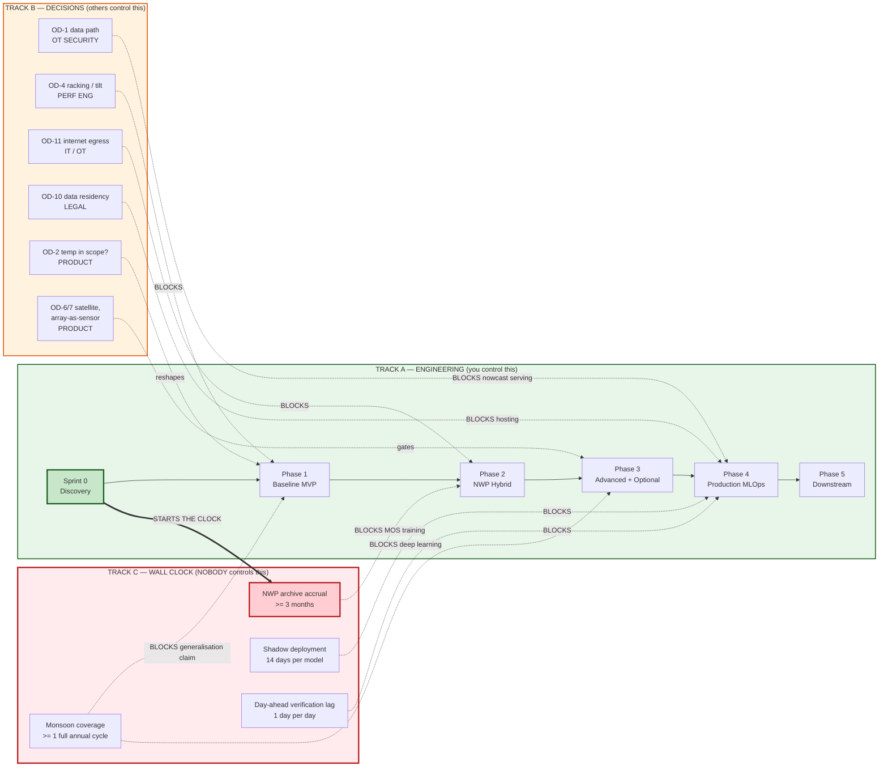
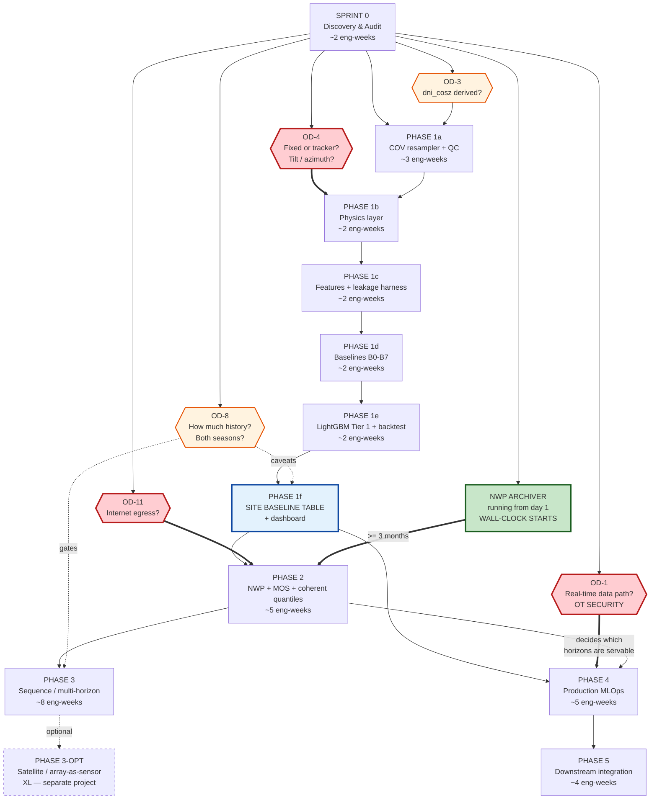
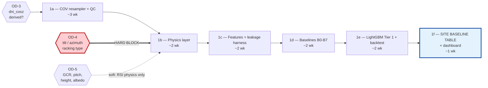
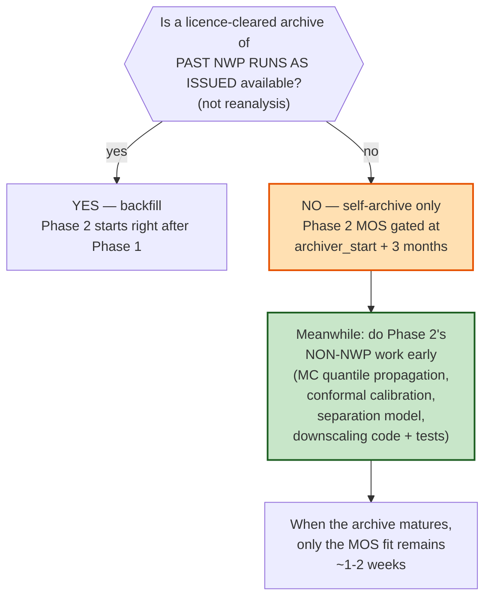
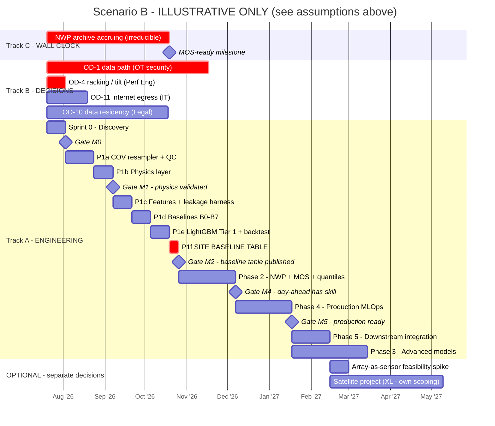

# ROADMAP — Multi-Horizon Probabilistic Irradiance Forecasting System (PLTS)

**File:** `ROADMAP_Forecasting_Irradiance_ML.md`
**Companions:**
- `PRD_Forecasting_Irradiance_ML.md` — scope, requirements, rationale, source-document audit
- `MASTER_CONTEXT_Forecasting_Irradiance_ML.md` — normative implementation rules (ADRs, contracts, agent instructions)

**Precedence:** on *scope and priority*, the PRD wins. On *implementation detail*, the Master Context wins. On *sequencing, gates and contingency*, **this document wins.**

> **Assumption labels:** `[C]` Confirmed · `[A]` Assumed · `[TBC]` To Be Confirmed.

---

## 0. How to read this document

This is not a Gantt chart with dates painted on it. It is three things:

1. **A dependency graph** — what genuinely blocks what, and what merely *looks* like it does.
2. **A gate schedule** — the decisions that must be made, by whom, before the next phase can start.
3. **A contingency plan** — §14 is the most important section in this document. It answers *"what do we do if the open decisions come back badly?"*, which is the question every roadmap avoids and every project eventually has to answer anyway.

**If you read only one section, read §14.** If you read two, read §5 (the critical path is not engineering — it is decisions and wall-clock).

---

## 1. Roadmap Principles

| # | Principle | Consequence |
|---|---|---|
| RP-1 | **Discovery before modelling.** | No model — not even persistence — is built until Sprint 0 answers what the data actually is. §7. |
| RP-2 | **Baselines before candidates.** | Phase 1 ships a *baseline table*, not a model. That table is the reference against which every future claim is measured (ADR-006). |
| RP-3 | **Effort is estimated; calendar is not.** | Estimates are in **engineer-weeks**, under a stated assumption (§2). Calendar duration is dominated by decision lead times and wall-clock data accrual, neither of which the engineering team controls. |
| RP-4 | **Some things cannot be bought with headcount.** | Three months of NWP archive takes three months. A monsoon season takes a monsoon season. See the wall-clock track, §3. |
| RP-5 | **Every phase has an anti-scope.** | What a phase *deliberately does not do* is stated. Scope creep in Phase 1 is how Phase 2 never happens. |
| RP-6 | **A phase can exit with a negative result.** | "Sequence models evaluated; rejected; here is the evidence" is a **successful** Phase-3 exit (ADR-006, MS-08). |
| RP-7 | **No accuracy number is quoted before Phase 1 closes.** | CF-14. This applies to the roadmap too: there is no "target nRMSE by Q4" anywhere in this document, and there will not be one. |
| RP-8 | **Decisions are tracked as work.** | OD-1…OD-13 have owners and appear on the board. An un-owned decision is a decision that will not be made. |

---

## 2. Estimation Basis

**All effort figures below rest on this assumption. If it is wrong, the figures are wrong.** `[A]`

| Assumption | Value |
|---|---|
| Team | **1.0 FTE senior ML engineer + 0.5 FTE data engineer** |
| Supporting roles | Performance Engineer (~0.25), O&M (ad hoc), OT Security (ad hoc), DevOps (~0.25 in Phase 4), Product (~0.15) |
| Data access | Historical data is **already accessible** for offline work (a CSV export is sufficient for Phases 0–3 backtesting) |
| Unit | **Engineer-weeks** — one engineer, one week, working on this and not on three other things |
| **Excluded from every estimate** | Procurement · **OT security approval** · stakeholder decision lead time · sensor recalibration · **wall-clock data accrual** |

### 2.1 Why calendar duration is not estimated here

Three of the four items on the *excluded* list are on the **critical path** (§5). Converting engineer-weeks into a delivery date without knowing how long OT security takes to approve a data path would be arithmetic dressed up as a commitment.

§13 gives **three conditional scenarios** instead. Pick the one that matches reality once OD-1, OD-8 and OD-11 are answered.

### 2.2 Complexity scale

| Symbol | Engineer-weeks | Meaning |
|---|---|---|
| **S** | 1–3 | One person, a couple of weeks, low uncertainty |
| **M** | 4–6 | Known shape, some unknowns |
| **L** | 6–10 | Multiple interacting components, real uncertainty |
| **XL** | >10 | A project in its own right; needs its own scoping and probably its own specialist |

---

## 3. The Three Tracks

Most roadmaps have one track (engineering) and are surprised when it stalls. This one has three, and **the engineering track is rarely the binding constraint.**



### 3.1 Track C — the one that gets forgotten

| Wall-clock dependency | Duration | Can it be compressed? |
|---|---|---|
| **NWP archive → ≥3 months of matched (forecast, actual) pairs for MOS** | 3 months from the day the archiver starts | **Only by backfilling** from an archive of *past runs as issued* — see BR-03. **Not by hiring.** ECMWF Open Data retains only ~12 runs (≈2–3 days); what was not captured is gone. |
| **Monsoon coverage → ≥1 full annual cycle for an honest unseen-season test** | Up to 12 months, depending on existing history (OD-8) | **Only by having the history already.** Otherwise the only compression is to *not claim* generalisation you cannot demonstrate. |
| **Shadow deployment** | 14 days per promoted model (config) | Shortening it is a decision to accept more risk, not an optimisation. |
| **Day-ahead verification lag** | 1 day of evidence per day of operation | Irreducible. A D+1 forecast cannot be scored before D+1 arrives. |

> ### The single most consequential line in this roadmap
>
> **The NWP archiver must start in Sprint 0 — before any modelling, before anyone consumes it, before Phase 2 is even approved.**
>
> It costs one cron job and a disk. It buys three months of calendar time that **cannot be bought any other way**. Every week it is not running is a week of Phase-2 training data destroyed permanently.
>
> This is the highest return-on-effort item in the entire programme, and it is trivially easy to postpone because nothing depends on it *yet*.

---

## 4. Phase Dependency Graph

Solid arrow = hard dependency. Dashed = soft (can start, cannot *finish*). Red = external blocker.



### 4.1 What is *not* a dependency (and is often mistaken for one)

| Common belief | Reality |
|---|---|
| *"We need the real-time data path before we can start."* | **No.** Phases 0–3 are entirely offline/backtest work. A CSV export is enough. OD-1 only decides which horizons are **operationally served** in Phase 4. **Do not let OT approval block the build.** |
| *"We need NWP before we can forecast anything."* | **No.** Phase 1 nowcasting is sensor-only. NWP buys intra-day and day-ahead. |
| *"We need to know if it's bifacial before we can start."* | **No.** RSI = rear-side is `[C]`. The *geometry* (OD-5) gates the RSI **physics baseline** only. The RSI linear baseline and direct-ML path work without it, with a documented caveat. |
| *"We need the satellite decision before Phase 3."* | **No.** Phase-3 core (sequence + multi-horizon) is independent. The satellite work is a **separate project** (§12.2). |
| *"Deep learning is the goal, so let's get to Phase 3 fast."* | **No.** Phase 3 may correctly conclude that deep learning **loses** to LightGBM on this site (MS-10). Rushing there does not change that outcome; it just means you learn it more expensively. |

---

## 5. The Critical Path

**The critical path runs through Track B and Track C, not Track A.**

```
  OD-4 (racking / tilt / azimuth)  ──► Phase 1b physics ──► everything downstream
        ▲ owner: Performance Engineer. Requires: a drawing and a datasheet.
        ▲ Effort: hours. Lead time: DAYS TO WEEKS, because it depends on someone else.

  NWP ARCHIVER START  ──►  +3 months  ──►  Phase 2 MOS training
        ▲ owner: Data Engineer. Requires: a cron job.
        ▲ Effort: HOURS. Lead time: THREE MONTHS OF CALENDAR, and it does not start until you start it.

  OD-1 (data path)  ──►  Phase 4 horizon servability
        ▲ owner: OT Security. Requires: a meeting and a policy decision.
        ▲ Effort: zero engineering. Lead time: UNBOUNDED. Escalate on day one.
```

### 5.1 Consequences

1. **Start the NWP archiver on day one.** Not "once Phase 2 is approved". Not "once we know we need NWP". **Day one.** It is the only item where a few hours of work today saves three months later.
2. **Escalate OD-1 to OT security on day one,** even though nothing is blocked by it yet. It has the longest and least predictable lead time of anything in the programme.
3. **Chase OD-4 in Sprint 0.** It is a drawing and a datasheet, and it blocks the entire physics layer. If nobody knows whether the array is on trackers, that is itself an important finding.
4. **Adding engineers does not compress the critical path.** It compresses Phase 1 and Phase 3 — neither of which is the constraint.

---

## 6. Milestones and Gates

Each gate is a **go/no-go**, not a status update. A gate that everyone passes is not a gate.

| ID | Milestone | Gate criteria (ALL must hold) | Owner | If it fails |
|---|---|---|---|---|
| **M0** | **Sprint 0 complete — "we know what we have"** | ① NWP archiver running and growing · ② `canonical_freq` **justified by measured COV inter-arrival stats**, not chosen · ③ `dni_cosz` derived-vs-measured **answered** · ④ `site_configuration` populated (or every gap has a named owner + date) · ⑤ historical coverage audited · ⑥ CI green with the **leakage harness** in place · ⑦ OD-1 formally escalated | Data Eng + Product | **Do not proceed to Phase 1.** Building a physics layer on unknown geometry produces plausible, confident, wrong numbers. |
| **M1** | **Physics layer validated** | ① Solar position matches a reference SPA to <0.01° · ② Clear-sky model **validated against detected on-site clear-sky periods**, site correction fitted if needed (ADR-004a) · ③ Transposition bake-off run **against the measured POA sensor**; winner and residual reported · ④ `infinite_sheds` rear baseline runs (or is formally disabled with a logged reason per KU-06) | Perf Eng + ML Eng | Physics is wrong ⇒ `k_c` is wrong ⇒ **every target is wrong**. Fix before proceeding. |
| **M2** | **THE SITE BASELINE TABLE** — *the single most important artefact in the programme* | ① All of B0–B7 implemented against the `ForecastModel` contract · ② Backtested on an out-of-time set · ③ Metrics reported **per target × horizon × regime**, daylight-filtered, with the nRMSE denominator stated · ④ Published as `docs/site_baseline_report.md` | ML Eng | **Everything after this is measured against this table.** Without it, no accuracy claim in this programme is falsifiable (CF-14). |
| **M3** | **Tier-1 model beats smart persistence** | ① Positive skill vs **B1**, with **statistical significance** (Diebold–Mariano) · ② `failure_cells` reported — every (horizon, regime) where it **loses** · ③ Leakage suite green · ④ Human approval recorded | ML Eng + ML Lead | **This is an acceptable failure.** If LightGBM cannot beat smart persistence at 5–15 min, that is a *finding about the physics*, not a bug. Report it, and shift the value story to the longer horizons and to uncertainty calibration. |
| **M4** | **Day-ahead has real skill** | ① ≥3 months of archived NWP · ② MOS trained on **forecast**→actual pairs (**never on reanalysis**) · ③ Positive skill vs diurnal climatology on D+1 · ④ Coverage within tolerance **per regime** | ML Eng | If NWP is unavailable (OD-11 = no), this milestone is **cancelled, not delayed**. See BR-02. |
| **M5** | **Production-ready** | ① Chaos suite green — including the **COV silent-death** case · ② Rollback demonstrated <5 min · ③ Every alert has an owner **and a runbook** · ④ `served` flags set honestly per OD-1 · ⑤ Data residency resolved (OD-10) · ⑥ No write path to OT exists in the code | DevOps + OT Security | Do not go live. A forecasting system that fails silently is worse than no forecasting system, because people will act on it. |
| **M6** | **Downstream integrated** | ① BESS/dispatch consuming the API · ② **Consumers formally onboarded to the caveats** (R-19) — especially that RSI is a single-point sensor and P50 is not a guarantee · ③ Feedback loop to M2/M3/M8 modules live | Product | An API key handed to someone who thinks P50 is a promise is a liability, not an integration. |

---

## 7. Sprint 0 — "Find out what we actually have"

**Effort: ~2 engineer-weeks. Models built: zero. That is deliberate.**

> The most common failure mode in projects like this: start with LightGBM on whatever CSV is lying around, and discover four months later that the timestep was fiction, the DNI channel was derived, and the array is on trackers.

| # | Task | Deliverable | Effort | Owner | Blocks |
|---|---|---|---|---|---|
| **S0-1** | **Start the NWP archiver.** Cron → ECMWF Open Data (IFS + AIFS) for the site grid cell → Parquet. Record `issue_time`, `valid_time`, **`retrieved_at_utc`** as three separate columns. | A growing archive; `src/ingestion/nwp_archiver.py` | 0.5 wk | Data Eng | **Phase 2 (wall-clock).** DO THIS FIRST. |
| **S0-2** | **COV characterisation.** Per tag: recover the **deadband** from the floor of the `\|Δvalue\|` distribution; inter-arrival p50/p90/p99; max observed gap; heartbeat/max-report-time. | `docs/phase0_cov_characterisation.md` + a **data-backed** `canonical_freq` | 0.75 wk | Data Eng | **Everything.** The real resolution is not the claimed resolution. |
| **S0-3** | **The `dni_cosz` test.** Compute `r = GHI − DHI − DNI_cosZ` over all history. Is `\|r\|` ≈ 0 to machine precision (⇒ **derived**), or a realistic distribution with structure vs zenith (⇒ **measured**)? | One plot; one boolean in `sensor_metadata.is_derived_tag` | **0.05 wk** | Perf Eng | Half the QC design. **Ten minutes of work; settles OD-3.** |
| **S0-4** | **Site metadata audit.** Coordinates, altitude, timezone, racking type, tilt/azimuth, POA co-planarity, GCR, row pitch, module height, bifaciality, RSI mounting position, albedometer?, sensor classes, calibration status. | Populated `site_configuration` + `sensor_metadata` | 0.5 wk | Perf Eng + O&M | **Phase 1b physics.** The code **refuses to start** without lat/lon/alt/tz (FR-004). |
| **S0-5** | **Historical coverage audit.** How many months? **Which seasons — determined from the data's own regime distribution, not from a textbook** (see the box below). Gap profile. Maintenance/outage periods. Curtailment periods. | `docs/phase0_data_audit.md` | 0.5 wk | Data Eng | The honesty of every generalisation claim (ML-002). |
| **S0-6** | **Repo skeleton + CI + the leakage harness.** | Green CI on an empty pipeline; `tests/leakage/test_no_future_leakage.py` | 0.5 wk | ML Eng | **Write the test that makes the project safe *before* the code that could break it.** |
| **S0-7** | **Escalate OD-1 to OT security.** A meeting, and a written answer on what data path is achievable and at what cadence/latency. | A written decision, or a date for one | 0.1 wk | Product | **Phase 4 servability. Longest lead time in the programme. Start it now.** |

### 7.0.1 Execution status — 2026-07-17

> **Snapshot:** 2026-07-17 05:55 UTC. Legend: ✅ complete · 🟡 in progress · ⏭️ ready to start · ⬜ not started. Green means the deliverable **and** its acceptance evidence exist; it does not mean “the code was written.”

| ID | Status | Verified progress | Remaining gate / next action |
|---|---|---|---|
| **S0-1** | 🟡 **Implementation and activation complete; final observation pending** | IFS + AIFS archiver, NWP schema, hourly GitHub Actions workflow, and three separate UTC timestamps are implemented. **117 local tests pass**. Manual smoke, full, and catch-up runs succeeded. The Shared Drive has **11 IFS + 11 AIFS production issue cycles** with paired Parquet/manifests. Scheduler is enabled at `gdrive:nwp`. | Verify two successive ECMWF issue cycles produced by `schedule` after the Shared Drive cutover/enable at **2026-07-17 05:40 UTC**. Older scheduled runs and manual catch-up are evidence of functionality, not this post-cutover observation gate. |
| **S0-2** | ⏭️ **Ready — start now** | Raw inventory: **145 readable ZIPs**, **170 CSV entries**, **163 populated**, **7 empty**, **136 unique tags**, EMI01–EMI05 recognised. EMI05 aliases are confirmed. | Characterise COV per tag, report empty-file exceptions, publish `docs/phase0_cov_characterisation.md`, and choose `canonical_freq` from measured inter-arrival/deadband evidence. |
| **S0-3** | ⬜ **Not started** | GHI, DHI, and DNI·cosZ history is available. | Run the residual-versus-zenith test, publish one plot, and set `sensor_metadata.is_derived_tag`. |
| **S0-4** | 🟡 **Partial** | Core site facts and specification sources have been supplied; only lat/lon/elevation/timezone are currently in repository config. | Populate complete `site_configuration` + `sensor_metadata`, including calculated/recorded GCR and bifaciality, RSI mounting, sensor serial/class/calibration data, and owner/date for each remaining null. |
| **S0-5** | ⬜ **Not started** | Historical raw files are available. | Audit coverage/gaps/outages/curtailment and derive the site's monthly `k_c`, variability, and regime distributions; publish `docs/phase0_data_audit.md`. |
| **S0-6** | 🟡 **Partial** | Repository skeleton and NWP-specific test suite exist; **117 tests pass locally**. | Add general CI plus `tests/leakage/test_no_future_leakage.py`, then record a green CI run. |
| **S0-7** | ⬜ **Not started / unresolved** | The current offline/manual SCADA export path is understood. | Obtain a written OT-security decision—or a named owner and decision date—covering achievable production path, cadence, and latency. |

**Gate decision:** M0 is **not passed (0/7 fully accepted)**. **GO for S0-2 now**, in parallel with the S0-1 observation window. **NO-GO for Phase 1 and for any model.**

> ### Do not assume Indonesia's monsoon calendar. Measure it.
>
> "Wet season = November–March" is **wrong for large parts of Indonesia.** The archipelago has (at least) three distinct rainfall regimes: **monsoonal** (Java, Nusa Tenggara, southern Kalimantan — one wet peak around Dec–Feb), **equatorial** (Sumatra, central Kalimantan — *two* rainfall peaks per year), and **anti-monsoonal / local** (parts of Maluku — wettest in **June–August**, the exact inverse).
>
> The site location is `[TBC]` (KU-01). **Assuming a monsoon calendar and designing the train/test split around it is how you build an "unseen-season test" that isn't one.**
>
> **S0-5 must therefore derive the site's own seasonal cloud-regime profile from the data** — monthly distributions of `k_c`, of `k_c` variability, and of the rule-based regime labels — and that empirical profile, not the calendar, defines what "unseen season" means for this site (ML-002).

### 7.1 Sprint 0 exit = Gate M0

Sprint 0 is complete when **every** M0 criterion holds. If `site_configuration` still has nulls, Sprint 0 is not complete — it is complete when each remaining null **has a named owner and a date**.

---

## 8. Phase 0 — Discovery & Data Audit

**Phase 0 ≈ Sprint 0, plus the decision work that is not engineering effort.**

| Field | Content |
|---|---|
| **Definition of Ready** | Access to a historical data extract · access to layout drawings and instrument datasheets · a named Performance Engineer · a scheduled OT security conversation |
| **Scope** | Everything in §7 |
| **Deliverables** | `docs/phase0_data_audit.md` · `docs/phase0_cov_characterisation.md` · populated `site_configuration` + `sensor_metadata` · **a running NWP archiver** · a data-backed `canonical_freq` · the site's **empirical** seasonal regime profile |
| **Exit criteria** | **Gate M0** (§6) |
| **Engineering effort** | **S — ~2–3 engineer-weeks** |
| **Non-engineering lead time** | **Unbounded.** OT security (OD-1), legal (OD-10), and asset-owner decisions (OD-2, OD-9) run on their own clocks. |
| **Risks addressed** | R-07 (coverage) · R-12 (`dni_cosz`) · R-13 (orientation metadata) · R-21 (COV deadband) · R-22 (data path) · R-23 (NWP archive) |
| **Risks introduced** | **RR-01:** the temptation to skip straight to modelling because "we already have the data". |
| **Roles** | Data Eng (lead) · Perf Eng · O&M · OT Security · Product |
| **ANTI-SCOPE — deliberately NOT done** | ❌ No model. Not even persistence. ❌ No feature engineering. ❌ No "quick LightGBM to see what we get". ❌ No dashboard. |

> **Why the anti-scope is enforced.** A "quick LightGBM to see what we get", run before `canonical_freq` is known, produces a number. That number will be quoted in a meeting. It will then be very hard to un-quote when Sprint 0 reveals that the timestep it assumed does not exist. **The cost of Sprint 0 is two weeks. The cost of skipping it is a wrong number that people believe.**

---

## 9. Phase 1 — Baseline MVP

**This is the phase that produces the artefact everything else is measured against: the site baseline table.**

Phase 1 is not one lump of work. It has a genuine internal DAG, and getting the order wrong wastes weeks.



### 9.1 Work breakdown

| Sprint | Scope | Deliverable | Effort | Depends on |
|---|---|---|---|---|
| **1a** | **COV resampler** (ZOH / trapezoid time-weighted, ADR-012) · **full QC pipeline** (DQ-01…DQ-20, wrapping `pvanalytics`) · DQ state machine · cross-channel liveness (COV silent-death) · **hypothesis property tests** | Silver layer producing a clean canonical grid; `docs/` note on measured reconstruction error vs deadband | **3 wk** | S0-2, OD-3 |
| **1b** | **Physics layer:** solar geometry (pvlib) · **clear-sky validation against detected clear periods + fitted site correction** (ADR-004a) · **transposition bake-off against the measured POA sensor** (Perez vs Hay-Davies vs isotropic vs Klucher) · `infinite_sheds` rear baseline with **fitted `shade_factor` and fitted monthly albedo** | `docs/transposition_bakeoff.md` · `docs/clearsky_validation.md` · **Gate M1** | **2 wk** | **OD-4 (hard)**, OD-5 (soft, RSI only) |
| **1c** | **Feature builder** — the *one* function used by both training and inference (C-11) · time-based lags and rolling windows only (C-13) · **the correct wind u/v** (§8.3 MC) · regime classifier · **leakage harness green on every feature** | `src/features/builder.py` + `tests/leakage/` green | **2 wk** | 1b |
| **1d** | **All eight baselines** against the `ForecastModel` contract: B0 naive · B1 smart · **B2 damped/optimal** · B3 diurnal climatology · B4 clear-sky · B5 NWP-raw (stub until Phase 2) · **B6 two-state (Paulescu)** · **B7 CH-PeEn (probabilistic)** | `src/models/baselines/` | **2 wk** | 1c |
| **1e** | **LightGBM Tier 1**, quantile, per `(primitive, horizon, quantile)` · rolling-origin backtest · Diebold–Mariano · per-regime slicing · `failure_cells` | Backtest report; **Gate M3** | **2 wk** | 1d |
| **1f** | **THE SITE BASELINE TABLE** · Streamlit dashboard (21 panels) · CI hardening | **`docs/site_baseline_report.md`** — **Gate M2** | **1 wk** | 1e |

**Total: ~12 engineer-weeks** — above the PRD's "L (6–10)" estimate. The PRD figure assumed no transposition bake-off and no two-state model; both were added by the audit. **The honest number is 10–12.** *(This is exactly the kind of estimate revision that should be visible rather than absorbed.)*

### 9.2 Phase 1 detail

| Field | Content |
|---|---|
| **Definition of Ready** | Gate M0 passed · **OD-4 answered** · historical extract available locally |
| **Exit criteria** | AC-001…AC-014, AC-021, AC-022 · **Gates M1, M2, M3** · `docs/site_baseline_report.md` published |
| **Complexity** | **L — 10–12 engineer-weeks** |
| **Risks addressed** | R-08 (convective under-representation — now *measured* rather than feared) · R-16 (nighttime metric inflation) · R-02 (soiling — DQ-18 goes live) |
| **Risks introduced** | **RR-02:** the transposition bake-off produces a surprising winner and nobody believes it. *Mitigation:* it is validated against a **real sensor**, not a paper. Publish the residuals. |
| **Roles** | ML Eng (lead) · Data Eng (1a) · Perf Eng (1b, and sign-off on M2) |
| **ANTI-SCOPE** | ❌ No NWP modelling (the **archiver** runs; the **model** does not exist yet) ❌ No LSTM/GRU/TCN ❌ No TFT ❌ No satellite ❌ No API hardening ❌ **No accuracy claims outside `site_baseline_report.md`** |

> ### The one deliverable that matters
>
> **`docs/site_baseline_report.md`** is not documentation. It is the **measuring instrument** for the rest of the programme.
>
> It states, per target × horizon × weather regime, daylight-filtered, with the nRMSE denominator named: *what smart persistence achieves at this site.*
>
> Every claim made after Phase 1 — by an engineer, by a vendor, by a consultant, by an AI assistant — is checked against this table. Before it exists, **every accuracy claim about this site is a guess**, including the ones in the source document (PRD Appendix A, Finding A-3).

---

## 10. Phase 2 — Hybrid Forecast (NWP)

| Field | Content |
|---|---|
| **Definition of Ready** | Gate M2 passed · **OD-11 answered YES (internet egress exists)** · **≥3 months of archived NWP** (or a licence-cleared backfill — BR-03) |
| **Scope** | ECMWF ingestion (IFS **and** AIFS) · **MOS / bias correction trained on forecast→actual pairs** · **separation model** to split forecast GHI into DNI/DHI (ECMWF's free tier has `ssrd` but **not** `fdir`) · **temporal downscaling of 3-hourly `ssrd` via clear-sky-index interpolation** · residual ML on the physics baseline · **Monte-Carlo propagation for coherent quantiles** (ADR-015) · conformal calibration, regime-conditional |
| **Deliverables** | Day-ahead and intra-day forecasts with **demonstrated skill vs climatology** · calibrated intervals with **per-regime coverage** |
| **Exit criteria** | AC-008, AC-024 · **Gate M4** |
| **Complexity** | **M — 5–6 engineer-weeks** |
| **Risks addressed** | R-05 (NWP latency — now *measured* from `retrieved_at_utc`) · R-06 (issue-time leakage) · R-17 (quantile miscalibration) · R-24 (haze breaking the clear-sky model) |
| **Risks introduced** | **RR-03:** MOS trained on the wrong thing. See the box below. |
| **Roles** | ML Eng · Data Eng |
| **ANTI-SCOPE** | ❌ No deep learning ❌ No satellite ❌ No new sensors |

### 10.1 Three ways to get Phase 2 wrong

| Trap | Why it is tempting | What actually happens |
|---|---|---|
| **Train the MOS on ERA5 reanalysis** | ERA5 goes back to 1940. It is *right there*. You would not have to wait three months. | **Reanalysis has assimilated the observations you are scoring it against.** The MOS coefficients fitted on reanalysis→actual describe a relationship that does not exist between forecast→actual. Deploy it and it is **badly miscalibrated in a way that looks fine in validation.** ERA5 is for climatology and non-forecast backfill. **Never for MOS.** (ADR-013.) |
| **Linearly interpolate 3-hourly `ssrd` in W/m²** | It is one line of pandas. | **It flattens the diurnal curve.** Interpolating irradiance linearly between 09:00 and 12:00 does not know the sun is climbing. The morning and afternoon shape is visibly ruined. **Correct method:** interpolate the **clear-sky index** (smooth, slowly varying), then multiply by the high-resolution clear-sky curve on the canonical grid. Small code; large error if skipped. |
| **Forget that `ssrd` is accumulated in J/m²** | The column is called "surface solar radiation downwards" and it sounds like a flux. | It is a **cumulative** field. The value at step *t* is the accumulation since the run start. **Difference consecutive steps, then divide by Δt.** Skip this and you get a monotonically increasing "irradiance" — obviously wrong, and shipped anyway more often than you would think. |

### 10.2 The Phase-2 wall-clock branch



> **Even in the bad branch, Phase 2 is not idle.** The MC quantile propagation (ADR-015), the conformal calibration, the separation model, and the downscaling code are all NWP-*shaped* but not NWP-*blocked*: they can be built and unit-tested against synthetic or reanalysis inputs. **Only the final MOS fit needs real, matured, archived forecasts.**
>
> This is why the archiver being late is *survivable*, and why the archiver never being started is not.

---

## 11. Phase 3 — Sequence, Multi-Horizon & Optional Enhancements

**Phase 3 is where an honest team is most likely to produce a negative result — and that is fine.**

| Field | Content |
|---|---|
| **Definition of Ready** | Gate M4 passed (NWP working — a TFT without known-future covariates is an expensive climatology, MS-11) · **sufficient history** (OD-8 — see the gate below) |
| **Scope (core)** | LSTM / GRU / TCN · **NHITS first, then TFT** (NHITS is far cheaper; try it before reaching for a transformer) · regime-weighted ensemble · adaptive weighting **with verification-lag enforcement** (ADR-017) |
| **Scope (optional, each a separate decision)** | **Himawari-9 satellite** (OD-6) · **array-as-sensor-network cloud motion** (OD-7) |
| **Deliverables** | **Either** a promoted advanced model, **or** a documented, evidence-backed *"evaluated; rejected; did not beat Tier 1"*. **The second is a successful outcome and must be reported as one** (RP-6, MS-08). |
| **Exit criteria** | A significance-tested comparison vs Tier 1, per horizon **and per regime** · business cases written for any optional enhancement |
| **Complexity** | **L — 6–10 engineer-weeks** (core) · **XL** (satellite — a project in its own right) |
| **Risks addressed** | R-09 (overfitting) · R-14 (partially — satellite is the only real mitigation) |
| **Risks introduced** | **RR-04:** sunk-cost pressure to promote a deep model that did not earn it. *Mitigation:* the gate is mechanical (MS-02, MS-09) and the `failure_cells` report is mandatory. |
| **Roles** | ML Eng · (+ **a remote-sensing specialist, if and only if satellite is approved**) |
| **ANTI-SCOPE** | ❌ **Do not start Phase 3 before NWP works.** ❌ Do not start the satellite project as a side-quest inside Phase 3 — it gets its own scoping. ❌ Do not promote a model because it is more sophisticated. |

### 11.1 The Phase-3 entry gate — be willing not to enter

Before spending 6–10 engineer-weeks on deep learning, check whether the preconditions for it actually exist:

| Precondition | Threshold | If not met |
|---|---|---|
| **Historical coverage** | ≥ 2 full annual cycles is comfortable; **1 cycle is marginal; <1 cycle is not enough** | **Defer Phase 3.** `pytorch-forecasting`'s own docs are blunt: with one or very few time series, they must be *very long* for deep learning to work. **This is one site.** (MS-10.) |
| **NWP working** | Gate M4 passed | **Defer Tier 3 (TFT/NHITS).** Without known-future covariates it is a climatology with a GPU bill (MS-11). Tier 2 (LSTM/GRU/TCN) can still be attempted for nowcasting. |
| **Tier 1 has been genuinely tuned** | LightGBM hyperparameters searched; feature set iterated | **Tune Tier 1 first.** An under-tuned baseline makes deep learning look good for the wrong reason. This is the single most common way a "deep learning wins" result is manufactured. |

> **A defensible Phase-3 outcome:** *"We evaluated LSTM, GRU, TCN, NHITS and TFT against a tuned LightGBM on an out-of-time test set spanning an unseen wet and dry season. None achieved a statistically significant improvement at any horizon. The ensemble weighting in ADR-017 delivered a small but significant gain at 30–120 min. We recommend not deploying the deep models, and we recommend revisiting this once ≥2 years of history has accrued."*
>
> **That paragraph is worth more than a promoted model that quietly loses on convective days.**

### 11.2 Optional enhancement — Satellite (Himawari-9)

**Scoped as a separate project. It does not belong inside Phase 3's estimate.**

| Field | Content |
|---|---|
| **Why it matters** | It is **the only realistic path to recovering the 15–120 minute skill that the missing sky camera costs us** (R-14, ADR-002). Indonesia sits under Himawari-9 (140.7°E); full-disk scan **every 10 minutes** at 0.5–2 km; free via JAXA P-Tree and NOAA/AWS mirrors. |
| **Level 1 — satellite as a *current-state* feature** | Moderate effort. A Heliosat-type GHI retrieval, or a third-party API. **Caveat:** aggregated APIs typically return **1-hourly** satellite radiation — **far too coarse for nowcasting.** Native 10-minute processing is required for real value. |
| **Level 2 — satellite *nowcast* via cloud-motion advection** | Substantial effort. **This is optical flow on images.** It is *explicitly outside the MVP* (CF-05) — and correctly so. It is a Phase-3+ project with its own business case, its own specialist, and its own decision (OD-6). |
| **Complexity** | **XL.** Do not fold it into an ML engineer's sprint. |
| **Prerequisites** | OD-6 approved · licence terms verified for **commercial** use `[TBC]` · internet egress (OD-11) · a remote-sensing specialist |
| **Honest expectation** | It will help most where the point-forecast gap is widest: **15–120 minutes.** It will not fix 5-minute convective timing. Nothing will. |

### 11.3 Optional enhancement — Array-as-sensor-network

| Field | Content |
|---|---|
| **The idea** | A large PLTS has hundreds of inverters spread over a square kilometre. **DC power across them is a coarse, distributed irradiance field.** Cross-correlate inverter DC power time series with known inverter coordinates → **cloud motion vectors — with no camera and no satellite.** |
| **Why it is interesting** | It is the **only** camera-free, satellite-free way to recover *spatial* cloud information at this site. It is absent from the source document entirely. |
| **Preconditions (all `[TBC]`)** | Inverter **geographic coordinates** (from the layout drawing) · **sub-minute DC power** (COV may actually help here — a fast-changing inverter reports often) · **clean curtailment/clipping exclusion** · a data path (OD-1) |
| **The main pitfall** | **A clipped inverter is blind to irradiance.** During clipping, DC power stops responding to irradiance changes entirely. Without rigorous clipping exclusion, the "cloud motion" you recover is an artefact of the inverter's power electronics. |
| **Complexity** | **L–XL.** Genuinely promising. Genuinely non-trivial. |
| **Recommendation** | **Fund a 2-week feasibility spike, not a project.** Take one month of inverter DC power + coordinates, compute the cross-correlation lag structure, and see whether a coherent advection velocity falls out. **If it does, it is a major finding. If it does not, you have spent two weeks.** |

---

## 12. Phase 4 — Production MLOps

| Field | Content |
|---|---|
| **Definition of Ready** | Gate M2 passed (there is something worth serving) · **OD-1 answered** (which horizons are servable) · **OD-10 answered** (where it may be hosted) |
| **Scope** | FastAPI hardening (full provenance on every row; **no stale `200`s**) · MLflow registry · Prometheus + Grafana · drift monitors (**seasonally aware — do not cry wolf every monsoon**) · retraining (scheduled / drift / performance / manual — **none auto-promotes**) · **human-gated promotion** · rollback · shadow deploy · alerting **with runbooks** |
| **Deliverables** | A production service that **degrades honestly**; runbooks; a chaos suite |
| **Exit criteria** | AC-016…AC-020, AC-023 · **Gate M5** · **chaos suite green, including the COV silent-death case** · runbooks signed off by operations |
| **Complexity** | **M — 4–6 engineer-weeks** |
| **Risks addressed** | R-10 (production degradation) · R-18 (infrastructure) · R-20 (lack of oversight) |
| **Risks introduced** | **RR-05:** shipping before the `served` flags are set honestly, so operators trust a 5-minute forecast built on 3-hour-old data. |
| **Roles** | ML Eng · DevOps · **OT Security (sign-off)** |
| **ANTI-SCOPE** | ❌ No Kubernetes ❌ No TimescaleDB ❌ No Airflow ❌ No Redis — **unless a specific, measured MVP bottleneck justifies it in an ADR** (ADR-010) |

### 12.1 The honesty checklist for go-live

Before anyone sees a forecast on a screen:

- [ ] **`served=false`** on every horizon whose data-freshness budget is not met (CON-4). The dashboard says *"backtest only — data path too slow"*, not nothing.
- [ ] **Fallback status is visible without clicking.**
- [ ] **The RSI representativeness caveat** is on the RSI panel and in the API payload (FR-020, AC-023).
- [ ] **The nRMSE denominator is printed on the metrics panel** (ML-011).
- [ ] **Chaos suite green**, including a sensor that goes *silent without erroring* — the COV case a normal test suite misses entirely.
- [ ] **`grep -r` over `src/ingestion/` finds no write path to OT** (D-11).
- [ ] **Rollback demonstrated in under five minutes**, in front of someone.
- [ ] **Every alert has a runbook.** An alert without a runbook becomes noise, then becomes muted, then becomes an incident.

---

## 13. Phase 5 — Downstream Integration

| Field | Content |
|---|---|
| **Definition of Ready** | Gate M5 passed · downstream module owners identified |
| **Scope** | BESS/dispatch contract · PV power forecast handoff · operational planning · integration with the performance-analytics modules (M2 / M3 / M8) |
| **Deliverables** | A documented, versioned downstream contract; onboarded consumers |
| **Exit criteria** | **Gate M6** |
| **Complexity** | **M — 3–5 engineer-weeks** |
| **Risks addressed** | R-19 (downstream misuse) — **this is the whole point of the phase gate** |
| **Roles** | ML Eng · BESS Eng · Product |
| **ANTI-SCOPE** | ❌ **Do not build the BESS dispatch logic.** This product stops at irradiance (NG-4, NG-5). |

### 13.1 The consumer onboarding gate

> **Nobody gets an API key until they have been onboarded to the caveats.**

| Caveat | What the consumer must acknowledge |
|---|---|
| **P50 is a median, not a guarantee.** | Half the time the actual will be below it. That is what a median *is*. If your logic breaks when the actual is below P50, your logic is wrong. |
| **RSI is a single-point sensor reading.** | It is **not** the array-average rear irradiance. Using it as a bifacial-gain proxy requires a separate spatial-calibration study that has not been done (ADR-014). |
| **The P10–P90 band is the product.** | On a convective day it will be wide. **That width is information, not a defect.** Narrow it yourself at your own risk. |
| **`fallback_used=true` means the model did not run.** | The number is still a number, but it is a *different* number with a *different* error distribution. Check the flag. |
| **`served=false` means backtest-only.** | Do not build an operational dependency on a horizon the data path cannot support. |

**A P50 handed to someone who believes it is a promise is worse than no forecast at all**, because they will size a battery to it.

---

## 14. Contingency — What If the Open Decisions Come Back Badly

> **This is the section every roadmap should have and almost none do.**
>
> The plan above assumes the open decisions resolve favourably. **They might not.** Below is what to do in each case — *decided in advance, calmly, rather than in a meeting in four months' time.*

### BR-01 — OD-1 comes back: *"Manual CSV only. No real-time path will be approved."*

| | |
|---|---|
| **Probability** | **Moderate-to-high** `[A]`. OT segmentation policies rarely soften quickly, and the programme's existing constraint is manual CSV ingestion. |
| **Impact** | **Nowcasting (5–120 min) is no longer an operational product.** You cannot serve a 15-minute forecast from data that arrives in a daily batch. |
| **What survives** | 🟢 **Day-ahead and intra-day** — these tolerate hours of data latency. NWP-driven D+1 issued once a day is perfectly viable from a daily CSV. 🟢 **The entire QC / sensor-health system** (DQ-01…DQ-20) — arguably the highest-ROI part of the build, and it works fine on batch data. 🟢 **Backtesting and research.** 🟢 **The baseline table.** |
| **What dies** | 🔴 Operational nowcasting. All horizons <6 h are `served=false`. |
| **The plan** | **1.** Re-scope the product as **"Day-Ahead Forecasting + Sensor Health Surveillance"**. That is still a genuinely valuable product and it is honestly deliverable. **2.** Keep every nowcast horizon in the backtest, so that **the day the data path changes, they light up with zero rework.** **3.** Quantify what is being lost — *"with a 1-minute path, the 30-minute forecast would deliver X% skill; today it delivers nothing"* — and put that number in front of the person who can approve the path. **A concrete number is the only thing that moves an OT policy.** |
| **Do NOT** | ❌ Serve a "5-minute forecast" from hours-old data because the pipeline technically produces one. That is the failure mode this entire architecture's `served` flag exists to prevent. |

### BR-02 — OD-11 comes back: *"No internet egress. Ever."*

| | |
|---|---|
| **Impact** | **No NWP.** Phase 2 has no content. **Day-ahead collapses to diurnal climatology.** |
| **What survives** | 🟢 Nowcasting (sensor-only — this is what ADR-001 was designed for). 🟢 QC / sensor health. 🟢 The clear-sky model (Ineichen works offline; **McClear does not** — accept the haze risk R-24 and monitor it). |
| **What dies** | 🔴 Day-ahead skill. 🔴 Intra-day skill beyond ~2 h. 🔴 **Tier 3 (TFT/NHITS) becomes pointless** — no known-future covariates (MS-11). |
| **The plan** | **1.** **Gate M4 is cancelled, not postponed.** Say so. **2.** Re-scope to **"Nowcasting + Sensor Health"**, with day-ahead served as *explicitly-labelled climatology* — which is still better than nothing and still honest. **3.** Investigate a **one-way NWP ingress**: a file drop onto a DMZ share, refreshed by a machine that *does* have egress. This is a far softer ask than bidirectional internet and OT teams often accept it. **4.** If even that fails, the value story rests on nowcasting and QC — and that is a **narrower but still defensible product.** |

### BR-03 — OD-8 comes back: *"We have 5 months of history."*

| | |
|---|---|
| **Impact** | **No unseen-season test is possible.** No defensible generalisation claim. |
| **What survives** | 🟢 Everything, technically. The models will train. They will produce numbers. |
| **What dies** | 🔴 **Confidence in those numbers.** A model validated only within a single season may collapse when the season turns — and you will not know until it does. 🔴 Phase 3 (deep learning) — MS-10's precondition is not met. |
| **The plan** | **1. Do not pretend.** `site_baseline_report.md` states, in bold, that no unseen-season test was possible, and **every downstream claim inherits that caveat.** **2.** Ship Phase 1 anyway — the baseline table is still worth having, and the QC pipeline is season-independent. **3. Defer Phase 3** until ≥1 full annual cycle has accrued. Write this down; it will be forgotten otherwise. **4.** Schedule a **mandatory re-validation** at the first season turn, with a pre-registered expectation. **If skill collapses, that is the finding — and you predicted it.** **5.** Meanwhile, use the accruing data: the model retrains monthly, and the drift monitor is watching. |
| **Do NOT** | ❌ Present a within-season backtest as evidence of generalisation. ❌ Train a TFT on 5 months of one site and promote it. |

### BR-04 — OD-3 comes back: *"`dni_cosz` is a derived tag: `GHI − DHI`."*

| | |
|---|---|
| **Impact** | The three-instrument closure check is **circular**. It provides **zero** QC value. `dni_cosz` is redundant as a target. |
| **The plan** | **1.** Drop `dni_cosz` as an independent forecast target — it is already derived by construction under ADR-011, so **nothing changes in the model architecture.** (This is a nice consequence of having chosen the primitive decomposition.) **2. Delete DQ-14** (BSRN closure) from the QC suite, and **say why** — a check that cannot fail is worse than no check, because it creates false confidence. **3.** Replace the lost QC signal with: clear-sky comparison (DQ-17), drift on clear periods (DQ-18), and the POA-vs-physics residual (DQ-15). **These still work.** **4.** Record it in `sensor_metadata.is_derived_tag` so nobody rediscovers this in a year. |
| **Silver lining** | The primitive decomposition (ADR-011) means this costs almost nothing architecturally. **Had we forecast five channels independently and "reconciled" afterwards — as the source document proposes — this discovery would have invalidated a chunk of the design.** |

### BR-05 — OD-4 comes back: *"Single-axis trackers, and the POA sensor is on a fixed reference plane."*

| | |
|---|---|
| **Impact** | `r_poa = POA_measured / POA_physics` compares a **fixed-plane sensor** against **tracking-plane physics**. The ratio is **meaningless.** |
| **The plan** | **1.** Compute `POA_physics` **on the sensor's plane**, not the array's — `r_poa` then measures transposition error correctly. **2.** Compute a **separate** array-plane POA from the tracker angle (measured, or modelled via `pvlib.tracking.singleaxis`) for downstream consumers. **3. Two POA outputs, clearly named:** `poa_sensor_wm2` and `poa_array_wm2`. **Do not silently conflate them** — that error propagates straight into every PR calculation downstream. **4.** If the tracker angle is not available in the data, this becomes a **new blocking unknown** — escalate it. |

### BR-06 — The COV deadband turns out to be large (e.g. 20 W/m²)

| | |
|---|---|
| **Impact** | A 1-minute canonical grid is a fiction. The effective resolution is far coarser than "real-time". Reconstruction error is bounded at ~20 W/m² **regardless of method**. |
| **The plan** | **1. Coarsen `canonical_freq`** to whatever the inter-arrival statistics actually support. **Say so publicly.** **2. Re-examine the short horizons.** If the effective resolution is 5 minutes, a 5-minute-ahead forecast is a one-step-ahead forecast from a noisy observation — persistence will be extremely hard to beat, and that is *physics*, not failure. **3.** Ask O&M whether the deadband can be **tightened at source.** This is often a configuration change, not a hardware change, and it may be the single cheapest accuracy improvement available to the entire programme. **4.** Put the measured deadband on the dashboard (Panel 21). Operators should be able to see the resolution they are actually getting. |

### BR-07 — Tier 1 (LightGBM) fails to beat smart persistence at 5–30 min

| | |
|---|---|
| **Probability** | **Genuinely possible**, especially at 5–15 min, and especially without imagery. |
| **Impact** | On the headline "ML beats baseline" narrative — considerable. On the *product* — much less than it sounds. |
| **The plan** | **1. Report it. Do not retry until something wins** — that is p-hacking with extra steps (MS-07, MS-08). **2. Shift the value story**, honestly: at 5–15 min the deliverable is **calibrated uncertainty** (which persistence does *not* give you) and **ramp probability** (US-13), not point accuracy. A well-calibrated P10–P90 band with a persistence P50 is a **genuinely useful product** for a BESS operator. **3.** Longer horizons (30 min – 48 h) are where ML and NWP earn their keep. That is where the skill will be. **4.** Feed the finding into the satellite business case (OD-6): *"we have demonstrated that the sensor-only ceiling at 15–60 min is X. Satellite is the only way past it."* **A measured ceiling is a much stronger argument for investment than a hopeful projection.** |

### BR-08 — Kill criteria: when to stop, or radically re-scope

> **Every programme should know in advance what would make it not worth doing. Most find out too late.**

**If ALL of the following are true simultaneously:**

- ❌ **OD-1** = manual CSV only, permanently (no nowcasting), **and**
- ❌ **OD-11** = no internet egress, permanently (no NWP, so no day-ahead), **and**
- ❌ **OD-8** = less than 6 months of history (no defensible generalisation)

**…then this is no longer a forecasting product.** With no real-time data, no NWP, and no history, the only thing left to forecast with is diurnal climatology — and you do not need a machine-learning platform for that.

**What to do instead — and this is not a consolation prize:**

**Build the QC and sensor-health system alone.** Phases 0 and 1a–1b only. Roughly **5–6 engineer-weeks.** It delivers:

- soiling and drift detection on the pyranometers (DQ-18 — a rolling `k_c` median on detected clear periods is one of the highest-ROI diagnostics available at any PV plant);
- the three-instrument closure check (if `dni_cosz` is real);
- POA-vs-physics residual monitoring;
- rear-side (`ρ`) drift as a ground-condition / albedo signal;
- a validated clear-sky model and a validated transposition model for the whole platform;
- clean, QC'd, canonically-gridded irradiance data feeding **every other module** (M2, M3, M8).

**That is a real product**, it is honestly deliverable under those constraints, and **it is worth building on its own merits.** It also leaves the forecasting system one decision away, should the constraints ever lift.

**Being able to say this in advance is what separates a roadmap from a wish.**

---

## 15. Recommended Execution Order — and why it differs from the PRD's numbering

> **The PRD numbers its phases 0–5. Those numbers are *identities*, not an *execution order*.**

**Recommended order:**

```
Phase 0  →  Phase 1  →  Phase 2  →  Phase 4  →  Phase 5  →  Phase 3
Discovery   Baseline    NWP         Production  Downstream   Advanced models
                                    ▲                        ▲
                                    │                        │
                        Get Tier 1 into production      LAST, not third
                        BEFORE chasing deep learning
```

**Rationale — three reasons, and they compound:**

1. **Phase 3 may produce nothing.** MS-10 is explicit: with one site and limited history, deep learning is *expected* to struggle against a tuned LightGBM. Spending 8 engineer-weeks on it *before* anything reaches production means the programme's first eight months could deliver zero operational value **and** a negative result. Delivering Tier 1 to production first means the negative result, when it comes, lands on top of a working system rather than instead of one.

2. **Production generates the evidence Phase 3 needs.** Real fallback-activation rates, real per-regime error distributions, real operator feedback, real drift behaviour. Phase 3's model selection is materially better-informed *after* Phase 4 than before it.

3. **Value is delivered earlier, and value that is delivered is value that is defended.** A forecasting system that operators are already using survives a budget review. One that is "still in the modelling phase" after nine months does not.

**Deviation logged.** If the PRD's numeric order is preferred for governance reasons, the dependency graph in §4 still holds — but this recommendation should be actively overridden, not passively ignored.

---

## 16. The Timing Coincidence That Is Not a Coincidence

> ### Start the archiver in Sprint 0, and it matures **exactly** when Phase 2 needs it.

| Week | Engineering track | NWP archive age |
|---|---|---|
| 0 | **Sprint 0 begins — archiver starts** | 0 |
| 2 | Sprint 0 ends (Gate M0) | 2 weeks |
| 2–14 | **Phase 1 — Baseline MVP** (12 weeks) | growing |
| **~13** | *(still in Phase 1)* | **≈ 3 months ✅ MOS-ready** |
| 14 | Phase 1 ends (Gate M2) | ~14 weeks |
| **14** | **Phase 2 begins** | **archive is already mature — zero waiting** |

**Now the counterfactual.** Start the archiver *when Phase 2 starts* — which is the natural, sensible-seeming thing to do, because that is when you first need it:

| Week | Engineering track | NWP archive age |
|---|---|---|
| 14 | Phase 2 begins — archiver starts | 0 |
| 14–27 | **NOTHING HAPPENS.** The team waits. | growing |
| 27 | Archive reaches 3 months | ✅ |
| 27 | Phase 2 can finally train the MOS | — |

**Cost of that entirely reasonable decision: 13 weeks of programme delay.**
**Cost of avoiding it: one cron job, on day one, before anyone needs it.**

This is the clearest illustration in the whole programme of why Track C (§3) exists as a separate track. **Wall-clock dependencies do not announce themselves. They are only visible if you go looking for them, and by the time they bite, it is too late to do anything about it.**

---

## 17. Illustrative Schedule — Scenario B (base case)

> ⚠️ **ILLUSTRATIVE ONLY.** This Gantt is the arithmetic consequence of §2's stated assumptions. It is **not a commitment.** Change the team size, the decision lead times, or the history available, and it changes. Its purpose is to show **shape and sequence**, not dates.
>
> **Scenario B assumptions:** 1.0 FTE ML Eng + 0.5 FTE Data Eng · OD-4 answered within 2 weeks · OD-11 = yes (internet egress exists) · **no NWP backfill available** (self-archive only) · ≥14 months of history · OD-1 resolved to an SFTP push path during Phase 2 · start date 20 July 2026.



**Read the Gantt this way:**

- **The red `NWP archive` bar in Track C is the one that costs nothing and saves three months.** It runs entirely in the background of Phase 1.
- **`OD-1` runs for 120 days in Track B and blocks nothing until Phase 4.** That is exactly why it must be *started* on day one and *not worried about* in between.
- **Phase 3 sits last**, per §15.
- **The two optional enhancements sit outside the main sequence**, because they are separate decisions with separate business cases (OD-6, OD-7).

### 17.1 The other two scenarios

| | **Scenario A — favourable** | **Scenario B — base** | **Scenario C — constrained** |
|---|---|---|---|
| **OD-1 (data path)** | Real-time path already exists | SFTP push approved during Phase 2 | **Manual CSV only, permanently** |
| **OD-11 (internet)** | Yes | Yes | **No** |
| **OD-8 (history)** | ≥2 years | ~14 months | **<6 months** |
| **NWP backfill** | Available, licence cleared | Not available | N/A |
| **Effect on Phase 2** | Can start immediately after Phase 1 | Archive matures just in time (§16) | **Cancelled** (BR-02) |
| **Effect on Phase 3** | Viable | Marginal — 1 annual cycle is thin (MS-10) | **Deferred indefinitely** (BR-03) |
| **Effect on nowcasting** | Fully servable | Servable from Phase 4 | **Not an operational product** (BR-01) |
| **Product shape** | Full multi-horizon probabilistic forecasting | Full, with 5/10-min horizons phased in | **QC + sensor health only** (BR-08) |
| **Rough ML-engineer effort** | ~28 weeks | ~30 weeks | **~6 weeks** |

> **Scenario C is not a failure state.** It is a different, smaller, still-worthwhile product — and knowing that *in advance* is what allows it to be delivered well rather than discovered as a disappointment. See BR-08.

---

## 18. Effort Summary

| Phase | Complexity | ML Eng | Data Eng | Other | Total eng-weeks |
|---|---|---|---|---|---|
| **0 / Sprint 0** — Discovery | S | 0.5 | 1.75 | 0.5 (Perf, Product) | **~2.75** |
| **1** — Baseline MVP | L | 9 | 3 | 1 (Perf Eng) | **~13** |
| **2** — NWP hybrid | M | 5 | 1 | — | **~6** |
| **4** — Production MLOps | M | 4 | — | 1.5 (DevOps, OT) | **~5.5** |
| **5** — Downstream | M | 3 | — | 1 (BESS Eng, Product) | **~4** |
| **3** — Advanced models | L | 8 | — | — | **~8** |
| **CORE SUBTOTAL** (0,1,2,4,5) | | **21.5** | **5.75** | **4** | **~31** |
| **WITH Phase 3** | | **29.5** | **5.75** | **4** | **~39** |
| *Optional: array-as-sensor spike* | S | 2 | — | — | *~2* |
| *Optional: satellite project* | **XL** | 4 | 2 | **12+ (specialist)** | ***~18+ — separate funding*** |

### 18.1 Reading the effort table honestly

- **The ML engineer is the binding lane.** At 1.0 FTE and never blocked, ~30 engineer-weeks is ~30 calendar weeks. **Adding a second ML engineer does not halve it** — Phase 1's internal DAG (§9) is substantially serial, and the critical path (§5) runs through decisions and wall-clock anyway.
- **Phase 1 is 13 weeks, not the PRD's 6–10.** The audit added the transposition bake-off (M1) and the two-state baseline (B6). **The estimate went up because the scope got more honest.** This is the correct direction for an estimate to move after a design review, and it is better to see it now than in week nine.
- **The satellite project is 18+ engineer-weeks with a specialist.** It does not belong inside anyone's sprint. Fund it or do not, but do not smuggle it in.

---

## 19. Resource Loading

| Role | P0 | P1 | P2 | P4 | P5 | P3 |
|---|---|---|---|---|---|---|
| **ML Engineer (senior)** | 0.25 | **1.0** | **1.0** | 0.75 | 0.75 | **1.0** |
| **Data Engineer** | **1.0** | 0.4 | 0.25 | 0.1 | — | — |
| **Performance Engineer** | 0.5 | 0.25 | 0.1 | — | 0.1 | — |
| **O&M Engineer** | 0.25 | 0.1 | — | 0.1 | 0.1 | — |
| **OT / Network Security** | 0.1 | — | — | 0.25 | — | — |
| **DevOps** | — | 0.1 | — | 0.5 | 0.1 | — |
| **Product Owner** | 0.25 | 0.1 | 0.1 | 0.15 | 0.25 | 0.1 |
| **BESS / Dispatch Eng** | — | — | — | — | 0.5 | — |
| **Remote-sensing specialist** | — | — | — | — | — | *(only if satellite approved)* |

**Note the shape:** the **Data Engineer is the bottleneck in Phase 0**, not the ML engineer. Staffing Phase 0 with an ML engineer and no data engineer is a common and expensive mistake — Sprint 0 is almost entirely data-archaeology work.

---

## 20. RACI

**R** = Responsible · **A** = Accountable · **C** = Consulted · **I** = Informed

| Activity | ML Eng | Data Eng | Perf Eng | O&M | OT Sec | DevOps | Product | Asset Owner |
|---|---|---|---|---|---|---|---|---|
| Start NWP archiver (S0-1) | C | **R** | I | — | I | — | **A** | I |
| COV characterisation (S0-2) | C | **R** | C | C | — | — | **A** | I |
| `dni_cosz` derived test (S0-3) | C | C | **R** | C | — | — | **A** | I |
| Site metadata audit (S0-4) | C | C | **R** | **R** | — | — | **A** | C |
| Clear-sky validation (M1) | **R** | C | **A** | C | — | — | I | I |
| Transposition bake-off (M1) | **R** | — | **A** | C | — | — | I | I |
| **Site baseline table (M2)** | **R** | C | **A** | I | — | — | I | **I** |
| Model promotion (M3) | **R** | — | C | — | — | — | C | **A** |
| Data path decision (OD-1) | I | C | I | C | **R** | C | **A** | C |
| Data residency (OD-10) | I | I | — | — | C | C | **R** | **A** |
| Go-live (M5) | **R** | C | C | C | **A** | **R** | C | **A** |
| Downstream onboarding (M6) | **R** | — | C | — | — | — | **A** | I |
| Satellite go/no-go (OD-6) | C | C | C | — | — | — | **R** | **A** |
| **Scope kill / re-scope (BR-08)** | C | C | C | — | C | — | **R** | **A** |

---

## 21. Roadmap-Level Risks

*(These are distinct from the **product** risks R-01…R-25 in PRD §36. These are risks to the **plan**, not to the system.)*

| ID | Risk | P | I | Mitigation | Early warning sign |
|---|---|---|---|---|---|
| **RR-01** | **Sprint 0 is skipped** because "we already have the data" and someone wants a model this month | **H** | **H** | The Gate-M0 checklist is a hard gate. **Refuse to build a model on an unmeasured timestep.** | Anyone says *"let's just get a quick LightGBM going while we wait"* |
| **RR-02** | **The NWP archiver is postponed** because nothing depends on it yet | **H** | **H** | §16. **Make it Sprint-0 Task 1, before anything else.** Track archive size as a dashboard metric from week one. | It is not running in week 1 |
| **RR-03** | **OT approval (OD-1) is treated as a Phase-4 problem** and escalated late | **H** | **M** | Escalate in Sprint 0. It blocks nothing early — which is precisely why it gets forgotten. | It is not on anyone's calendar by end of Sprint 0 |
| **RR-04** | **Scope creep in Phase 1** — "while we're in there, let's also add an LSTM" | **H** | **M** | The Phase-1 anti-scope (§9.2) is enforced at sprint review. | Phase 1 is at week 15 and the baseline table does not exist |
| **RR-05** | **Sunk-cost promotion in Phase 3** — a deep model is promoted because eight weeks were spent on it | **M** | **H** | The gate is mechanical (MS-02, MS-09). **`failure_cells` is mandatory.** The ML Lead, not the ML Engineer, signs off. | Someone starts arguing that the significance test is "too strict" |
| **RR-06** | **Estimate anchoring** — the PRD said Phase 1 was 6–10 weeks, so 13 is treated as an overrun | **M** | **M** | §18.1. **The estimate rose because the design review found real work that was missing.** Re-baseline explicitly and say why. | Phase 1 is described as "late" in week 11 |
| **RR-07** | **A number escapes before Gate M2** — someone quotes an accuracy figure from a work-in-progress notebook | **M** | **H** | CF-14. **No accuracy claim leaves the team before `site_baseline_report.md` exists.** It is very hard to un-quote a number that has reached a steering committee. | A slide appears with an nRMSE on it |
| **RR-08** | **Downstream consumers integrate before being onboarded to the caveats** | **M** | **H** | The M6 gate (§13.1). **No API key without onboarding.** | Someone asks for "just read access to test something" |
| **RR-09** | **The team optimises for the demo, not the operator** — a beautiful dashboard over an honest fallback chain | **M** | **M** | The chaos suite is a Gate-M5 blocker (§12.1). **Fallback status is Panel 12, not a tooltip.** | The dashboard looks great and nobody has tested what happens when a sensor dies |

---

## 22. Decision → Phase Blocking Matrix

**Which open decisions block which phases.** 🔴 = hard block · 🟠 = degrades the phase · ⚪ = no effect.

| Decision | Owner | Sprint 0 | Phase 1 | Phase 2 | Phase 4 | Phase 5 | Phase 3 |
|---|---|---|---|---|---|---|---|
| **OD-1** real-time data path | **OT Security** | ⚪ | ⚪ | ⚪ | 🔴 | 🟠 | ⚪ |
| **OD-2** ambient temp in scope? | Product | ⚪ | 🟠 | 🟠 | ⚪ | 🟠 | ⚪ |
| **OD-3** `dni_cosz` derived? | Perf Eng | 🔴 *(it IS the sprint)* | 🟠 | ⚪ | ⚪ | ⚪ | ⚪ |
| **OD-4** racking / tilt / azimuth | **Perf Eng** | ⚪ | **🔴** | 🔴 | 🔴 | 🔴 | 🔴 |
| **OD-5** RSI geometry / albedo | Perf Eng | ⚪ | 🟠 *(RSI physics only)* | ⚪ | ⚪ | 🟠 | ⚪ |
| **OD-6** satellite approved? | Product | ⚪ | ⚪ | ⚪ | ⚪ | ⚪ | 🟠 *(optional scope)* |
| **OD-7** array-as-sensor approved? | Product | ⚪ | ⚪ | ⚪ | ⚪ | ⚪ | 🟠 *(optional scope)* |
| **OD-8** historical coverage | Data Eng | 🔴 *(it IS the sprint)* | 🟠 *(caveats the baseline)* | 🟠 | ⚪ | ⚪ | **🔴** |
| **OD-9** regulatory submission? | Asset Owner | ⚪ | ⚪ | 🟠 *(issuance schedule)* | 🟠 | 🟠 | ⚪ |
| **OD-10** data residency | Legal / IT | ⚪ | ⚪ | ⚪ | **🔴** | ⚪ | ⚪ |
| **OD-11** internet egress | IT / OT | ⚪ | ⚪ | **🔴** | ⚪ | ⚪ | 🟠 *(kills Tier 3)* |
| **OD-12** wind available? | O&M | ⚪ | 🟠 | ⚪ | ⚪ | ⚪ | 🟠 |
| **OD-13** COV deadband / heartbeat | Data Eng | 🔴 *(it IS the sprint)* | 🟠 | ⚪ | 🟠 *(servability)* | ⚪ | ⚪ |

### 22.1 The four to chase this week

| Priority | Decision | Why now | Effort to answer |
|---|---|---|---|
| 🥇 | **OD-4** — fixed or tracker? tilt/azimuth? | **Hard-blocks five of six phases.** It is a drawing and a datasheet. | **Hours**, once someone looks |
| 🥈 | **OD-1** — the data path | **Longest, least predictable lead time in the programme.** Blocks nothing yet, which is exactly why it is forgotten. | **Zero engineering.** One meeting, then wait. |
| 🥉 | **OD-11** — internet egress | Determines whether Phase 2 exists at all. Also a softer ask than OD-1 (egress-only, to two known endpoints). | One conversation with IT |
| 4️⃣ | **OD-8** — how much history? | Determines whether Phase 3 is worth planning. | **One query**, once you have the extract |

**Notice:** three of these four cost **almost no engineering effort** and are answered by **asking someone**. They are the highest-leverage work available right now, and they are not code.

---

## 23. Anti-Scope Summary

*(Consolidated. Print this. Pin it to the wall.)*

| Phase | Deliberately NOT done | Why |
|---|---|---|
| **0** | ❌ Any model — **not even persistence** ❌ Feature engineering ❌ "A quick LightGBM to see what we get" | A number produced before `canonical_freq` is known **will be quoted in a meeting**, and it will be very hard to un-quote (RR-01, RR-07). |
| **1** | ❌ NWP *modelling* (the **archiver** runs; the model does not exist) ❌ LSTM / GRU / TCN ❌ TFT ❌ Satellite ❌ API hardening ❌ **Any accuracy claim outside `site_baseline_report.md`** | Phase 1 has one job: **produce the measuring instrument.** Everything else is an optimisation against a number that does not exist yet. |
| **2** | ❌ Deep learning ❌ Satellite ❌ New sensors | Phase 2 has one job: **make NWP earn its keep.** |
| **4** | ❌ Kubernetes ❌ TimescaleDB ❌ Airflow ❌ Redis — **unless a measured MVP bottleneck justifies it in an ADR** | ADR-010. Every production component must be justified by a **specific, observed** limitation. Not by popularity. |
| **5** | ❌ **Building the BESS dispatch logic** | This product stops at irradiance (NG-4, NG-5). Owning the downstream decision means owning the downstream blame. |
| **3** | ❌ Promoting a model because it is sophisticated ❌ Starting the satellite work as a side-quest inside a sprint | MS-06, MS-08. **"Rejected — did not beat Tier 1" is a successful outcome.** |

---

## 24. Change Control

| Change | Requires |
|---|---|
| Re-order phases | Product Owner + ML Lead. Log the deviation and the rationale here. |
| Add scope to a phase | An entry in that phase's table **and** a corresponding effort revision. **Silent scope addition is how estimates become "overruns".** |
| Change a **Canonical Fact** (Master Context §2) | A formal decision, an entry in the MC revision log, **and** a sweep of every affected document, diagram, test and code path — **in the same change.** |
| Change an accepted **ADR** | A superseding ADR. **Never edit an accepted ADR in place** — the historical reasoning is the point. |
| Skip a **gate** | Product Owner + Asset Owner, **in writing, with the accepted risk named.** Gates exist because someone will otherwise be tempted. |
| Quote an **accuracy figure** | **Gate M2 must have passed.** No exceptions (CF-14, RR-07). |
| Re-baseline an **estimate** | State **what changed in the scope** — not just the new number. §18.1. |

---

## 25. What To Do On Monday

If you read nothing else in this document:

| # | Action | Owner | Effort | Why |
|---|---|---|---|---|
| **1** | **Start the NWP archiver.** | Data Eng | **A few hours** | It buys **three months of calendar time** that cannot be bought any other way (§16). Nothing depends on it yet. That is exactly why it will be postponed unless you do it now. |
| **2** | **Ask Performance Engineering: fixed-tilt or tracker? What tilt and azimuth? Is the POA sensor co-planar with the modules?** | Product | **One email** | **OD-4 hard-blocks five of six phases.** It is a drawing and a datasheet. |
| **3** | **Put OD-1 on OT Security's calendar.** | Product | **One meeting request** | Longest and least predictable lead time in the programme. Blocks nothing today. Blocks everything in Phase 4. |
| **4** | **Run the ten-minute `dni_cosz` test.** Compute `GHI − DHI − DNI_cosZ` on whatever history you have. | Perf Eng | **Ten minutes** | If it is zero to machine precision, the channel is derived, half the QC design is theatre, and **you want to know that now, not in month four.** |

**Nothing on that list is a model. Three of the four are not even code.**

That is not a failure of ambition. It is the recognition that on a project like this, **the expensive mistakes are made in week one and discovered in month five** — and every one of them is cheap to prevent and very costly to unwind.

---

## Revision History

| Ver | Date | Change | Approved by |
|---|---|---|---|
| 1.0 | — | Initial issue. Derived from PRD §37, expanded with dependency graph, three-track model, gates M0–M6, contingency branches BR-01…BR-08, roadmap risks RR-01…RR-09, and the recommended execution re-ordering (§15). | *pending* |
| 1.1 | 2026-07-17 | Added the evidence-backed Sprint 0 execution ledger and explicit S0-2 GO / Phase-1 NO-GO decision. No phase scope, estimate, or gate criterion changed. | *pending* |
