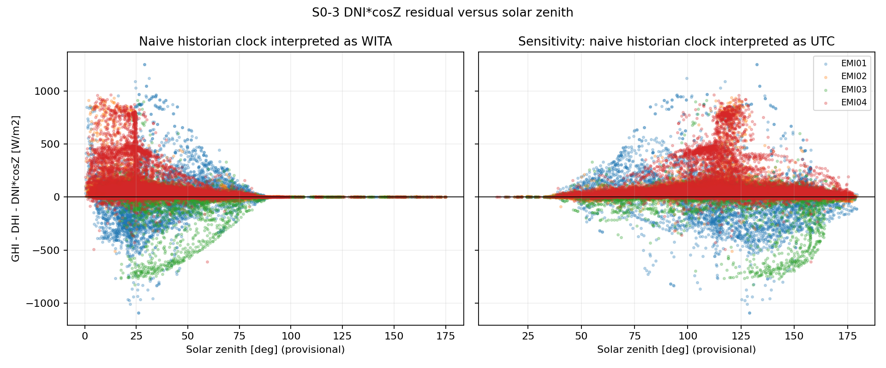

# Phase 0 DNI·cosZ Derived-versus-Measured Test

S0-3 acceptance status: **GREEN**

Decision: **DNI·cosZ is an independently measured channel for project semantics.** The canonical metadata is therefore `sensor_metadata.dni_cosz.is_derived_tag: false`.

This is a Sprint 0 discovery result. No forecasting model, persistence baseline, production resampler, or feature pipeline was created.

## Question and decision rule

The tested closure residual is:

`r = GHI - DHI - DNIcosZ`

A derived tag would keep the residual at zero or within the measured input quantization/rounding envelope. An independently measured channel should produce a non-trivial physical residual distribution. The boolean was written only if every required source, EMI, alignment method, and staleness sensitivity produced the same decision.

## Source scope and provenance

| Scope | Audited files | Bytes | Raw valid rows/events | Coverage used | Role |
|---|---:|---:|---:|---|---|
| Authoritative local raw COV | 145 ZIP | 23,776,109 | 2,640,992 post-integrity events across all characterised tags | 2026-06-01 to 2026-06-30 | Primary raw-event evidence |
| Shared Drive `Data Weather Station` closure subset | 156 XLSX | 291,499,871 | 8,027,772 raw valid GHI/DHI/DNIcosZ rows | 2025-01-12 to 2026-06-30 | Longer-history sensitivity and coverage evidence |

The 156 workbooks are the complete audited instantaneous closure subset for WS-1 through WS-4 in the current 2,028-workbook Drive inventory: 75 legacy filenames and 81 standardized filenames. Accumulation workbooks were excluded. The XLSX reader consumed only the raw `date_time`, raw sensor-value, and `object_caeid` columns; helper/resampled columns in those workbooks were not used. File path, byte size, and SHA-256 provenance are recorded in `artifacts/phase0_dni_cosz/source_manifest.csv`.

EMI05 was excluded because it does not contain the full instantaneous GHI, DHI, and DNI·cosZ triplet.

## COV alignment and leakage control

- Direct coincidence was characterised separately and was not treated as representative of all COV events.
- The diagnostic grid is the S0-2 measured `canonical_freq=1min`.
- Grid reconstruction uses backward-only as-of/ZOH alignment. Every source timestamp is at or before its grid timestamp; no future value is used.
- Because configured historian max-report-time remains unknown, the decision was repeated at 60, 120, 300, and 900 seconds of staleness.
- Decision samples use active components (`DHI + DNIcosZ > 50 W/m²`). Night/flat and provisional daylight populations remain separately available in the residual artifact.
- Exact duplicate rows are removed. Conflicting values at the same EMI/timestamp/channel are rejected rather than arbitrarily selected.

## Tolerance evidence

Tolerance is propagated from S0-2 empirical resolution evidence, not selected as a convenient fixed residual threshold. EMI02–EMI04 use 1 W/m² per channel. EMI01 uses 1 W/m² for GHI/DHI and a 2 W/m² `abs_delta_p01` fallback for DNIcosZ because its empirical deadband confidence is unresolved. This yields residual quantization bounds of 1.5 W/m² for EMI02–EMI04 and 2 W/m² for EMI01, plus a separate machine-precision bound.

## Historical direct-coincidence evidence

Active-component samples only:

| EMI | Samples | Mean | Median | Std | MAE | RMSE | p01 | p95 | Max | Below quantization | Decision |
|---|---:|---:|---:|---:|---:|---:|---:|---:|---:|---:|---|
| EMI01 | 128,951 | -0.78 | 36 | 137.47 | 97.42 | 137.47 | -410 | 143 | 1,071 | 1.41% | measured |
| EMI02 | 104,763 | 64.54 | 56 | 74.96 | 67.01 | 98.91 | -28 | 138 | 1,032 | 1.37% | measured |
| EMI03 | 4,827 | -242.87 | -119 | 258.46 | 245.31 | 354.66 | -763 | -3 | 967 | 1.28% | measured |
| EMI04 | 80,791 | 132.12 | 77 | 156.06 | 134.80 | 204.48 | -26 | 458 | 1,017 | 0.41% | measured |
| **Combined** | **319,332** | **50.61** | **53** | **144.08** | **99.14** | **152.71** | **-390** | **257** | **1,071** | **1.15%** | **measured** |

All irradiance statistics are W/m² except proportions.

## Staleness sensitivity

Historical active-component combined results:

| Method | Samples | Median | MAE | RMSE | p01 | p95 | Max | Below quantization | Decision |
|---|---:|---:|---:|---:|---:|---:|---:|---:|---|
| Direct coincident | 319,332 | 53 | 99.14 | 152.71 | -390 | 257 | 1,071 | 1.15% | measured |
| Backward 60 s | 162,786 | 48 | 89.80 | 149.72 | -423.15 | 239 | 1,080 | 1.57% | measured |
| Backward 120 s | 181,108 | 45 | 85.99 | 147.13 | -411 | 230 | 1,080 | 1.83% | measured |
| Backward 300 s | 205,094 | 40 | 81.09 | 143.71 | -397 | 216 | 1,080 | 2.30% | measured |
| Backward 900 s | 250,178 | 33 | 74.73 | 139.77 | -373 | 204 | 1,095 | 3.25% | measured |

The raw COV scope independently produced `measured` for all four EMI and all five method/staleness cases. Its combined direct active population was 5,117 samples with median 291 W/m², MAE 301.86 W/m², and only 0.76% below quantization.

## Final decision

All **40/40** required cases agree on `measured`:

- 2 source scopes;
- 4 complete EMI triplets;
- direct coincidence plus 4 backward-only staleness windows.

The decision is stable to the tested tolerance and staleness sensitivities. `sensor_metadata.is_derived_tag=false` is therefore justified and is validated against the deterministic JSON artifact in the test suite.

## Solar-zenith caveat

The exact-zero/physical-distribution decision is invariant to a fixed timestamp offset. The plot nevertheless shows two panels: naive historian timestamps interpreted as WITA and, as a sensitivity, as UTC. Historian clock semantics are still unconfirmed, so the zenith interpretation remains provisional and must not be presented as a final zenith-conditioned causal analysis.

## Reproducibility and acceptance

- Successful strict full-history GitHub Actions run: [29589030480](https://github.com/ompltsikn/Forecasting-Irradiance/actions/runs/29589030480), code SHA `74bd5497dcc41c332bfbc40f85487f9579aef5cf`.
- Artifact hashes are recorded in `artifacts/phase0_dni_cosz/run_manifest.json` and are verified by `tests/unit/test_dni_cosz_status_contract.py`.
- Library, integration pipeline, legacy/standardized XLSX ingestion, Colab/local notebook runner, metadata consistency, and workflow contracts are covered by tests.
- Raw plant values, downloaded workbooks, and credentials are excluded from Git and from the uploaded evidence artifact.
- Timestamp/zenith caveat is explicit.
- No forecasting model was created.

S0-3 is complete. This result resolves only DNI·cosZ tag semantics; it does not pass Gate M0 by itself and does not authorize Phase 1.
